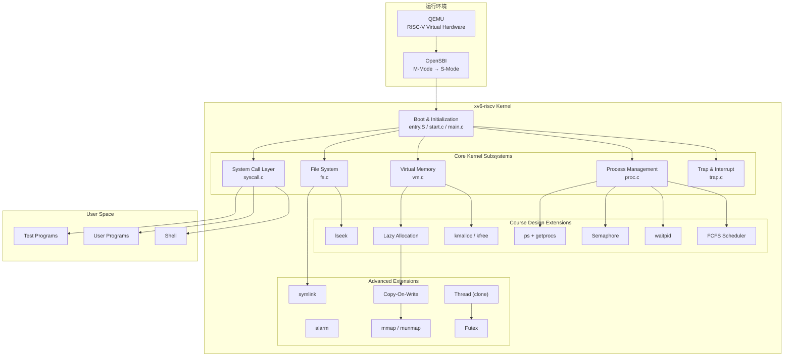

# xv6-riscv 增强型操作系统内核

基于 MIT xv6-riscv，引入现代 Unix/Linux 内核设计思想，扩展内核功能边界。

- [进度汇报](docs/process.md)
- [结题报告](docs/final_report.md)
- [性能基准](docs/bench/bench.md)


## 项目简介

本项目**基于 MIT xv6-riscv**，在保持原有体系结构稳定性的前提下，**成功扩展并实现了 16 个新增系统调用**。通过引入内核字节分配器、按需分页、写时复制、VMA 存储映射、FCFS 动态调度切换、轻量级线程、Futex 同步、符号链接等多项现代操作系统关键特性，进一步拓宽了系统的实际应用边界。

**全量测试结果**：alltests 集成测试 **PASS: 21/21**；grind 压力测试持续运行数十分钟，**系统稳定，未发生内核 Panic 或死锁**。

通过移植 LLM 推理引擎 llama.c 并设计三组对比实验，本项目进一步量化验证了：
- **多核并行能力**：RR 调度下 1→4 线程加速比达 1.84×。
- **Futex 同步优势**：相比 Spinlock 快 92.4%，相比 Pipe 快 40%。
- **mmap 零拷贝优势**：冷启动耗时 0 Ticks，对比 malloc+read 的 21 Ticks。

### 整体架构




## 功能特性

| 模块 | xv6 已实现功能 | 本项目扩展实现 | 
|:---------|:------------|:--------------|
| 系统启动 | M→S 态切换、内核加载、栈初始化、启动日志 | — |
| 中断与异常 | 时钟中断、键盘输入、ecall 系统调用 | 缺页异常处理（Lazy/COW/VMA）、用户态异常分类拦截（scause 2/13/15 诊断） |
| 内存管理 | 物理页分配、Sv39 虚拟内存 | kmalloc/kmfree 内核堆分配器、按需分页、COW Fork、mmap/munmap |
| 进程管理 | PCB、fork/exec、RR 调度 | FCFS 非抢占调度（RR/FCFS 动态切换）、waitpid（WNOHANG）、Semaphore 信号量、Alarm 异步定时器 | 
| 文件系统 | 目录文件操作、路径解析、重定向、mkfs | lseek（SEEK_SET/CUR/END）、Symlink 软链接 |
| 用户程序 | ELF 加载、Shell、管道 | ps 命令（getprocs 系统调用）、异常隔离（用户态崩溃不 panic） | 
| **扩展功能** | — | **alarm**、**COW Fork**、**mmap/munmap**、**clone 线程**、**futex 用户态锁** |


## Quick Start

### 前置依赖

- **操作系统**：Ubuntu 22.04 LTS（或其他 Linux 发行版）
- **RISC-V 工具链**：`riscv64-linux-gnu-gcc` 或 `riscv64-unknown-elf-gcc`
- **QEMU**：`qemu-system-riscv64`（推荐 7.2.0+）

安装依赖（Ubuntu）：
```bash
sudo apt update
sudo apt install -y gcc-riscv64-linux-gnu qemu-system-misc
```

### 1. 编译并启动内核

```bash
# 编译并启动 QEMU 模拟器
make qemu
```

内核引导后将进入 xv6 Shell：
```
xv6 kernel is booting

hart 1 starting
hart 2 starting
init: starting sh
$ 
```

### 2. 运行自动化集成测试

系统进入 Shell 后，运行 `alltests` 启动自动化验证：

```bash
$ alltests
```

`alltests` 包含 **20 项增量功能单元测试**（覆盖 kmalloc、lazy alloc、COW、mmap、clone、futex、semaphore、symlink、alarm、waitpid、lseek、ps、sched 等）以及 xv6 原生的 `usertests` 集成测试。

### 3. 并发压力测试

运行高并发、死锁与竞争条件压力测试：

```bash
$ grind
```

该程序会长时间高并发执行 `fork`、`kill`、文件读写和内存分配，字符交替输出（如 `ABBABA`）代表内核多核同步锁设计正确，运行稳定。

### 4. 性能验证

为了便于复现性能评估数据，本项目提供一个自动化脚本 `bench.c` ，

```bash
$ bench
```
工作流程：
1. 切换为 RR 调度，运行 Exp1（多核可扩展性），重复 3 轮
2. 切换为 FCFS 调度，再次运行 Exp1，重复 3 轮
3. 切换回 RR 调度，运行 Exp2（同步机制对比），重复 3 轮
4. 运行 Exp3（冷启动对比），1 轮

每个实验通过 fork() + exec() 调用 llama 程序并传入对应参数（exp1、exp2、exp3），父进程 wait() 等待子进程完成后收集结果。调度模式的切换通过 sched程序完成：sched 0 切到 RR，sched 1 切到 FCFS。

*虽然系统已通过增量功能单元测试与 usertests 共 21 项，运行 grind 数十分钟无 panic、无内存泄漏等异常现象，但在运行测试程序以及 bench 时，实验一与二仍有概率发生卡死现象，初步定位该问题与 sys_futex 的慢速路径调度时序有关，或其他原因，还需要进一步分析修复。*

## 系统调用清单

共实现 **37 个系统调用**（原生 21 个 + 增量 16 个）：

| 编号 | 系统调用 | 类型 | 说明 |
|------|----------|------|------|
| 1 | `fork` | 原生 | 创建子进程 |
| 2 | `exit` | 原生 | 进程退出 |
| 3 | `wait` | 原生 | 等待子进程 |
| 4 | `pipe` | 原生 | 创建管道 |
| 5 | `read` | 原生 | 读取文件 |
| 6 | `kill` | 原生 | 终止进程 |
| 7 | `exec` | 原生 | 执行程序 |
| 8 | `fstat` | 原生 | 获取文件状态 |
| 9 | `chdir` | 原生 | 切换目录 |
| 10 | `dup` | 原生 | 复制文件描述符 |
| 11 | `getpid` | 原生 | 获取进程 ID |
| 12 | `sbrk` | 原生 | 扩展/收缩堆 |
| 13 | `sleep` | 原生 | 进程休眠 |
| 14 | `uptime` | 原生 | 获取系统运行时间 |
| 15 | `open` | 原生 | 打开文件 |
| 16 | `write` | 原生 | 写入文件 |
| 17 | `mknod` | 原生 | 创建设备节点 |
| 18 | `unlink` | 原生 | 删除文件 |
| 19 | `link` | 原生 | 创建硬链接 |
| 20 | `mkdir` | 原生 | 创建目录 |
| 21 | `close` | 原生 | 关闭文件描述符 |
| **22** | **`getprocs`** | 增量 | 获取进程列表 |
| **23** | **`kmalloctest`** | 增量 | 内核堆分配器测试 |
| **24** | **`sched_switch`** | 增量 | 动态切换调度策略 |
| **25** | **`waitpid`** | 增量 | 等待指定子进程 |
| **26** | **`sem_alloc`** | 增量 | 分配信号量 |
| **27** | **`sem_free`** | 增量 | 释放信号量 |
| **28** | **`sem_wait`** | 增量 | 信号量 P 操作 |
| **29** | **`sem_signal`** | 增量 | 信号量 V 操作 |
| **30** | **`sigalarm`** | 增量 | 设置定时器信号 |
| **31** | **`sigreturn`** | 增量 | 信号处理返回 |
| **32** | **`lseek`** | 增量 | 文件偏移定位 |
| **33** | **`symlink`** | 增量 | 创建符号链接 |
| **34** | **`mmap`** | 增量 | 内存映射文件 |
| **35** | **`munmap`** | 增量 | 解除内存映射 |
| **36** | **`clone`** | 增量 | 创建轻量级线程 |
| **37** | **`futex`** | 增量 | 用户态快速互斥体 |

---

## 用户程序

| 程序 | 说明 |
|------|------|
| `sh` | xv6 Shell |
| `init` | 初始进程 |
| `alltests` | 自动化集成测试入口 |
| `usertests` | xv6 原生集成测试 |
| `grind` | 并发压力测试 |
| `bench` | 性能基准测试 |
| `llama` | 极简 Transformer 推理引擎（stories260K 模型） |
| `semtest` | 信号量测试 |
| `futextest` | Futex 测试 |
| `clonetest` | 线程测试 |
| `cowtest` | COW 测试 |
| `mmaptest` | mmap 测试 |
| `symlinktest` | 符号链接测试 |
| `alarmtest` | 定时器信号测试 |
| `waitpidtest` | waitpid 测试 |
| `lseektest` | lseek 测试 |
| `schedtest` | 调度器测试 |
| `kmalloctest` | 内核堆测试 |
| `lazytests` | 懒分配测试 |
| `forktest` | Fork 压力测试 |
| `crash_test` | 崩溃恢复测试 |
| `ls` / `cat` / `echo` / `grep` / `wc` / `rm` / `mkdir` / `ln` / `ps` | 常用工具 |

## 参考资料（部分）
- https://github.com/mit-pdos/xv6-riscv
- https://github.com/mit-pdos/xv6-riscv-book/
- https://github.com/qemu/qemu
- https://github.com/sandyyyz/Re-XVapor
- https://github.com/tianx666/xv6-book-riscv-rev1-Chinese
- https://blog.csdn.net/zzy980511/category_11740137.html
- https://github.com/mit-pdos/xv6-riscv-fall19
- https://github.com/torvalds/linux
- https://pdos.csail.mit.edu/6.S081
- https://linux-kernel-labs.github.io/
- https://pdos.csail.mit.edu/6.S081/2020/labs/lazy.html
- https://fail.lingfei.xyz/tags/xv6/
- https://github.com/karpathy/llama2.c