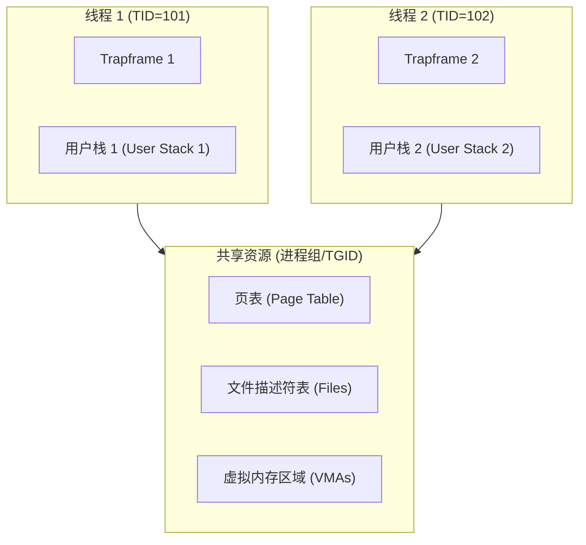
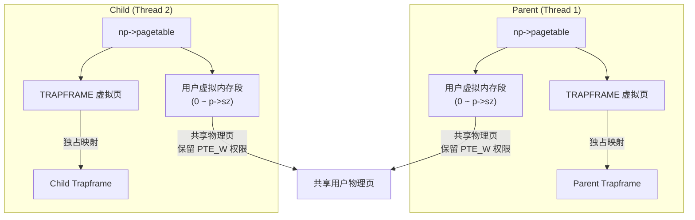

### clone

传统的 fork 会复制父进程的完整页表与内存，而轻量级线程创建要求多个线程共享相同的虚拟地址空间（相同的页表和
VMA），但拥有独立的执行流、寄存器状态和用户栈。

轻量级进程（线程）的核心特征是：共享虚拟内存空间（页表）和文件描述符，但拥有独立的 CPU 寄存器上下文和独立的用户态栈。
1. 线程安全页表引用计数器
在多核 QEMU 环境下，如果直接把父进程的 pagetable 赋予子线程，那么任何一个进程/线程在退出调用 freeproc 时都会尝试销毁页表。为了防止 double free 和内核崩溃，我们必须引入一个用自旋锁保护的页表引用计数指针 pagetable_ref：
- 普通进程初始化：在 allocproc 中，从内核堆中通过 kmalloc 分配一个整型变量，初始值设为 1。
- 派生子线程时：在 clone 系统调用内，不复制页表，直接将子线程的 pagetable_ref 指向父进程的引用计数，并在自旋锁保护下执行 (*pagetable_ref)++。
- 线程/进程销毁时：在 freeproc 内，在自旋锁保护下执行 (*pagetable_ref)--。只有当计数归零（即最后一个线程退出）时，才真正执行 proc_freepagetable 回收页表和引用计数器本身。
2. 用户态独立栈与寄存器设置
在 RISC-V 架构中，函数的调用约定对栈指针对齐有严格要求：
- 栈必须是 16 字节对齐的，且向下生长。
- 新线程的 trapframe->epc 设为入口函数 fn。
- trapframe->sp 设为用户态为其传入的对齐后的栈顶地址。
- trapframe->a0 设为传参值 arg。

1.  定义标志位：在内核中定义类似 Linux 的克隆标志：
    #define CLONE_VM    0x00000100 // 共享虚拟内存页表
    #define CLONE_FILES 0x00000200 // 共享文件描述符表
2.  重构 PCB (struct proc)：
      - 增加 tgid（Thread Group ID，标识所属进程组，主线程的 PID 即为 TGID）。
      - 引入页表引用计数。在全局增加一个计数器，或在 PCB 链中通过统计共享相同 pagetable 的线程数量来判断何时可以真正销毁页表。
3.  实现 sys_clone(uint64 fn, uint64 stack, uint64 arg)：
      - 分配一个新的 struct proc 作为新线程。
      - 页表共享：如果不拷贝页表，直接令 child->pagetable =
        parent->pagetable。由于共享页表，当线程发生缺页中断（Lazy/COW/Mmap）时，任一线程填充的物理页，其他线程均能立刻看到。
      - 共享文件描述符：直接令 child->ofile = parent->ofile（或通过引用计数共享）。
      - 上下文设置：
          - 将新线程的 trapframe->epc 指向用户态入口函数 fn。
          - 将 trapframe->sp 指向用户态指定的独立线程栈 stack。
          - 将 trapframe->a0（第一个参数寄存器）设置为 arg。
      - 调度接入：将新线程状态置为 RUNNABLE，接入调度器。

- 顶级页表与 Trapframe 独立：每个线程在被 allocproc 分配时，都拥有自己物理独立的 np->pagetable。在这个顶级页表里，TRAPFRAME 虚拟页精准且独占地映射到它各自的 np->trapframe 物理页。这彻底消除了多核并发切换特权级时的寄存器写冲突。
- 虚拟用户空间物理共享：实现 uvmsharecopy 函数。在 clone 时，遍历父进程的用户地址映射（0 到 p->sz），将映射关系直接复制到子线程的页表项中，保留原有的读/写/执行等权限（不标记 PTE_COW），并直接递增物理页的底层引用计数 ref_inc。

### futex

传统的信号量或互斥锁在每次加锁/解锁时都需要陷入内核（System Call），开销较大。futex 的核心思想是：
  - 无竞争时在用户态解决：利用原子操作（如 RISC-V 的 amoswap 或 lr.w/sc.w）在用户态直接修改锁变量（0 或 1）。
  - 有竞争时才陷入内核：当用户态发现锁已被占用，调用 sys_futex(uaddr, FUTEX_WAIT, val) 让出
    CPU；锁持有者释放锁时，若发现有等待者，调用 sys_futex(uaddr, FUTEX_WAKE,
    val) 唤醒等待线程。

1.  系统调用接口：

    int sys_futex(uint64 uaddr, int op, int val);

      - uaddr：用户态锁变量的虚拟地址。
      - op：操作类型，主要实现 FUTEX_WAIT 和 FUTEX_WAKE。
      - val：期望值（对于 WAIT）或唤醒数量（对于 WAKE）。

2.  地址对齐与物理地址映射： 由于不同进程/线程的虚拟地址可能映射到相同的物理地址（或通过共享内存），内核应使用物理地址作为等待队列的 Key：

    uint64 paddr = walkaddr(p->pagetable, uaddr);
    if(paddr == 0) return -1;
    paddr = paddr + (uaddr % PGSIZE); // 得到准确的物理地址

3.  操作分支实现：

      - FUTEX_WAIT：
          - 必须保证“检查锁变量的值”与“进入睡眠”这两个操作的原子性，防止在检查后、睡眠前发生线程切换（经典的 Lost Wakeup 问题）。
          - 内核获取一个全局自旋锁 futex_table_lock。
          - 读取用户态 uaddr 处当前的值（使用 copyin）。
          - 如果 cur_val != val，说明在进入内核期间锁已被释放，内核立即释放锁并返回，不进入睡眠。
          - 如果 cur_val == val，将当前线程的状态设为 SLEEPING，其 chan（等待通道）设为该物理地址
            (void*)paddr，随后释放 futex_table_lock 并调用 sched() 切换上下文。
      - FUTEX_WAKE：
          - 获取 futex_table_lock。
          - 遍历进程表 proc[]，寻找处于 SLEEPING 状态且 chan == (void*)paddr 的线程。
          - 唤醒最多 val 个匹配的线程（通常 val=1 唤醒一个，或 val=INT_MAX 唤醒所有）。
          - 释放 futex_table_lock 并返回。