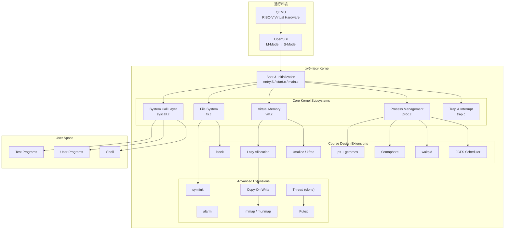
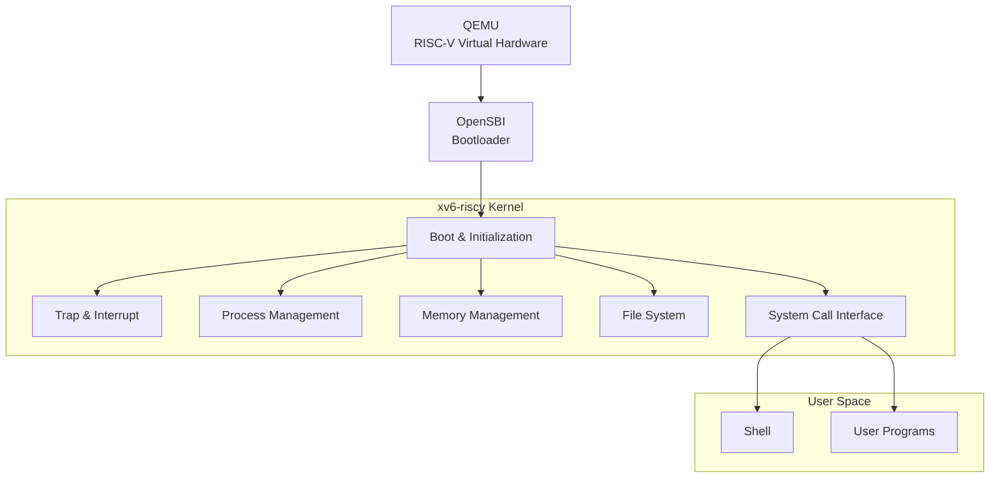
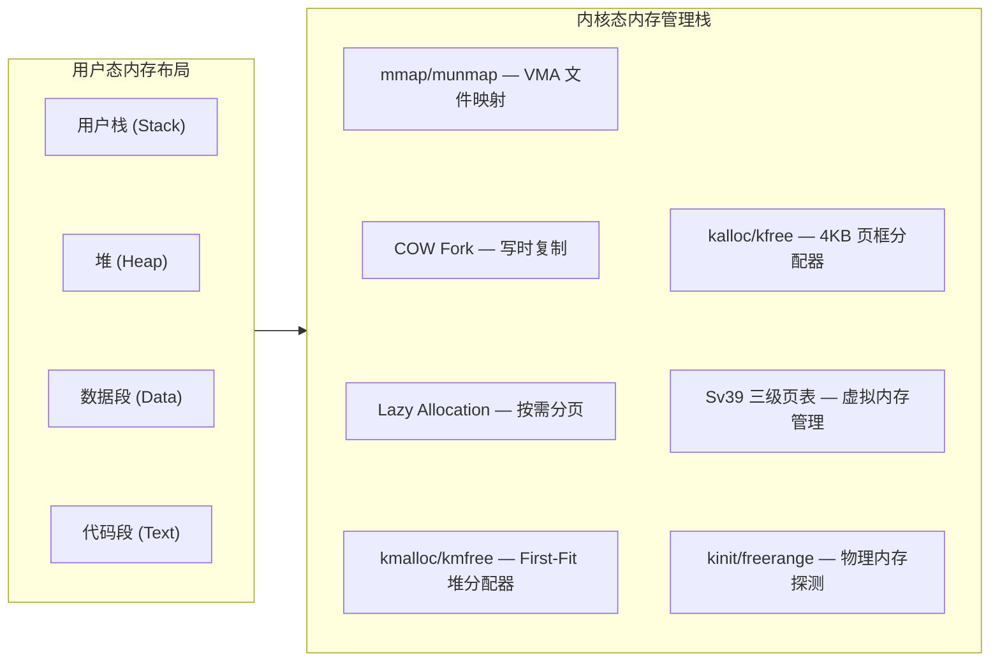
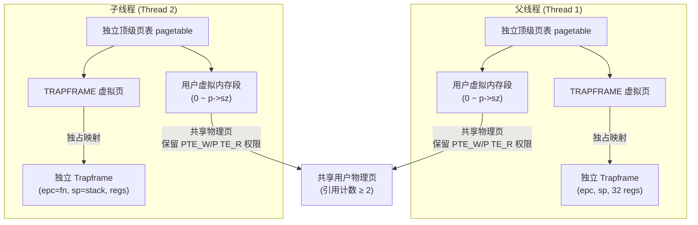
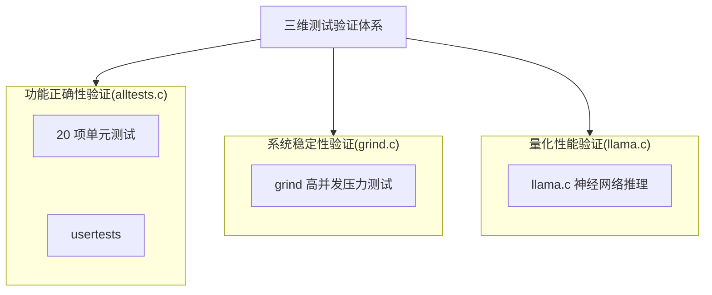

<!-- <div class="markdown-body"> -->

# 基于 xv6 的内核功能扩展与性能量化评估 

- **操作系统课程设计结题报告**
- 姓名：袁善
- 学号：20231072030
- 日期：2026年6月20日


## 一、项目摘要

- **项目背景与目标**：
  - 作为 MIT 经典的教学操作系统，xv6-riscv 展现了简洁的 Unix 内核结构与 RISC-V 虚拟内存机制。然而，原生 xv6 针对教学做了极简化处理，缺乏按需分配、写时复制（COW）、轻量级线程、文件内存映射（mmap）等现代内核特性，难以应对高并发或算力密集型应用。
  - 基于此，本项目旨在**基于 MIT xv6-riscv**，在完成课程要求功能的前提下，引入部分现代 Unix/Linux 内核设计思想，**拓展** xv6 内核的**功能**边界并**验证其在真实负载下的表现**。
- **团队信息与分工**：本项目由袁善（学号 20231072030）单人完成。
- **项目仓库地址**：`https://github.com/yuuichi33/OS`
- **开发环境**：宿主机 Windows 11 + VSCode (SSH 远程连接)；目标机 Ubuntu 22.04 LTS；编译：`riscv64-linux-gnu-gcc`；模拟器：QEMU 7.2.0（`qemu-system-riscv64`）。
- **工作概述**
  - **功能实现**：共支持 37 个系统调用（其中**增量实现 16 个**）。包括内核级堆分配器（kmalloc/kfree）、按需分页（Lazy Allocation）、写时复制（COW Fork）、文件内存映射（mmap/munmap）、FCFS 与 RR 动态调度切换、轻量级线程（clone）、用户态快速同步互斥体（futex）以及信号量、异步定时器（Alarm）、软链接（Symlink）等模块。
  - **功能验证**：系统通过**增量的 20 项单元测试**、**xv6 原生 usertests 集成测试**，在 **grind 压力测试**下持续运行，未发生内核 Panic 或死锁。**达到课程标准。**
  - **性能评估**：移植极简 Transformer 推理引擎 **llama.c** 并加载 **stories260K** 模型，针对**多核并行能力、同步原语效率及存储映射机制设计**对比实验，量化评估内核相关子系统的实际开销。



## 二、项目完成情况

### 2.1 功能实现

本项目共支持 **37 个系统调用**，其中 21 个为原生系统调用，**16 个为本项目增量设计与实现**。

| 模块 | xv6 已实现功能 | 本项目扩展实现 | 
|:---------|:------------|:--------------|
| 系统启动 | M→S 态切换、内核加载、栈初始化、启动日志 | — |
| 中断与异常 | 时钟中断、键盘输入、ecall 系统调用 | 缺页异常处理（Lazy/COW/VMA）、用户态异常分类拦截（scause 2/13/15 诊断） |
| 内存管理 | 物理页分配、Sv39 虚拟内存 | kmalloc/kmfree 内核堆分配器、按需分页、COW Fork、mmap/munmap |
| 进程管理 | PCB、fork/exec、RR 调度 | FCFS 非抢占调度（RR/FCFS 动态切换）、waitpid（WNOHANG）、Semaphore 信号量、Alarm 异步定时器 | 
| 文件系统 | 目录文件操作、路径解析、重定向、mkfs | lseek（SEEK_SET/CUR/END）、Symlink 软链接 |
| 用户程序 | ELF 加载、Shell、管道 | ps 命令（getprocs 系统调用）、异常隔离（用户态崩溃不 panic） | 
| **扩展功能** | — | **alarm**、**COW Fork**、**mmap/munmap**、**clone 线程**、**futex 用户态锁** |

### 2.2 交付物

- 14 周提交进度报告，含技术方案、分工方案。
- 结题报告PDF，内容包括项目概述，技术方案，详细实现，系统运行功能测试，创新点，总结与展望等内容。
- 汇报PPT、可运行源码及文档。

## 三、项目内容

### 3.1 系统设计目标与技术选型

xv6 是一个面向教学的 Unix 风格操作系统，其代码结构清晰、模块划分合理，完整实现了进程管理、虚拟内存管理、文件系统、系统调用和异常处理等核心机制。

本项目**基于 riscv 架构的 xv6** `(https://github.com/mit-pdos/xv6-riscv)`进行增量式开发，重点参考 Linux 和开源项目 Re-XVapor `(https://github.com/sandyyyz/Re-XVapor)` 以及 MIT 6.S081。项目拟在保持 xv6 原有体系结构稳定性的前提下，逐步扩展其功能，实现课程设计要求的操作系统关键机制，并在此基础上**引入部分现代 Unix/Linux 内核设计思想**，提高系统的完整性与可扩展性。

**处理器架构与内核基准决策依据**
- **RISC-V 架构指令设计简洁**：规避了 x86 繁重的历史兼容包袱，RV64 寄存器与控制状态寄存器（CSRs）设计清晰，极大简化了上下文切换与 Trap 处理的汇编实现。
- **特权级与分页规范**：具备明确的 U/S/M 特权级划分，配合标准的 Sv39 三级页表，能够较好地映射进程隔离、虚存管理等操作系统核心概念。
- **xv6 体量精简，抽象完整**：相比复杂的 Linux 内核，xv6 代码体量适中，且完整保留了 Unix 的核心抽象（PCB、VM、VFS、Syscall），为后续渐进式扩展 COW、Lazy Allocation、clone 线程等现代内核特性留出了充足的改造空间。

**平台技术选型与硬件模拟合理性依据**

系统采用 **QEMU virt 平台**（配合 OpenSBI 固件）作为开发运行环境，其合理性如下：

- **特权级切换**：标准固件 OpenSBI 运行于 M-Mode，通过 mret 降权至 S-Mode 引导内核，从而能够规范化地配置 sstatus 等监管态寄存器的特权级行为。
- **页表机制对齐**：QEMU MMU 硬件级支持 Sv39 三级页表走表，对未映射或只读写企图能精准触发缺页异常（scause 12/13/15），为 Lazy 分配、COW 及 mmap 的延迟装载提供标准的硬件反馈。
- **中断与多核并发**：通过仿真 CLINT/PLIC 提供稳定的时钟（用于调度与 sigalarm）与外设中断；利用 -smp 模拟多核并发环境，用以验证 clone 线程的物理页共享与 futex 的多核同步机制。

### 3.2 系统总体架构

系统采用经典的分层式结构设计。整体运行环境由 QEMU、OpenSBI 和 xv6 内核组成。



- **QEMU**：提供 RISC-V 虚拟硬件环境（`-machine virt`，4 核，128MB 内存）
- **OpenSBI**：完成机器态（M-Mode）到监管态（S-Mode）的初始化和特权级切换
- **xv6 内核**：负责 CPU、内存、磁盘、中断等全部资源的管理和系统服务
- **系统调用层**：提供用户态与内核态的交互接口（共 37 个系统调用）
- **用户空间**：运行 Shell 和应用程序

### 3.3 子系统设计与实现

#### 3.3.1 系统启动（Bootloader）

**1. 启动与特权切换控制流**
```
QEMU → OpenSBI (M-mode 初始化与硬件配置) 
     → 执行 mret 切换至 S-mode 
     → entry.S (各 CPU 核分配独立的内核栈)
     → start.c (配置监听寄存器与中断委托) 
     → main.c (主 CPU 初始化内存、进程、文件系统等，激活次 CPU)
     → scheduler() → 调度 init 进程 → 启动用户态 Shell
```

**2. 启动日志**：系统在 QEMU 中稳定启动并进入 Shell，启动过程可复现，无异常重启。此部分完全复用 xv6 已实现功能。
```
xv6 kernel is booting

hart 1 starting
hart 2 starting
hart 3 starting
$ _
```

#### 3.3.2 中断与异常处理（Trap & Interrupt）

xv6 采用**基于 Trap 的统一异常处理框架**。所有系统调用、异常和中断最终均通过 Trap 机制进入内核。RISC-V 架构中，scause 寄存器标识中断/异常类型：

| scause | 类型 | 说明 |
|:------|:----|:-----|
| 8 | 系统调用 | `ecall` 指令触发 |
| 2 | 非法指令 | 执行损坏指令 |
| 12 | 指令缺页 | 执行无权限内存 |
| 13 | 读缺页 | 读取未映射/无权限地址 |
| 15 | 写缺页 | 写入只读/未映射地址 |

**1. 异常分发控制流**
  ```
  用户态运行 → 中断/异常 → trampoline.S → usertrap()
      ├── scause == 8  → 系统调用 → syscall() 分发
      ├── devintr != 0 → 硬件中断（时钟/键盘/磁盘）
      │     └── which_dev == 2 → 时钟中断 → alarm 检测
      └── 其他异常 → 分类拦截
            ├── scause 2  → 非法指令 → 打印诊断 → Kill 隔离
            ├── scause 13 → 读段错误（Load Page Fault）
            │     ├── VMA 区间 → mmap 按需调页
            │     └── 堆区间  → Lazy Allocation
            ├── scause 15 → 写段错误（Store Page Fault）
            │     ├── VMA 区间 → mmap 按需调页
            │     ├── PTE_COW  → COW 分裂
            │     └── 堆区间  → Lazy Allocation
            └── 其他 → 打印诊断信息 → setkilled(p)
  ```

**2. 设计与实现细节**
- 修改 trap.c 中的 usertrap()，实现对非法指令（scause == 2）与内存越界读写（scause 13/15）的分类识别。
- 当发生无法通过缺页机制修复的异常时，内核打印错误地址与指令并强制结束该进程（exit(-1)），从而保证内核与其他并发进程正常运行不发生 Panic。

**3. 核心代码**（`kernel/trap.c`）：
```c
void usertrap(void) {
  // ...
  if(r_scause() == 8){
    // 系统调用
    p->trapframe->epc += 4;
    intr_on();
    syscall();
  } else if((which_dev = devintr()) != 0){
    // 硬件中断 alarm 检测
    if(which_dev == 2 && p->alarm_interval > 0) {
      p->alarm_ticks++;
      if(p->alarm_ticks == p->alarm_interval) {
        *p->alarm_tf = *p->trapframe;      // 备份现场
        p->trapframe->epc = p->alarm_handler; // 重定向
      }
    }
  } else {
    // 用户态异常分类拦截
    uint64 scause = r_scause();
    uint64 stval = r_stval();
    uint64 sepc = r_sepc();
    if(scause == 13 || scause == 15) {
      // 缺页处理：VMA / Lazy / COW
      // ...
    } else {
      // 非法指令等 → 打印诊断 → Kill
      printf("[Exception] Process %d killed: scause=%p\n", p->pid, scause);
      setkilled(p);
    }
  }
  if(killed(p)) exit(-1);
}
```

#### 3.3.3 内存管理（Memory Management）

xv6 采用**页式内存管理**。在原有 4KB 物理页框分配器（kalloc/kfree）与 Sv39 页表的基础上，本项目重构并扩展了内存管理结构：



##### A. 内核堆分配器（kmalloc/kmfree）

为了给信号量、线程参数及定时器备份等模块提供内核动态内存支持，本项目在底层的 kalloc 之上构建了一个字节级动态内存分配器 kmalloc 与 kmfree。

**1. 核心数据结构**（`kernel/kalloc.c`）：
```c
// 内存块首部： 每个分配块在数据区之前携带元信息
struct kmem_header {
  uint64 size;              // 内存块大小（不含首部，单位：字节）
  struct kmem_header *next; // 指向下一内存块（隐式空闲链表指针）
  int is_free;              // 是否空闲（1: 空闲, 0: 已分配）
};

// 全局堆管理器： 管理所有内核堆内存块
struct {
  struct spinlock lock;     // 多核并发互斥锁
  struct kmem_header *head; // 隐式空闲链表头指针
} kmalloc_mem;
```

**2. 算法控制流 ：First-Fit 分配 + 相邻空闲块合并（Coalesce）**
- **分配（kmalloc）**：将请求大小对齐至 8 字节。持锁遍历隐式空闲链表，寻找首个 is_free=1 且 size >= 请求大小 的块（First-Fit 策略）。
  - **Split（切分）**：若当前块大小超出请求大小与 Header 大小之和，将其分裂为前后两块，后半段重新初始化为空闲块插入链表。
  - 若无满足条件的空闲块，则释放锁并调用底层 kalloc() 申请新页，将其挂入链表头部，重新分配。
- **释放（kmfree）**：将目标块标记为 is_free=1。随后扫描整个链表，检测物理地址相邻的空闲块（当前块末尾地址 == 下一个块起始地址），若连续则合并（Coalesce），防止碎片累积。若某块独占整张物理页，则归还给物理页分配器。

**3. 核心代码**（`kernel/kalloc.c`）：
```c
void* kmalloc(uint64 size) {
  if(size == 0) return 0;
  size = (size + 7) & ~7;                // 8 字节对齐
  acquire(&kmalloc_mem.lock);
  struct kmem_header *curr = kmalloc_mem.head;
  // First-Fit：遍历空闲链表，定位首个满足大小的块
  while(curr) {
    if(curr->is_free && curr->size >= size) {
      // Split：大块切分，后半段重新标记为空闲
      if(curr->size >= size + sizeof(struct kmem_header) + 8) {
        struct kmem_header *new_block = (struct kmem_header*)
            ((char*)curr + sizeof(struct kmem_header) + size);
        new_block->size = curr->size - size - sizeof(struct kmem_header);
        new_block->is_free = 1;
        new_block->next = curr->next;
        curr->size = size;
        curr->next = new_block;
      }
      curr->is_free = 0;
      release(&kmalloc_mem.lock);
      return (void*)(curr + 1);          // 返回数据区地址（跳过 header）
    }
    curr = curr->next;
  }
  release(&kmalloc_mem.lock);
  // 申请新 4KB 页挂入链表并重试
  void *page = kalloc();
  if(page == 0) return 0;
  // ... 页块挂载与重新尝试路径 ...
}

void kmfree(void *addr) {
  // ... 标记 is_free=1 ...
  // Coalesce：合并物理上连续的相邻空闲块
  struct kmem_header *curr = kmalloc_mem.head;
  while(curr) {
    if(curr->is_free && curr->next && curr->next->is_free) {
      if((char*)curr + sizeof(struct kmem_header) + curr->size
          == (char*)curr->next) {
        curr->size += sizeof(struct kmem_header) + curr->next->size;
        curr->next = curr->next->next;   // 合并空闲块
        continue;                        // 重新检查
      }
    }
    curr = curr->next;
  }
}
```

##### B. 按需分页（Lazy Allocation）

**1. 算法控制流：惰性分配与缺页补全**
- **申请时（sys_sbrk）**：仅调整进程虚拟地址空间上界 p->sz（p->sz += n），不调用 kalloc 申请物理页。
- **缺页触发（usertrap）**：当进程实际读写未分配的虚拟地址时，触发缺页异常（scause == 13/15）。在 usertrap() 中通过 walk(pagetable, va, 0) 确认该虚拟地址合法（属于 [0, p->sz) 且未映射）。
- **物理页装载**：调用 kalloc() 分配物理物理页，并通过 mappages() 补齐页表项映射。
- **透明访问**：重构 walkaddr() 与 copyout()，使内核在处理系统调用（如 read 写入 Lazy 区域）时，也能透明且安全地触发物理页装载。
- 同时，修改 uvmunmap 与 uvmcopy，在检测到未映射页（PTE_V == 0）时选择跳过，不触发 panic。

**2. 核心代码**（`kernel/sysproc.c` & `kernel/trap.c`）：
```c
// sys_sbrk：增长时仅抬高虚拟边界，不分配物理页
uint64 sys_sbrk(void) {
  uint64 addr;
  int n;
  struct proc *p = myproc();

  argint(0, &n);
  addr = p->sz;

  if(n < 0) {
    if(-n > p->sz)
      return -1;
    // 内存缩减：必须立即调用 growproc 释放物理页
    if(growproc(n) < 0)
      return -1;
  } else {
    // 延迟分配：只向上增长虚拟边界 sz，不分配物理页
    if(p->sz + n >= MAXVA || p->sz + n < p->sz)
      return -1;
    p->sz += n;
  }
  return addr;
}

// usertrap 中：缺页异常动态装载
if(scause == 13 || scause == 15) {
  uint64 va = PGROUNDDOWN(r_stval());
  if(r_stval() < PGROUNDUP(p->sz)) {       // 合法性校验（含页内偏移）
    char *mem = kalloc();                   // 分配物理页
    if(mem == 0) { setkilled(p); }
    else {
      memset(mem, 0, PGSIZE);
      if(mappages(p->pagetable, va, PGSIZE, (uint64)mem, PTE_R|PTE_W|PTE_U) < 0) {
        kfree(mem);
        setkilled(p);
      }
    }
  } else {
    setkilled(p);                           // 非法越界地址，结束进程
  }
}
```

##### C. 写时复制（Copy-On-Write Fork）

**1. 核心数据结构： 物理页引用计数池**（`kernel/kalloc.c`）：
```c
// 全局物理页引用计数池
struct {
  struct spinlock lock;                // 并发保护自旋锁
  char counts[PHYSTOP / PGSIZE];       // 物理页引用计数数组
} page_ref;

void ref_inc(uint64 pa) {
  if(pa < (uint64)end || pa >= PHYSTOP)
    return;
  acquire(&page_ref.lock);
  page_ref.counts[pa / PGSIZE]++;
  release(&page_ref.lock);
}
void ref_dec(uint64 pa) {
  if(pa < (uint64)end || pa >= PHYSTOP)
    return;
  acquire(&page_ref.lock);
  page_ref.counts[pa / PGSIZE]--;
  release(&page_ref.lock);
}
int ref_get(uint64 pa) {
  if(pa < (uint64)end || pa >= PHYSTOP)
    return 0;
  int c;
  acquire(&page_ref.lock);
  c = page_ref.counts[pa / PGSIZE];
  release(&page_ref.lock);
  return c;
}
```

**2. 自定义页表标志位**（`kernel/riscv.h`）：
```c
#define PTE_COW (1L << 8)  // 写时复制标记：利用 RISC-V PTE 保留位[8]标识 COW 页
```

**3. 算法控制流： COW Fork 两阶段控制流**
- **阶段一：Fork 时（uvmcopy）：共享页表**
  遍历父进程页表。对可写（PTE_W）页面，清除写权限，打上 PTE_COW 标记。然后调用 ref_inc(pa) 递增引用计数，并使子进程页表指向同一物理页，实现零拷贝共享。
- **阶段二：写入时（cow_alloc）：物理页分裂**
  进程尝试写入打上 PTE_COW 的页面时，硬件触发 scause == 15。内核通过 cow_alloc() 拦截并处理：
  - 若引用计数 == 1（独占状态）：直接清除 PTE_COW 恢复写权限（PTE_W），原地分裂。
  - 若引用计数 > 1（共享状态）：分配新物理页，进行数据拷贝，将新页重新映射到当前虚拟地址并赋予 PTE_W 权限，同时原页引用计数递减。
  - 刷新 TLB（sfence_vma()）。
- **kfree 物理页延迟回收**：重构 kfree，仅在引用计数归零时，才将物理页真正归还到空闲链表。

**4. 核心代码**（`kernel/vm.c`）：
```c
// Fork 时：共享映射 + 打 COW 标记（零拷贝）
int uvmcopy(pagetable_t old, pagetable_t new, uint64 sz) {
  pte_t *pte;
  uint64 pa, i;
  uint flags;

  for(i = 0; i < sz; i += PGSIZE){
    if((pte = walk(old, i, 0)) == 0)
      continue;
    if((*pte & PTE_V) == 0)
      continue;
    pa = PTE2PA(*pte);
    flags = PTE_FLAGS(*pte);

    if(flags & PTE_W) {
      flags = (flags & ~PTE_W) | PTE_COW;           // 清写权限 + 打 COW 标记
      *pte = (*pte & ~PTE_W) | PTE_COW;
    }
    ref_inc(pa);                                    // 递增物理页引用计数
    if(mappages(new, i, PGSIZE, pa, flags) != 0){
      ref_dec(pa);                                  // 映射失败回退引用计数
      goto err;
    }
  }
  return 0;

 err:
  uvmunmap(new, 0, i / PGSIZE, 1);
  return -1;
}

// 缺页时：COW 物理页分裂
int cow_alloc(pagetable_t pagetable, uint64 va) {
  if(va >= MAXVA) return -1;
  uint64 va0 = PGROUNDDOWN(va);
  pte_t *pte = walk(pagetable, va0, 0);
  if(pte == 0 || (*pte & PTE_V) == 0) return -1;

  if(*pte & PTE_COW) {
    uint64 pa = PTE2PA(*pte);
    uint flags = PTE_FLAGS(*pte);

    if(ref_get(pa) == 1) {
      // 独占引用：原地恢复写权限
      *pte = (*pte & ~PTE_COW) | PTE_W;
    } else {
      // 共享引用：分配新物理页并执行数据拷贝
      char *mem = kalloc();
      if(mem == 0) return -1;
      memmove(mem, (char*)pa, PGSIZE);
      *pte = PA2PTE(mem) | ((flags & ~PTE_COW) | PTE_W);
      kfree((void*)pa);                             // 递减原物理页引用计数
    }
    sfence_vma();                                   // 刷新本核 TLB
  }
  return 0;
}
```

##### D. mmap/munmap 文件内存映射

为了避免传统 read/write 系统调用带来的内核态与用户态双重数据拷贝，本项目实现了基于 VMA（虚拟内存区域）的文件内存映射机制。

**1. 核心数据结构**（`kernel/proc.h` 中的 VMA 结构体定义）：
```c
// 虚拟内存区域结构（每个进程支持最大 16 个 VMA 槽位）
struct vma {
  int valid;          // 槽位是否被占用
  uint64 addr;        // 映射起始虚拟地址（4KB 对齐）
  int len;            // 映射长度（字节）
  int prot;           // 访问权限（PROT_READ / PROT_WRITE）
  int flags;          // MAP_SHARED（共享回写）或 MAP_PRIVATE（私有写时复制）
  struct file *f;     // 关联的文件结构体指针
  int offset;         // 映射在文件内部的偏移量
};
```

**2. 算法控制流： 虚拟登记与延迟装载**
- **映射建立（sys_mmap）**：调用 sys_mmap() 时，不立即分配物理页，亦不读取磁盘。仅在 PCB 中查找一个空闲的 struct vma 槽位，登记其起止地址、偏移、文件及标志属性，并递增文件引用。
- **缺页读入（usertrap/mmap_alloc）**：当进程实际读取该 VMA 地址区间发生缺页（scause == 13/15）时，内核捕获此异常，并在 usertrap() 中分配一个 4KB 物理页，根据 vma 记录的文件与偏移信息，通过调用 readi 读盘并填充物理页，最后将其映射至用户态虚拟地址。
- **回写与卸载（sys_munmap）**：进程主动调用 sys_munmap 或执行 exit() 销毁虚拟内存空间时：
  - 系统遍历该 VMA 中所有已映射页。
  - 若映射标志为 MAP_SHARED 且该物理页被修改过（PTE 的 PTE_D 被硬件标记为脏页，或判定为可写），则调用 writei 将修改内容回刷至磁盘对应文件中。
  - 通过 uvmunmap 解除页表映射，释放物理内存并递减文件指针引用。

**3. 核心代码**（`kernel/sysfile.c` & `kernel/trap.c`）：
```c
// mmap 系统调用：建立 VMA 区域，延迟物理装载
uint64 sys_mmap(void) {
  uint64 addr;
  int len, prot, flags, fd, offset;
  struct file *f;
  struct proc *p = myproc();

  argaddr(0, &addr);
  argint(1, &len);
  argint(2, &prot);
  argint(3, &flags);
  argint(4, &fd);
  argint(5, &offset);

  if(argfd(4, 0, &f) < 0)
    return -1;

  // 权限防御：共享可写映射要求文件本身可写
  if((prot & PROT_WRITE) && (flags & MAP_SHARED) && (f->writable == 0))
    return -1;

  if(f->type != FD_INODE)
    return -1;

  // 寻找空闲的 VMA 槽位
  struct vma *v = 0;
  for(int i = 0; i < 16; i++) {
    if(p->vmas[i].valid == 0) { v = &p->vmas[i]; break; }
  }
  if(v == 0) return -1;

  // 自动寻找未被占用的高虚拟地址区间（1GB 以上起始）
  uint64 va = 0x40000000;
  for(int i = 0; i < 16; i++) {
    if(p->vmas[i].valid && p->vmas[i].addr + p->vmas[i].len > va) {
      va = PGROUNDUP(p->vmas[i].addr + p->vmas[i].len);
    }
  }

  v->valid = 1;
  v->addr = va;
  v->len = len;
  v->prot = prot;
  v->flags = flags;
  v->f = filedup(f);    // 递增文件引用计数
  v->offset = offset;

  return va;
}

// usertrap() 中对 VMA 页面的缺页懒加载（内联逻辑）
// 1. 先检查缺页地址是否属于某个 VMA 映射区
struct vma *v = 0;
for(int i = 0; i < 16; i++) {
  if(p->vmas[i].valid && stval >= p->vmas[i].addr
     && stval < p->vmas[i].addr + p->vmas[i].len) {
    v = &p->vmas[i]; break;
  }
}
if(v != 0) {
  // 写异常 + 只读映射 → 拒绝
  if(scause == 15 && !(v->prot & PROT_WRITE)) { setkilled(p); }
  else {
    char *mem = kalloc();
    memset(mem, 0, PGSIZE);
    ilock(v->f->ip);
    int file_offset = v->offset + (va0 - v->addr);
    readi(v->f->ip, 0, (uint64)mem, file_offset, PGSIZE);
    iunlock(v->f->ip);
    int perm = PTE_U;
    if(v->prot & PROT_READ)  perm |= PTE_R;
    if(v->prot & PROT_WRITE) perm |= PTE_W;
    mappages(p->pagetable, va0, PGSIZE, (uint64)mem, perm);
  }
}
```

#### 3.3.4 进程管理（Process Management）

##### A. FCFS + RR 调度器

**1. 核心数据结构**（`kernel/proc.h`）：
```c
struct proc {
  // ...
  uint ctime;            // 进程创建时间戳： 用于 FCFS 调度选取最早进程
  enum procstate state;  // 进程状态: UNUSED, USED, SLEEPING, RUNNABLE, RUNNING, ZOMBIE
  // ...
};

// 全局调度模式变量（0: Round-Robin, 1: FCFS 先来先服务）
int sched_mode;  
```

**2. 算法控制流： 调度切换控制**
调度器主循环 `scheduler()` 在空闲核心上运行。每次遍历进程表时，通过 `sched_mode` 确定调度策略：
- **RR 模式（0）**：每次时钟中断触发时执行 `yield()`，当前进程让出 CPU 并标记为 `RUNNABLE`，CPU 重新轮转扫描首个可运行进程。
- **FCFS 模式（1）**：遍历进程表，在所有 `RUNNABLE` 的就绪进程中选取创建时间戳 `ctime` **最小**（即最早到达）的一个投入运行。时钟中断下不抢占进程，当前进程持续运行至主动 `exit()` 或发生 IO 阻塞（`sleep()`）调用 `sched()` 让出 CPU。

**3. 核心代码**（`kernel/proc.c`）：
```c
void scheduler(void) {
  struct proc *p;
  struct cpu *c = mycpu();
  c->proc = 0;
  for(;;){
    intr_on();
    if(sched_mode == 0) {
      // RR 调度（持锁-检查-释放，逐进程处理）
      for(p = proc; p < &proc[NPROC]; p++) {
        acquire(&p->lock);
        if(p->state == RUNNABLE) {
          p->state = RUNNING;
          c->proc = p;
          swtch(&c->context, &p->context);
          c->proc = 0;
        }
        release(&p->lock);
      }
    } else {
      // FCFS 调度：两遍扫描
      struct proc *first_p = 0;
      int first_ctime = 0;
      // 第一遍：逐进程持锁-检查-释放，找到 ctime 最小的 RUNNABLE 进程
      for(p = proc; p < &proc[NPROC]; p++) {
        acquire(&p->lock);
        if(p->state == RUNNABLE) {
          if(first_p == 0 || p->ctime < first_ctime) {
            first_ctime = p->ctime;
            first_p = p;
          }
        }
        release(&p->lock);
      }
      // 第二遍：锁定选中的进程，验证状态后投入运行
      if(first_p) {
        acquire(&first_p->lock);
        if(first_p->state == RUNNABLE) {
          first_p->state = RUNNING;
          c->proc = first_p;
          swtch(&c->context, &first_p->context);
          c->proc = 0;
        }
        release(&first_p->lock);
      }
    }
  }
}
```

##### B. waitpid 机制

**1. 算法控制流：精准子进程回收与非阻塞**
在原有 `wait` 机制上扩展：
- **精准回收**：若参数 target_pid > 0，则扫描子进程表时仅匹配 PID 对应的特定子进程；若 target_pid == -1，回退为回收任意子进程。
- **非阻塞（WNOHANG）**：若指定 WNOHANG 且匹配的目标子进程非 ZOMBIE 状态，函数不挂起父进程，而是**立即返回 0**，允许父进程继续执行。

**2. 核心代码**（`kernel/proc.c`）：
```c
int waitpid(int target_pid, uint64 addr, int options) {
  struct proc *pp;
  int havekids, pid;
  struct proc *p = myproc();

  acquire(&wait_lock);
  for(;;){
    havekids = 0;
    for(pp = proc; pp < &proc[NPROC]; pp++){
      if(pp->parent == p){
        if(target_pid > 0 && pp->pid != target_pid) continue; // 匹配目标 PID
        acquire(&pp->lock);
        havekids = 1;
        if(pp->state == ZOMBIE){
          pid = pp->pid;
          int temp_xstate = pp->xstate;
          freeproc(pp);                                      // 彻底回收资源
          release(&pp->lock);
          release(&wait_lock);
          // 状态写回用户态
          if(addr != 0 && copyout(p->pagetable, addr, (char *)&temp_xstate,
                                  sizeof(temp_xstate)) < 0) {
            return -1;
          }
          return pid;
        }
        release(&pp->lock);
      }
    }
    if(!havekids || killed(p)){ release(&wait_lock); return -1; }
    if(options == 1){ release(&wait_lock); return 0; }       // WNOHANG
    sleep(p, &wait_lock);                                    // 阻塞挂起等待
  }
}
```

##### C. 信号量（Semaphore）

**1. 核心数据结构**（`kernel/sem.c`）：
```c
struct sem {
  struct spinlock lock;  // 保护计数的自旋锁
  int count;             // 可用资源数
};
```

**2. 算法控制流：基于 sleep/wakeup 的进程级锁机制**
利用内核字节级堆分配器 kmalloc 动态创建及回收 sem。在 sem_wait 中，先递减计数；若计数变为负数（资源耗尽），调用内核 sleep 挂起进程。P/V 操作均直接使用信号量内存地址作为睡眠通道（chan），从而在 sem_signal 中通过 wakeup(s) 实现精准调度。

**3. 核心代码**（`kernel/sem.c`）：
```c
int sem_wait(uint64 sem_addr) {          // P 操作：申请资源
  struct sem *s = (struct sem*)sem_addr;
  acquire(&s->lock);
  s->count--;
  while(s->count < 0) {
    sleep(s, &s->lock);                  // 资源不足，挂起在信号量 s 上
  }
  release(&s->lock);
  return 0;
}

int sem_signal(uint64 sem_addr) {        // V 操作：释放资源并唤醒
  struct sem *s = (struct sem*)sem_addr;
  acquire(&s->lock);
  s->count++;
  if(s->count <= 0) {
    wakeup(s);                           // 有进程在等待时，唤醒在通道 s 上的进程
  }
  release(&s->lock);
  return 0;
}
```

##### D. Alarm 异步定时器

**1. 核心数据结构：struct proc 成员**（`kernel/proc.h`）：
```c
struct proc {
  // ...
  int alarm_interval;           // 触发间隔
  uint64 alarm_handler;         // 用户态处理函数地址
  int alarm_ticks;              // 滴答累计计数
  struct trapframe *alarm_tf;   // 动态备份现场（kmalloc 分配）
  int alarm_running;            // 标志位：防处理函数重入触发
};
```

**2. 算法控制流：中断重定向与恢复**
当时钟中断触发且 alarm_ticks 达到上限时，内核动态分配（kmalloc）一块 struct trapframe 保存当前所有通用寄存器与程序计数器（epc），重置 alarm_ticks。随后将 p->trapframe->epc 强行覆盖为处理函数 alarm_handler 并在进程返回时跳转执行。当处理函数完成后，用户态显式执行 sigreturn 系统调用，将备份现场完整复制回当前内核 trapframe，并重置 alarm_running。

**3. 核心代码**（`kernel/trap.c` / `kernel/sysproc.c`）：
```c
// usertrap() 中：时钟中断触发 alarm 信号
if(which_dev == 2 && p->alarm_interval > 0 && p->alarm_running == 0) {
  p->alarm_ticks++;
  if(p->alarm_ticks == p->alarm_interval) {
    p->alarm_ticks = 0;
    p->alarm_running = 1;                // 先置防重入锁，防止嵌套触发
    *p->alarm_tf = *p->trapframe;        // 备份完整寄存器现场
    p->trapframe->epc = p->alarm_handler; // 重定向返回地址到用户 handler
  }
}

// sigreturn 系统调用：恢复现场并清除防重入锁
uint64 sys_sigreturn(void) {
  *p->trapframe = *p->alarm_tf;          // 恢复寄存器原现场
  p->alarm_running = 0;                  // 解除重入保护
  return p->trapframe->a0;               // 保护返回值（避免被 syscall 框架覆盖）
}
```

#### 3.3.5 文件系统（File System）

##### A. lseek 文件定位

**1. 核心数据结构**（`kernel/file.h`）：
```c
struct file {
  int off;              // 当前文件读写偏移量（字节）
  struct inode *ip;     // 指向文件 Inode
  // ...
};
```

**2. 算法控制流：多核保护与随机访问**
- 支持 SEEK_SET（开头）、SEEK_CUR（当前）、SEEK_END（末尾）模式。
- 操作前调用 ilock(f->ip) 获取 Inode 级睡眠锁，保障在多进程/多核竞争下更新偏移量和文件大小一致。过滤非法 fd 与非磁盘文件定位。

**3. 核心代码**（`kernel/sysfile.c`）：
```c
uint64 sys_lseek(void) {
  struct file *f;
  int offset;
  int whence;

  argint(1, &offset);
  argint(2, &whence);
  if(argfd(0, 0, &f) < 0)
    return -1;

  if(f->type != FD_INODE)                // 仅支持普通 inode 文件
    return -1;

  struct inode *ip = f->ip;
  int new_off = f->off;

  ilock(ip);                              // Inode 锁保护
  if(whence == 0)      new_off = offset;
  else if(whence == 1) new_off = f->off + offset;
  else if(whence == 2) new_off = ip->size + offset;
  else { iunlock(ip); return -1; }

  if(new_off < 0) { iunlock(ip); return -1; }
  f->off = new_off;
  iunlock(ip);
  return new_off;
}
```

##### B. Symlink 软链接

**1. 核心数据结构**（`kernel/stat.h` / `kernel/fcntl.h`）：
```c
#define T_SYMLINK 4       // 软链接类型
#define O_NOFOLLOW 0x004  // 打开时不跟随软链接
```

**2. 算法控制流：环路检测与递归跟随**
- 创建：分配 T_SYMLINK 类型的 inode，并通过 writei 将指向的目标路径写入其数据块中。
- 解析：在 sys_open() 路径中，若打开的是软链接且无 O_NOFOLLOW 标志，则通过 readi 读出目标路径，调用 namei 递归查找。限制递归解析最大层级为 10，超过判定为环路死循环并返回失败。

**3. 核心代码**（`kernel/sysfile.c`）：
```c
// 创建软链接
uint64 sys_symlink(void) {
  begin_op();
  ip = create(path, T_SYMLINK, 0, 0);
  if(ip == 0) { end_op(); return -1; }
  // 将目标路径写入该 Inode 的数据块中
  if(writei(ip, 0, (uint64)target, 0, strlen(target)) != strlen(target)) {
    iunlockput(ip);
    end_op();
    return -1;
  }
  iupdate(ip);
  iunlockput(ip);
  end_op();
  return 0;
}

// sys_open() 递归解析逻辑
int depth = 0;
while(ip->type == T_SYMLINK && !(omode & O_NOFOLLOW)) {
  if(depth >= 10) {                              // 超过 10 层说明存在环路，中断报错
    iunlockput(ip);
    end_op();
    return -1;
  }
  depth++;
  char target_path[MAXPATH];
  memset(target_path, 0, MAXPATH);
  if(readi(ip, 0, (uint64)target_path, 0, ip->size) != ip->size) {
    iunlockput(ip);
    end_op();
    return -1;
  }
  iunlockput(ip);
  if((ip = namei(target_path)) == 0) {           // 递归寻路
    end_op();
    return -1;                                    // 断头链接，打开失败
  }
  ilock(ip);
}
```

#### 3.3.6 多线程机制（Clone）

**1. 核心数据结构：线程管理字段**（`kernel/proc.h`）：
```c
struct proc {
  // ...
  pagetable_t pagetable;      // 独立顶级页表
  int is_thread;              // 线程标志位
  int tgid;                   // 线程组组 ID（tgid == 主线程的 pid）
  // ...
};
```

**2. 算法控制流：物理页共享多线程（LWP）模型**
- **共享与隔离**：为子线程分配独立的 PCB 及专属的 trapframe 物理页，在 CPU 调度上下文切换时隔离核心寄存器。
- **物理共享**：自定义 uvmsharecopy，将父进程的用户态虚拟页表项原样（不加 PTE_COW）复制到子线程的独立页表中，共享相同的物理内存，并对映射的物理页调用 ref_inc。
- **状态拷贝**：子线程拥有独立用户态栈 stack，并在 trapframe 中通过 a0 传递参数。父子线程在终结时独立递减物理页计数，当线程组最后一个活跃成员退出时，真正释放共享的虚拟空间物理页。

**3. 核心代码**（`kernel/proc.c`）：
```c
int clone(uint64 fn, uint64 stack, uint64 arg) {
  int i, pid;
  struct proc *np;
  struct proc *p = myproc();

  // 1. 分配独立 PCB 与独立顶级页表
  if((np = allocproc()) == 0) return -1;

  // 2. 映射同一套用户虚拟物理页
  if(uvmsharecopy(p->pagetable, np->pagetable, p->sz) < 0){
    freeproc(np);
    release(&np->lock);
    return -1;
  }
  np->sz = p->sz;

  *(np->trapframe) = *(p->trapframe);
  np->trapframe->epc = fn;                      // 入口函数
  np->trapframe->sp = stack;                    // 独立用户栈
  np->trapframe->a0 = arg;                      // 传参

  // 3. 共享文件表与 VMA
  for(i = 0; i < NOFILE; i++)
    if(p->ofile[i]) np->ofile[i] = filedup(p->ofile[i]);
  np->cwd = idup(p->cwd);
  for(i = 0; i < 16; i++)
    if(p->vmas[i].valid) { np->vmas[i] = p->vmas[i]; filedup(p->vmas[i].f); }

  safestrcpy(np->name, p->name, sizeof(p->name));
  pid = np->pid;

  np->is_thread = 1;
  np->tgid = p->tgid;                           // 绑定线程组

  release(&np->lock);

  // 挂载父子关系，便于 wait()/waitpid() 正常回收
  acquire(&wait_lock);
  np->parent = p;
  release(&wait_lock);

  acquire(&np->lock);
  np->state = RUNNABLE;
  release(&np->lock);

  return pid;
}
```



#### 3.3.7 Futex 用户态快速同步锁

**1. 核心数据结构**（`kernel/proc.c`）：
```c
#define FUTEX_WAIT 0
#define FUTEX_WAKE 1

struct spinlock futex_lock; // 全局锁保护挂起原子性
```

**2. 算法控制流："原子检查-挂起"防御 Lost-Wakeup 唤醒竞争**
- **Lost-Wakeup 隐患消除**：在 sys_futex(uaddr, FUTEX_WAIT, val) 中，获取全局自旋锁 futex_lock 后，使用 copyin 从用户态再次检查实际值是否仍为 val。若当前值已变为非期望值（说明其他线程已快速释放锁），直接释放锁并退出（返回 -2 通知用户态自旋重试），消除挂起与检查之间的竞态窗口。
- **通道标识与线程组隔离**：将用户虚拟地址映射通过页表 walk 提取出唯一物理地址（paddr）作为睡眠通道，避免在同一物理页内跨进程的地址发生冲突，遍历进程表唤醒时，限定同 tgid 以实现线程组的范围隔离。

**3. 核心代码**（`kernel/proc.c`）：
```c
uint64 sys_futex(void) {
  uint64 uaddr; int op, val;
  argaddr(0, &uaddr); argint(1, &op); argint(2, &val);

  // 地址对齐检验
  if(uaddr % 4 != 0)
    return -1;

  // 虚拟地址 → 物理地址（作为同步 Key，含页内偏移量确保唯一性）
  uint64 paddr = walkaddr(p->pagetable, uaddr);
  if(paddr == 0) return -1;
  paddr = paddr + (uaddr % PGSIZE);

  if(op == FUTEX_WAIT) {
    acquire(&futex_lock);
    int cur_val;
    if(copyin(p->pagetable, (char*)&cur_val, uaddr, sizeof(int)) < 0) {
      release(&futex_lock);
      return -1;
    }
    if(cur_val != val) {
      release(&futex_lock);              // 原子检查：锁已被释放，退回用户态自旋
      return -2;                         // 返回 EAGAIN
    }
    acquire(&p->lock);
    p->chan = (void*)paddr;              // 物理地址作同步睡眠通道
    p->state = SLEEPING;
    release(&futex_lock);
    sched();                             // 进程切换挂起
    p->chan = 0;
    release(&p->lock);
    return 0;
  } else if(op == FUTEX_WAKE) {
    acquire(&futex_lock);
    int woken = 0;
    // 唤醒同 tgid 且处于同一同步物理通道的等待进程
    for(struct proc *np = proc; np < &proc[NPROC]; np++) {
      if(np != p) {
        acquire(&np->lock);
        if(np->state == SLEEPING && np->chan == (void*)paddr
           && np->tgid == p->tgid) {
          np->state = RUNNABLE;
          woken++;
        }
        release(&np->lock);
        if(woken >= val) break;
      }
    }
    release(&futex_lock);
    return woken;                        // 返回实际唤醒数量
  }
  return -1;
}
```
## 四、测试与验证

为了验证系统在功能性、稳定性和高负载下的实际表现，本项目构建了一个三维**测试与验证体系**：


### 4.1 测试方案

- **功能测试**：针对新增功能分别自行设计测试程序或引入官方测试文件，精准验证**单一模块功能的正确性**。
- **异常测试**：构造非法内存访问和异常系统调用场景，验证**系统异常隔离能力和资源回收能力**。
- **系统测试**：运行 xv6 **原生测试集 usertests** ，全面验证进程管理、内存管理、文件系统及系统调用等核心功能的正确性与兼容性。
- **集成测试**：实现**统一测试框架 alltests.c**，对新增**功能测试、异常测试以及 xv6 原生 usertests** 共 21 项进行统一调度，实现一键式自动化测试。通过集成运行验证各模块之间的兼容性与协同工作能力，并检查系统整体稳定性。
- **压力测试**：运行 xv6 原生的 **grind** 测试，测试系统稳定性。

具体：[测试说明文档](devlog/test.md) `(devlog/test.md)`

### 4.2 alltests 集成测试内容

本项目设计了 alltests 集成测试框架，用于统一调度与运行增量的功能测试。测试项涵盖以下几个方面：

- **功能测试**：crash_test.c、ps.c、 kmalloctest.c、sched.c、schedtest.c、waitpidtest.c、semtest.c、alarmtest.c、symlinktest.c、lazytests.c、cowtest.c、 mmaptest.c、clonetest.c、futextest.c。

- xv6 官方综合测试集 **usertests.c** ，覆盖：
    - 系统调用参数合法性：非法用户指针、越界地址、超长字符串
    - 进程与内存管理：fork、wait、exit、kill、sbrk
    - 文件系统功能：文件创建、删除、读写、链接、目录操作
    - 并发与压力：大量并发 fork、文件操作竞争
    - 异常与鲁棒性：非法内存访问、资源耗尽

### 4.3 grind 压力测试

- **grind.c**：xv6 官方压力测试，创建两个子进程，高强度随机执行 23 种操作（fork、kill、文件读写、sbrk、管道等），在持续运行过程中未出现 panic、死锁或异常退出。字符交替输出（如 `ABBABA`）表明多核同步锁设计正确。

### 4.4 测试结果

运行 **alltests 全量通过（`PASS: 21/21`）**；grind 连续运行数十分钟，**系统稳定**。

<center></center>

## 五、LLM 推理引擎移植与性能验证

随着生成式人工智能的高速发展，大语言模型（LLM）的推理任务正逐步从云端向边缘侧与嵌入式设备迁移。在计算资源有限的软硬件环境下，**提高 AI 推理程序的运行速度并降低其资源开销**，不仅依赖于算法层面的量化与剪枝，也取决于底层操作系统能否提供高效的**多核调度、快速的线程同步以及零拷贝的存储访问**。

原生的 **xv6-riscv** 作为一个教学操作系统，其设计初衷在于**展示 Unix 的核心概念**，因而在应对算力密集型与 I/O 密集型并存的真实 AI 负载时，存在**并发能力弱、同步开销大以及 I/O 效率较低**的局限。

基于上述背景，本项目在 alltests 测试全部通过、grind 长时间运行系统稳定的前提下，将极简 Transformer 推理引擎 **llama2.c**（由 Andrej Karpathy 开源）移植至 xv6-riscv，命名为 llama.c。本章通过在系统内加载运行 stories260K.bin 模型（1.04MB），设计多组系统级对比实验。其核心目的在于：以大模型推理为真实重载应用闭环，**量化评估**本项目增量实现的轻量级线程（Clone）、快速同步（Futex）和存储映射（mmap）等优化机制，**相较于 xv6 传统基线机制所取得的性能改善幅度**。


- 实验程序 llama.c 移植自 [karpathy/llama2.c](https://github.com/karpathy/llama2.c)，模型使用 [stories260K.bin](https://huggingface.co/karpathy/tinyllamas)（约 1.04MB），分词器使用 tok512.bin。

### 5.1 llama.c 移植

llama.c 是一个极简的 Transformer 推理程序。它加载预训练的模型权重，并根据提示词逐个生成后续的 Token。原版的 run.c 依赖标准的数学库（<math.h>）、OpenMP 多线程库以及标准文件 I/O（fopen/fread）。由于 xv6 缺乏完整的 C 标准库支持，本项目对其进行了如下适配移植：

- **数值逼近手写数学函数**：由于 xv6 用户态不支持 <math.h>，而 Transformer 推理中的 RoPE 旋转位置编码和 Softmax 归一化需要大量的指数与三角函数计算，本项目采用数值逼近方法（如泰勒级数展开及快速平方根算法）手写实现了 exp、sqrt、sin、cos 等函数。

- **轻量级静态线程池**：通过扩展的 clone 系统调用构建静态工作线程池，替代原版依赖的 OpenMP 实现。多线程主要用于并行加速**矩阵-向量乘法（matmul）算子**，该算子占用了推理过程中 90% 以上的计算时间。为了对比不同的同步开销，我们在线程池中实现了三种同步驱动方式：
  - **Spinlock 模式**：线程在用户态通过原子变量进行忙等待，不发生内核转换，但空转消耗 CPU。
  - **Pipe 模式**：通过内核管道的 read/write 实现线程的阻塞与唤醒，每次同步都必须经历系统调用。
  - **Futex 模式**：利用本项目实现的 sys_futex，在无竞争时在用户态快速返回，有竞争时通过内核挂起与精准唤醒。
- **重构文件读取路径**：用 open/read/stat/close 替换标准的 fopen/fread 等流操作。模型加载支持以下两种方式对比：
  - **mmap 映射模式**：直接利用 sys_mmap 将模型权重文件映射到虚拟地址空间，实现零拷贝按需加载。
  - **malloc + read 模式**：先通过 sbrk 申请内存空间，再通过标准文件系统接口将权重数据复制到用户缓冲区。


### 5.2 实验一：多核可扩展性实验

- **实验目的**：验证多线程并行计算能否有效加速推理。把 matmul() 中的矩阵行切分到多个核心上并发执行，观察随着线程数增加，生成 Token 的速度能提升多少。

- **实验设计**：
  - QEMU 配置物理 4 核心（-smp 4），并发工作线程数分别设置为 1、2、4。
  - 使用 Futex 作为基础同步机制，在 RR（轮转）与 FCFS（先来先服务）两种调度策略下分别测试 3 轮，每轮推理生成 10 个 Token，记录消耗的系统 Ticks（时钟中断次数）并求取均值。
  - 由于所采用的 stories260K 模型隐藏层维度仅为 64，单次矩阵运算的物理耗时远小于 sys_futex 的内核陷入与上下文切换开销，导致无法显现并行优势。本实验在 matmul 算子最内层循环中引入**计算密度放大因子**（FACTOR = 100），通过增大单次任务的算术强度，评估该系统的性能。

- **实验数据**

    | 调度模式 | 线程数 | 轮 1 | 轮 2 | 轮 3 | 平均 Ticks | 加速比 |
    | :--- | :--- | ---: | ---: | ---: | ---: | ---: |
    | **RR** | 1 | 36 | 39 | 35 | **36.7** | 1.00× |
    | | 2 | 23 | 25 | 24 | **24.0** | 1.53× |
    | | 4 | 20 | 20 | 20 | **20.0** | 1.84× |
    | **FCFS** | 1 | 35 | 35 | 36 | **35.3** | 1.00× |
    | | 2 | 24 | 25 | 25 | **24.7** | 1.43× |
    | | 4 | 21 | 22 | 22 | **21.7** | 1.63× |

- **数据分析**
  - **并行提升**：在两种调度模式下，从 1 线程增加到 2 线程，性能均获得了明显的提升（RR 下为 1.53×，FCFS 下为 1.43×），表明矩阵乘法运算的行切分负载能够较好地利用物理核心。
  - **边际效益递减**：从 2 线程增加到 4 线程时，加速比曲线趋缓（4 线程下 RR 为 1.84×，FCFS 为 1.63×）。这符合 Amdahl 定律，因为除矩阵乘法外的串行过程（RoPE 编码、多头注意力非并行部分）以及多核之间并发竞争系统调度器锁、物理内存分配锁等内核同步开销，限制了加速比的线性延伸。
  - **调度器对比**：在多线程协作频繁睡眠唤醒的情况下，RR（时间片轮转）由于具备对就绪线程的及时抢占能力，使 worker 线程在状态就绪时能更快地获得 CPU 分配，因此其实际表现略好于非抢占式的 FCFS。


### 5.3 实验二：同步机制对比实验

- **实验目的**：多线程并行计算时，工作线程之间、工作线程与主线程之间需要同步。量化对比三种用户态同步方式（空转、内核态管道、Futex 机制）在多线程频繁同步时的效率损耗。

- **实验设计**
  - RR 调度，4 个线程，3 轮重复，每轮生成 10 个 Token。
  - 分别使用 **Spinlock、Pipe、Futex** 三种同步方式。
    - Spinlock：通过在用户态对原子共享标记变量进行无限忙等待，不执行系统调用。
    - Pipe：工作线程通过 read() 系统调用阻塞在内核管道上，主线程通过 write() 写入同步信号唤醒。
    - Futex：工作线程在状态未就绪时通过 futex_wait 进入内核挂起，主线程完成计算后通过 futex_wake 精准唤醒。

- **实验数据**

    | 同步方式 | 轮 1 | 轮 2 | 轮 3 | 平均 Ticks | 相比 Spinlock |
    | :--- | ---: | ---: | ---: | ---: | ---: |
    | Spinlock | 270 | 266 | 269 | **268.3** | - |
    | Pipe | 36 | 33 | 32 | **33.7** | 快 87.4% |
    | Futex | 20 | 20 | 21 | **20.3** | 快 92.4% |

- **数据分析**
  - **Spinlock 效率瓶颈**：由于物理 CPU 仅有 4 个，但包含主线程在内的计算调度实体达到了 5 个。使用 Spinlock 会导致空闲等待的工作线程死死占用物理核心而不主动让出，造成严重的 CPU 算力空转浪费，导致平均耗时达到 268.3 Ticks。
  - **Pipe 挂起让出**：使用 Pipe 机制后，等待的工作线程在调用 read() 后会立刻进入阻塞状态并被移出就绪队列，将物理核心让渡给主线程或其他计算实体，减少无效空转，使运行效率大幅提升了 87.4%。
  - **Futex 的核心优势**：Futex 相比 Pipe 在平均时间上进一步缩短了约 40%（从 33.7 Ticks 降至 20.3 Ticks）。这是因为 Futex 贯彻了 Fast-path 设计思想，只有在真正需要睡眠时才陷入内核（Slow-path），在无竞争或信号提前发出时直接在用户态解决，省去了多余的系统调用及上下文切换开销，达到了最优的整体表现。


### 5.4 实验三：存储映射冷启动对比实验

- **实验目的**：验证并对比大模型权重文件在 malloc + read 传统阻塞载入与 mmap 文件存储映射机制下的冷启动（Cold-start）初始化耗时。

- **实验设计**
  - 单线程运行，针对 1.04MB 规模的 stories260K.bin 模型权重文件，分别调用两种不同的读取方式。
  - 用 uptime() 系统调用测量加载前后的 Ticks 差值作为冷启动耗时

- **实验数据**

    | 加载方式 | I/O 机制 | 冷启动耗时 |
    | :--- | :--- | ---: |
    | malloc + read | 用户堆空间申请 + 阻塞式磁盘读取 + 内核/用户态双重拷贝 | **21 Ticks** |
    | mmap | 仅页表虚拟 VMA 建立 + 后续读写触发按需缺页调入（零拷贝） | **0 Ticks** |

- **数据分析**
  - 在 malloc + read 模式下，系统在执行计算前必须完整经历磁盘读操作、文件缓冲到进程空间的双重拷贝，冷启动耗时达到了 21 Ticks。在此期间，CPU 需阻塞等待磁盘控制器响应。
  - 在 mmap 模式下，冷启动耗时表现为 **0 Ticks**（耗时小于一个时钟滴答）。这得益于其延迟装载设计，mmap 建立映射的过程并不实际触发磁盘读盘，仅修改了页表 VMA 登记项，使冷启动耗时大幅缩短。后续随着推理的展开，仅当数据被读取时才通过缺页异常逐页调入。

### 5.5 自动化性能验证脚本 `bench.c`

为了便于复现性能评估数据，本项目提供一个自动化脚本 `bench.c` ，工作流程：

1. 切换为 RR 调度，运行 Exp1（多核可扩展性），重复 3 轮
2. 切换为 FCFS 调度，再次运行 Exp1，重复 3 轮
3. 切换回 RR 调度，运行 Exp2（同步机制对比），重复 3 轮
4. 运行 Exp3（冷启动对比），1 轮

每个实验通过 fork() + exec() 调用 llama 程序并传入对应参数（exp1、exp2、exp3），父进程 wait() 等待子进程完成后收集结果。调度模式的切换通过 sched程序完成：sched 0 切到 RR，sched 1 切到 FCFS。

运行 bench.c 程序结果如图。

<center></center>

### 5.6 结论

通过三个实验，本项目对 xv6 系统在以下维度上做了量化评估：

1. **多核并行计算能力**：1→2→4 线程的加速比分别为 1.53× 和 1.84×（RR 模式），证明 xv6 的**多核调度和 clone 线程机制能有效利用多核心**。但受限于串行部分（Amdahl 定律），4 线程未能达到 4× 的线性加速。

2. **同步原语的效率差异**：Spinlock 因为 CPU 空转几乎无法用于实际负载（268.3 Ticks）；Pipe 通过内核阻塞大幅改善（33.7 Ticks）；**Futex** 利用 Fast-path/Slow-path 设计在无竞争时避免系统调用，**达到最优（20.3 Ticks）**，比 Pipe 再快 40%。

3. **存储映射的零拷贝优势**：mmap 的冷启动延迟为 0 Ticks，对比 malloc + read 的 21 Ticks，在首屏加载速度上有数量级优势。按需调页机制将磁盘 I/O 分散到推理过程中，避免了启动时的阻塞等待。

*虽然系统已通过增量功能单元测试与 usertests 共 21 项，运行 grind 数十分钟无 panic、无内存泄漏等异常现象，但在运行测试程序以及 bench 时，实验一与二仍有概率发生卡死现象，初步分析可能是 llama.c 的线程池销毁阶段存在问题，或者多线程之间竞争导致死锁，或其他原因，还需要进一步分析修复。*

## 六、创新点

### 1. 完整的内存管理层次

本系统的内存子系统在 Sv39 页表及物理页框分配器的基础上，自下而上构建了**结构完整、层次分明的虚拟内存体系**：物理页分配器（kalloc）→ 内核堆分配器（kmalloc）→ 虚拟内存（Sv39 页表）→ 按需分页（Lazy）→ 写时复制（COW）→ 文件内存映射（mmap）。

### 2. 轻量级线程与用户态快速同步

基于**独立顶级页表 + 物理共享实现 clone 线程（LWP）**，配合 **futex 用户态快速锁**（Fastpath 用户态原子操作、Slowpath 内核挂起）为并发编程提供了完整的基础设施。在 llama2.c 推理程序中验证了多线程并行+高效同步的实际效果。

### 3. 多维度测试验证与应用闭环

系统的稳定性在“功能（alltests 包含 usertests）- 压力（grind）- 真实重载性能（bench）”三个层面得到验证。**将 LLM 推理引擎作为系统的真实负载**，在逻辑上闭环验证了各系统调用在边缘状态下的健壮度，同时为操作系统的优化方向提供了可量化的客观参考。


## 七、总结与展望

### 7.1 总结

本项目**基于 MIT xv6-riscv**，在保持原有体系结构稳定性的前提下，**成功扩展并实现了 16 个新增系统调用**。通过引入内核字节分配器、按需分页、写时复制、VMA 存储映射、FCFS 动态调度切换、轻量级线程、Futex 同步、符号链接等多项现代操作系统关键特性，进一步拓宽了系统的实际应用边界。

**全量测试结果**：alltests 集成测试 **PASS: 21/21**；grind 压力测试持续运行数十分钟，**系统稳定，未发生内核 Panic 或死锁**。

通过移植 LLM 推理引擎 llama.c 并设计三组对比实验，本项目进一步量化验证了：
- **多核并行能力**：RR 调度下 1→4 线程加速比达 1.84×。
- **Futex 同步优势**：相比 Spinlock 快 92.4%，相比 Pipe 快 40%。
- **mmap 零拷贝优势**：冷启动耗时 0 Ticks，对比 malloc+read 的 21 Ticks。

**本项目已达到课程要求**，具体工作：

- 基础环境搭建：构建远程 SSH 开发环境，完成交叉编译链和 QEMU 配置，通过 usertests 基础测试验证。
- 系统调用与异常防护：实现用户态异常分类拦截（非法指令、段错误）、getprocs 系统调用、内核动态内存分配器 kmalloc/kmfree，以及集成测试框架 alltests。
- 核心进程管理：实现 FCFS 与 RR 调度切换、waitpid 精准进程回收、基于 sleep/wakeup 的信号量机制，以及基于时钟中断的 alarm 异步事件通知。
- 文件系统增强：实现 lseek 文件定位和 symlink 软链接。
- 进阶虚拟内存管理：实现 Lazy Allocation（按需分页）、Copy-On-Write Fork（写时复制）以及 mmap/munmap（文件内存映射）。
- 多线程与用户态同步：基于独立页表 + 物理共享的 clone 轻量级线程模型，以及 futex 用户态快速同步锁。
- 简单的 LLM 推理引擎移植与性能评估：将 llama2.c 移植到 xv6，通过三个基准实验量化评估多核可扩展性、同步原语效率以及存储映射性能。

### 7.2 存在不足

- FCFS 两阶段扫描在释放进程锁与重新锁定的间隙存在同步窗口，会有额外开销。
- clone 当前通过 filedup 复制文件描述符表，而非完全共享同一个文件描述符数组，与 POSIX 标准线程的文件共享语义存在差异。
- 少数情况下，运行 bench 实验时系统有偶发的卡死现象，初步定位该问题与 sys_futex 的慢速路径调度时序有关，或其他原因。

### 7.3 展望

- 实现多核负载均衡，改进 FCFS 调度器，引入每个核心的本地就绪队列，减少全局锁竞争。
- 扩展 clone 系统调用参数，支持线程间真正共享同一个描述符数组，提升 POSIX 兼容性。
- 进一步分析并修复实验程序偶发卡死的问题。
- 当前 kmalloc/kfree 基于 First-Fit 算法，可进一步实现更高效的 Buddy System 或 Slab Allocator。
- 实现 ProcFS 虚拟文件系统。
- 增加更多进程调度算法（SPF、优先级调度等）。
- 完善用户态 libc。
- ......

## 参考资料（部分）

- https://github.com/mit-pdos/xv6-riscv
- https://github.com/mit-pdos/xv6-riscv-book/
- https://github.com/qemu/qemu
- https://github.com/sandyyyz/Re-XVapor
- https://github.com/tianx666/xv6-book-riscv-rev1-Chinese
- https://blog.csdn.net/zzy980511/category_11740137.html
- https://github.com/mit-pdos/xv6-riscv-fall19
- https://github.com/torvalds/linux
- https://pdos.csail.mit.edu/6.S081
- https://linux-kernel-labs.github.io/
- https://pdos.csail.mit.edu/6.S081/2020/labs/lazy.html
- https://fail.lingfei.xyz/tags/xv6/
- https://github.com/karpathy/llama2.c

<!-- </div> -->
