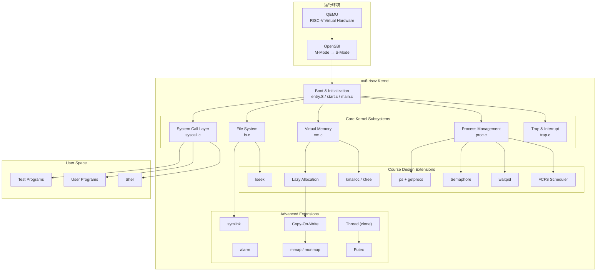
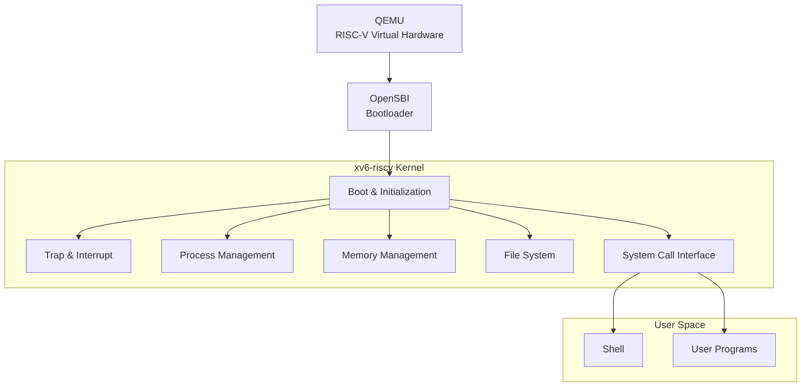
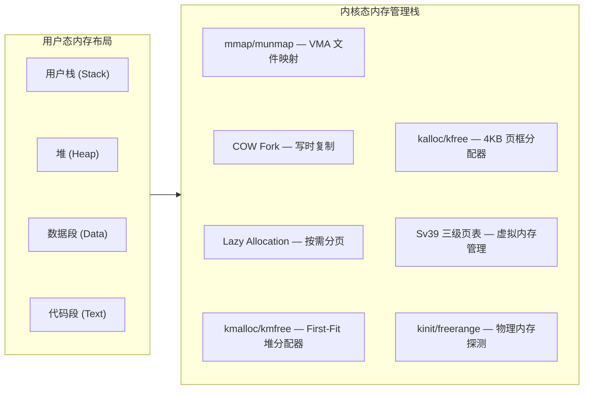
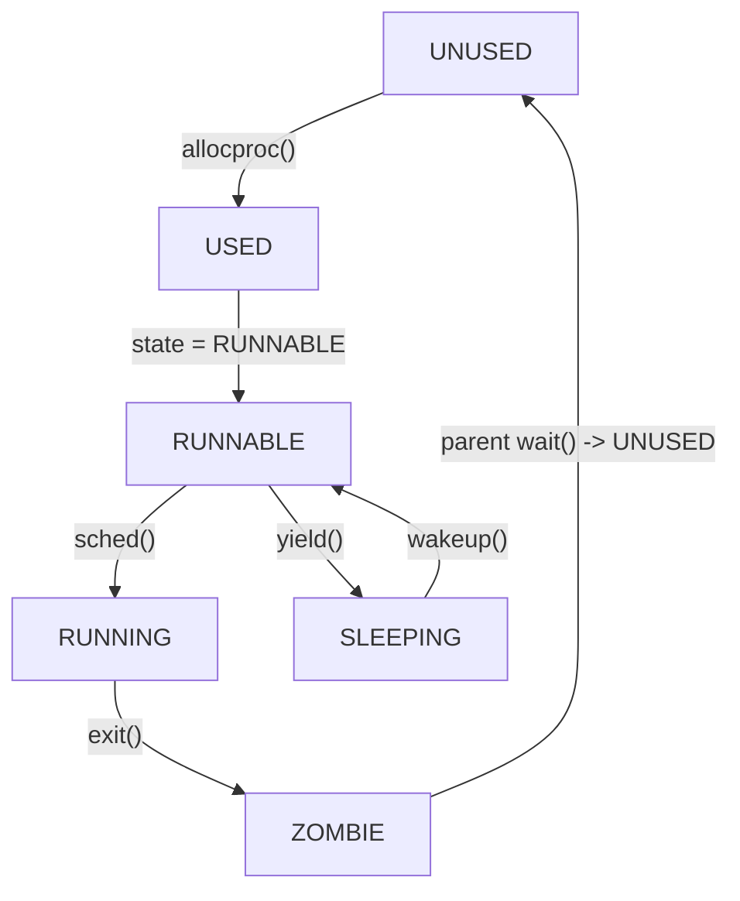
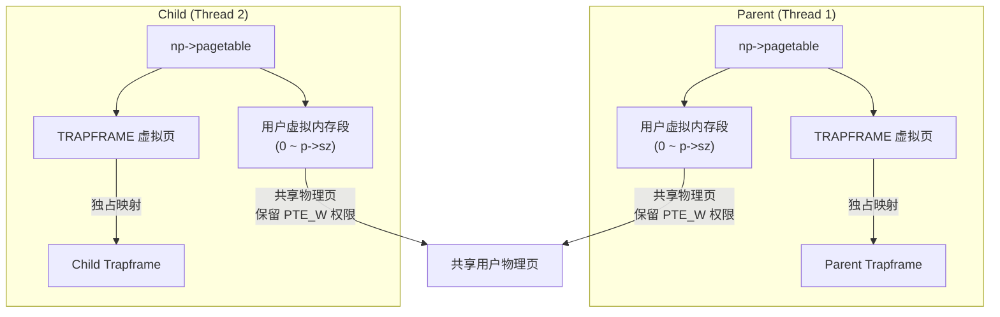

<!-- <div class="markdown-body"> -->

# 操作系统课程设计结题报告

- 姓名：袁善
- 学号：20231072030
- 日期：2026年6月20日


## 一、项目摘要

- **选题**：方案 A：OS 内核实现
- **基准**：基于 **MIT xv6-riscv**（`https://github.com/mit-pdos/xv6-riscv`），代码基线回退至 2023 年 1 月前的稳定状态
- **目标**：在完成课程要求功能的前提下，引入部分现代 Unix/Linux 内核设计思想，提高系统的完整性与可扩展性。
- **开发环境**：Windows (VSCode) + SSH 远程连接 + Ubuntu 22.04 虚拟机 + QEMU 模拟器
- **硬件与软件环境**
  - 宿主机 Windows 11 + VSCode 
  - 远程服务器 Ubuntu 22.04 LTS 
  - `riscv64-linux-gnu-gcc` 
  - 模拟器 QEMU 7.2.0（`qemu-system-riscv64`）
- **工作总结**
  - **功能实现**：
    - 实现共 37 个系统调用，其中增量实现 16 个。
    - 具体功能有：缺页异常处理、用户态异常分类拦截、kmalloc/kmfree 内核堆分配器、按需分页、COW Fork、mmap/munmap、FCFS 非抢占调度（RR/FCFS 切换）、waitpid、信号量、Alarm、lseek、Symlink、ps 命令、clone、futex 等。
    - 通过增量的 20 项单元测试与 xv6 原生的 usertests 测试，grind 压力测试运行数十分钟系统稳定无异常现象。
  - **性能验证**：
    - 移植 llama.c，运行 stories260K 模型，针对多核并行计算能力、同步原语的效率差异、以及存储映射的零拷贝优势三个方面设计实验。
    - 结论：xv6 的多核调度和 clone 线程机制能有效利用多核心；Futex 在无竞争时避免系统调用，相比较 Spinlock 与 Pipe，有效提升用户态同步效率；mmap 的冷启动延迟为 0 Ticks，实现零拷贝，避免启动时的阻塞等待。



## 二、项目完成情况

- **仓库地址**：`https://github.com/yuuichi33/OS`

### 2.1 功能实现
| 课程模块 | 课程要求功能 | 本项目扩展实现 | 
|:---------|:------------|:--------------|
| 系统启动 | M→S 态切换、内核加载、栈初始化、启动日志 | — |
| 中断与异常 | 时钟中断、键盘输入、ecall 系统调用 | 缺页异常处理（Lazy/COW/VMA）、用户态异常分类拦截（scause 2/13/15 诊断） |
| 内存管理 | 物理页分配、Sv39 虚拟内存 | kmalloc/kmfree 内核堆分配器、按需分页、COW Fork、mmap/munmap |
| 进程管理 | PCB、fork/exec、RR 调度 | FCFS 非抢占调度（RR/FCFS 动态切换）、waitpid（WNOHANG）、Semaphore 信号量、Alarm 异步定时器 | 
| 文件系统 | 目录文件操作、路径解析、重定向、mkfs | lseek（SEEK_SET/CUR/END）、Symlink 软链接 |
| 用户程序 | ELF 加载、Shell、管道 | ps 命令（getprocs 系统调用）、异常隔离（用户态崩溃不 panic） | 
| **扩展功能** | — | **alarm**、**COW Fork**、**mmap/munmap**、**clone 线程**、**futex 用户态锁** |

### 2.2 交付物

- 14 周提交进度报告，含技术方案、分工方案。
- 可运行源码及文档。
- 结题报告PDF，内容包括项目概述，技术方案，详细实现，系统运行功能测试，创新点，总结与展望等内容。
- 汇报PPT。

### 2.3 系统调用清单

共实现 **37 个系统调用**（原生 21 个 + 扩展 16 个）：

```
# 原生系统调用（21 个）
SYS_fork    SYS_exit    SYS_wait    SYS_pipe    SYS_read
SYS_kill    SYS_exec    SYS_fstat   SYS_chdir   SYS_dup
SYS_getpid  SYS_sbrk    SYS_sleep   SYS_uptime  SYS_open
SYS_write   SYS_mknod   SYS_unlink  SYS_link    SYS_mkdir
SYS_close

# 扩展系统调用（16 个）
SYS_getprocs    SYS_kmalloctest  SYS_sched_switch  SYS_waitpid
SYS_sem_alloc   SYS_sem_free     SYS_sem_wait      SYS_sem_signal
SYS_sigalarm    SYS_sigreturn    SYS_lseek          SYS_symlink
SYS_mmap        SYS_munmap       SYS_clone          SYS_futex
```

## 三、项目内容

### 3.1 系统设计目标与技术选型

xv6 是一个面向教学的 Unix 风格操作系统，其代码结构清晰、模块划分合理，完整实现了进程管理、虚拟内存管理、文件系统、系统调用和异常处理等核心机制。

RISCV：

本项目基于 riscv 架构的 xv6 `(https://github.com/mit-pdos/xv6-riscv)`进行增量式开发，重点参考 Linux 和开源项目 Re-XVapor `(https://github.com/sandyyyz/Re-XVapor)` 以及 MIT 6.S081。

本项目拟在保持 xv6 原有体系结构稳定性的前提下，逐步扩展其功能，实现课程设计要求的操作系统关键机制，并在此基础上引入部分现代 Unix/Linux 内核设计思想，提高系统的完整性与可扩展性。

系统设计目标如下：
- 熟悉 xv6-riscv 内核整体架构与启动流程；
- 掌握操作系统核心子系统的实现原理；
- 完成课程要求的内存管理、进程管理、文件管理等功能扩展；
- 完成额外增加的扩展功能；
- 建立统一的系统调用与资源管理框架；
- 构建可持续扩展的实验操作系统平台；
- 构建完整的测试与验证体系。

最终形成一个具备较完整内核功能的增强型 xv6 操作系统。

### 3.2 系统总体架构

系统采用经典的分层式结构设计。整体运行环境由 QEMU、OpenSBI 和 xv6 内核组成。



- **QEMU**：提供 RISC-V 虚拟硬件环境（`-machine virt`，4 核，128MB 内存）
- **OpenSBI**：完成机器态（M-Mode）到监管态（S-Mode）的初始化和特权级切换
- **xv6 内核**：负责 CPU、内存、磁盘、中断等全部资源的管理和系统服务
- **系统调用层**：提供用户态与内核态的交互接口（共 37 个系统调用）
- **用户空间**：运行 Shell 和应用程序

### 3.2 子系统设计与实现

#### 3.2.1 系统启动（Bootloader）

- 启动流程：
```
QEMU → OpenSBI (M-mode) → entry.S (各核栈初始化)
     → start.c (CSR 配置) → main.c (子系统初始化)
     → scheduler() → init → Shell
```

- 启动日志：

```
xv6 kernel is booting

hart 1 starting
hart 2 starting
hart 3 starting
$ _
```

系统在 QEMU 中稳定启动并进入 Shell，启动过程可复现，无异常重启。此部分完全复用 xv6 已实现功能。


#### 3.2.2 中断与异常处理（Trap & Interrupt）

xv6 采用基于 Trap 的统一异常处理框架。所有系统调用、异常和中断最终均通过 Trap 机制进入内核。RISC-V 架构中，`scause` 寄存器标识中断/异常类型：

| scause | 类型 | 说明 |
|:------|:----|:-----|
| 8 | 系统调用 | `ecall` 指令触发 |
| 2 | 非法指令 | 执行损坏指令 |
| 12 | 指令缺页 | 执行无权限内存 |
| 13 | 读缺页 | 读取未映射/无权限地址 |
| 15 | 写缺页 | 写入只读/未映射地址 |

- 异常分发流程
```
用户态运行 → 中断/异常 → trampoline.S → usertrap()
    ├── scause == 8  → 系统调用 → syscall() 分发
    ├── devintr != 0 → 硬件中断（时钟/键盘/磁盘）
    │     └── which_dev == 2 → 时钟中断 → alarm 检测
    └── 其他异常 → 分类拦截
          ├── scause 2  → 非法指令
          ├── scause 13 → 读段错误（Load Page Fault）
          │     ├── VMA 区间 → mmap 按需调页
          │     └── 堆区间  → Lazy Allocation
          ├── scause 15 → 写段错误（Store Page Fault）
          │     ├── VMA 区间 → mmap 按需调页
          │     ├── PTE_COW  → COW 分裂
          │     └── 堆区间  → Lazy Allocation
          └── 其他 → 打印诊断信息 → setkilled(p)
```

- 具体工作：
  - 修改 trap.c 中的 usertrap()，实现对非法指令（scause 2）与内存越界读写（scause 13/15）的分类识别。
  - 发生异常时，内核打印错误地址与指令并强制结束该进程（exit(-1)），保证内核和其他进程正常运行不崩溃。


#### 3.2.3 内存管理（Memory Management）

xv6 采用页式内存管理，本项目在其基础上构建了完整的内存管理层次结构：



#####  物理页框分配器（kalloc/kfree）

- 基于空闲链表（Free List），分配 O(1)，释放 O(1)
- 管理 128MB 物理内存（`PHYSTOP = 0x88000000`）
- 页框大小 4KB（`PGSIZE = 4096`）

```c
// kalloc.c — 物理页分配
void *kalloc(void) {
  struct run *r;
  acquire(&kmem.lock);
  r = kmem.freelist;
  if(r) kmem.freelist = r->next;
  release(&kmem.lock);
  if(r) {
    page_ref.counts[(uint64)r / PGSIZE] = 1; // 引用计数初始为 1
  }
  return r;
}
```

##### 内核堆分配器（kmalloc/kmfree）

基于 xv6 现有的物理页分配器（kalloc/kfree），在其之上构建一个内核级字节级动态内存分配器 kmalloc 与 kmfree。

- 基于首部链表（First-Fit Header）实现。申请时自动进行 8 字节对齐并按需拆分空闲块；无可用块时，向底层页分配器索要全新物理页。
- 在 kmfree 中实现了物理连续空闲块的自动检测与合并，有效防止了内存碎片的产生。
- 使用独立的自旋锁保护分配链表，保证了多 CPU 并发分配下的数据安全。


##### 按需分页（Lazy Allocation）

- 参考：https://pdos.csail.mit.edu/6.S081/2020/labs/lazy.html

- 传统的 sbrk(n)：用户请求增加 n 字节内存。内核立刻调用 kalloc 申请物理页，并通过 mappages 建立虚拟到物理的映射。这在请求很大时非常耗时，且很多程序申请了内存却根本不使用。
- Lazy 延迟分配：
  - 申请时：sbrk 不分配任何物理页，也不修改页表。它仅仅把进程的大小 p->sz 往上累加 n 字节，然后立刻返回。
  - 触发时：当用户程序实际开始读写这片“虚拟”内存时，由于没有建立物理映射，CPU 会瞬间触发 Page Fault（缺页异常）。
- 内核拦截处理：内核在 usertrap() 中拦截到这个异常，检查该异常地址是否在 [0, p->sz) 的合法堆区间内。如果在，内核在此刻才调用 kalloc 申请一页物理内存，并用 mappages 建立映射，然后让用户程序重新执行刚才那条指令。

- 具体工作
  - 修改 sys_sbrk。当进程申请增加堆内存时，仅抬高虚拟地址边界 p->sz，不实际分配物理页、不修改页表。在缩减内存时，依然立刻释放物理页。
  - 在 usertrap() 中拦截读缺页（scause 13）与写缺页（scause 15）异常。当地址处于 `[0, p->sz)` 合法堆区间内时，通过 kalloc 动态申请物理页并通过 mappages 补齐映射。
  - 重构 walkaddr() 和 copyout()。当用户进程将尚未映射的 Lazy 内存指针传给 read/write 等系统调用时，内核在执行虚拟地址转换时能自动透明地为其补齐分配物理页。
  - 修改 uvmunmap 与 uvmcopy，使其在执行页表释放或 fork 拷贝时，遇到尚未分配物理页的 Lazy 页面时直接 continue，不再 Panic。

- debug 记录：最初在 usertrap 中使用 walkaddr 检测地址是否映射，但 walkaddr 已被重构为自动分配物理页，导致重复分配。解决方案：改用 walk(pagetable, va, 0) 做纯页表查询。

##### 写时复制（Copy-On-Write Fork）

- 参考：https://pdos.csail.mit.edu/6.S081/2025/labs/cow.html

- 原生的 fork 拷贝父进程所有的物理内存给子进程。
- COW ：在 fork 调用 uvmcopy 时，完全不分配新的物理页。子进程的页表直接指向父进程相同的物理地址。同时，将父进程和子进程中所有可写的页表项全部清除写权限（清除 PTE_W），并打上自定义的写时复制标记 PTE_COW。
- 物理页引用计数（Reference Count）：
  - 由于多个进程的页表同时指向同一个物理页，传统的“进程退出即释放物理页”逻辑将导致系统崩溃。
  - 在 kalloc.c 中引入一个全局数组 page_ref。当物理页被多处共享映射时，引用计数递增；当进程释放映射（kfree）时，引用计数递减。只有当引用计数递减到 0 时，该物理页才会被真正归还给空闲链表。
- 缺页中断分割（Split on Write）：
  - 当父进程或子进程尝试修改打上 PTE_COW 标记的只读页面时，CPU 触发 scause 15（写缺页异常）。
  - 内核拦截该异常，读取该物理页的引用计数：
    - 如果计数为 1：说明其他共享该页的进程已经退出了，当前进程是该页的唯一拥有者。我们直接将该页的 PTE_COW 清除，重新赋予 PTE_W 写权限，无需任何拷贝，原地通过。
    - 如果计数 > 1：说明还有其他进程共享该页。我们调用 kalloc 申请一个新物理页，将原页内容通过 memmove 拷贝过去，在当前进程页表中重新映射并开启 PTE_W 权限，最后将原物理页的引用计数递减（调用 kfree）。

- 具体工作
  - 重构 uvmcopy，在 fork 时不复制物理内存，仅复制页表项，清除 PTE_W 写权限并打上自定义的 PTE_COW 标记。
  - 在 kalloc.c 中设计全局自旋锁保护的物理页计数器 page_ref。重构 kalloc 与 kfree，仅在引用计数递减到 0 时才真正归还物理空闲链表。
  - 在 usertrap 中捕获 scause 15 写异常。若多进程共享则调用 cow_alloc 申请新页拷贝数据；若当前进程独占该页（计数为 1），则直接还原写权限，免去拷贝开销。
  - 在 copyout() 中加入 PTE_COW 拦截与主动分裂，保障内核态向用户态写回数据时的安全性。

##### mmap/munmap 文件内存映射

- 参考：https://pdos.csail.mit.edu/6.S081/2025/labs/mmap.html

- 在传统的物理 I/O 中，用户读写文件必须通过 read/write 系统调用，这涉及到“磁盘 -> 内核缓存 -> 用户缓存”的多次数据拷贝，开销极大。 mmap（Memory Mapping） 采用另一种设计：直接把磁盘上的文件，映射到进程的虚拟地址空间中。
- 核心原理（Lazy File Loading）
  - 当用户调用 mmap(addr, len, prot, flags, fd, offset) 申请文件映射时：
    - 内核同样不分配物理内存，也不读取文件
    - 内核只在进程的 PCB 中，记录一块全新的虚拟内存区域——VMA（Virtual Memory Area，虚拟内存区域）。
    - VMA 记录了这片虚拟地址的起点、长度、读写权限（prot）、映射标志（flags，如共享 MAP_SHARED 或私有 MAP_PRIVATE）以及对应的文件指针 f 和偏移量。
- 缺页装载（On-Demand Paging）
  - 当进程第一次访问这片 VMA 虚拟地址时，CPU 触发缺页异常（Page Fault）。
  - 内核拦截异常，并在 usertrap 中发现异常地址处于某一个 VMA 范围内：
    - 调用 kalloc 申请一个物理页；
    - 从该 VMA 记录的文件中，调用 readi 自动将对应的数据块读取到新分配的物理页中；
    - 用 mappages 将物理页映射到该缺页虚拟地址。
    - 用户程序无缝地继续执行，此时它已经可以直接像读写内存数组一样，读写磁盘文件了。
- 内存回写与释放（munmap）
  - 当用户调用 munmap(addr, len) 时：
    - 如果映射标志是 MAP_SHARED（共享映射）且页面被修改过（Dirty 页），内核必须通过 writei 将该内存页的数据刷回磁盘文件，保证修改不丢失。
    - 然后，通过 uvmunmap 拆除该虚拟地址的页表映射并释放物理页。

- 实现要点：
  - 设计虚拟内存区域 struct vma 结构，并在 PCB 中维护进程最大 16 个 VMA 映射槽。
  - 实现 sys_mmap 系统调用。在 mmap 时仅在 VMA 中登记边界，不进行实际物理分配。在发生 VMA 区间缺页时，动态申请物理页，并调用 readi 将磁盘对应的文件块按需调入物理内存。
  - 在 sys_munmap 和 exit() 时，遍历映射区间，若为 MAP_SHARED 且已被建立物理映射的页，通过 writei 自动将脏数据刷回对应磁盘文件。
  - 在 sys_sbrk 中实现动态上限检测，限制进程大小不能超过 VMA 的最低起始地址，防止堆与 VMA 重叠。

- debug 记录： 
  - fork_test 报错 `panic: sched locks`，原因是 VMA 的 writei 回写操作放在了 exit() 的 acquire(&wait_lock) 之后，违反了"持锁不能睡眠"的规则。解决方案：将 VMA 释放逻辑移至 exit() 最开头。
  - 在 fork_test 中，子进程在执行 VMA 数据校验时，报错 `mismatch at 2048, wanted 'A', got 0x0`。原因是遗漏了更新文件偏移量 `v->offset`。解决方案：增加`v->offset += len;`，使文件偏移量与虚拟起点同步向后挪动。


#### 3.2.4 进程管理（Process Management）

##### PCB 结构（struct proc）

**进程状态机：**


##### FCFS + RR 调度器


- RR（Round-Robin）：时间片轮转，每次时钟中断（`which_dev == 2`）都会调用 `yield()` 让出 CPU。
- FCFS（First-Come-First-Served）：非抢占，进程一直运行到主动退出或阻塞。
- 动态切换：引入全局变量 `sched_mode`（`0` 表示 RR，`1` 表示 FCFS），并通过一个系统调用允许用户态动态修改。

- 具体工作
  - 创建 ctime 时间戳，在 proc.c 的 scheduler() 中实现 FCFS 策略，调度时选取 ctime 最小（最早创建）的就绪进程。
  - 修改 trap.c 实现非抢占的 FCFS。
  - 新增 sched_switch 系统调用和 sche 命令，支持切换调度模式。


##### waitpid 机制

支持父进程等待指定子进程退出：

- 若传入 pid > 0，内核仅查找、回收 PID 匹配的特定子进程；若传入 pid == -1，则兼容普通 wait，回收任意子进程。
- 非阻塞支持：支持首部选项 WNOHANG（值为 1）。当指定该选项且目标子进程尚未退出时，内核立即返回 0，避免了父进程无意义的挂起等待。

##### 信号量（Semaphore）

- 信号量（Semaphore）的机制与原理
  - 同步机制，本质上是一个受保护的整型变量 count，配合一个自旋锁 lock，用来控制多个进程对共享资源的访问。
  - 两个核心操作（P 操作 和 V 操作）
    - P 操作（Wait / Down，申请资源）
      - 原理：将信号量的值 count 减 1。
      - 如果减 1 后 count >= 0，说明还有空闲资源，进程继续执行。
      - 如果减 1 后 count < 0，说明资源已耗尽，进程必须挂起等待（进入睡眠状态）。
    - V 操作（Signal / Up，释放资源）
      - 原理：将信号量的值 count 加 1。
      - 如果加 1 后 count <= 0，说明有进程正在因为资源耗尽而睡眠，此时内核需要唤醒一个正在睡眠的进程。
  - 与 xv6 的 sleep / wakeup 结合
    - sleep(void *chan, struct spinlock *lk)：让当前进程在通道 chan 上睡眠。
    - wakeup(void *chan)：唤醒所有在通道 chan 上睡眠的进程。
    - 可以直接把信号量结构体本身的内存地址 s 作为睡眠通道 chan

  - P 操作中：如果资源不够，调用 sleep(s, &s->lock)。
  - V 操作中：释放资源后，调用 wakeup(s) 唤醒在该地址上睡眠的进程。

- 具体工作
  - 利用已实现的 kmalloc/kmfree 动态地管理信号量。
    - 定义 sem 结构体。
    - 动态分配 (sem_alloc)与动态释放 (sem_free)：利用 kmalloc() 动态申请信号量结构体，并将 64 位内核指针句柄传回用户态；释放时通过 kmfree() 彻底回收内存归还给堆。
    - P/V 操作：采用信号量自身的内存地址作为 xv6 sleep/wakeup 的共享通道。P 操作（sem_wait）在资源不足时将进程挂起，V 操作（sem_signal）在释放资源时精准唤醒通道上的等待进程。

##### Alarm 异步定时器

- 参考：https://pdos.csail.mit.edu/6.S081/2025/labs/traps.html

sigalarm 机制在内核中本质上是一种用户态异步信号中断与恢复。其核心控制流转换原理分为以下五个阶段：

- 时钟中断触发：用户程序在用户态正常运行时，硬件时钟中断将其强制陷入内核态 usertrap()。内核检测到时钟中断（which_dev == 2）后，对当前进程的累计滴答数（alarm_ticks）进行累加。
- 现场暂存（存档）：当累计滴答数达到用户设定阈值，且当前未处于报警处理状态时，内核利用已实现的 kmalloc 分配空间，将当前进程的 trapframe 现场（包含所有通用寄存器、程序计数器 epc 等）完整备份至 alarm_tf 中。
- 控制流重定向（跳转）：内核将进程当前 trapframe->epc 强行修改为用户注册的警报处理函数（handler）的虚拟地址。当中断返回（usertrapret）至用户态时，CPU 强行跳转去执行报警逻辑。
- 防嵌套重入（隔离）：引入 alarm_running 状态标志。在警报处理函数运行期间，屏蔽后续时钟中断的二次警报触发，防止发生嵌套中断导致调用栈溢出或寄存器覆盖。
- 现场恢复（读档）：警报函数执行完毕后，用户态主动发起 sigreturn 系统调用。内核将备份的 alarm_tf 现场完整写回当前 trapframe，并复位 alarm_running。系统调用返回后，用户程序在原被打断处无缝恢复执行。


```
时钟中断触发
  → alarm_ticks++
  → alarm_ticks == alarm_interval?
     → 是：备份 trapframe → epc = alarm_handler → alarm_running = 1
     → 否：继续运行
  → 返回用户态 → CPU 跳转到 handler 执行
     → handler 内调用 sigreturn()
        → 恢复 trapframe 备份 → alarm_running = 0
        → 原中断点继续执行
```


#### 3.2.5 文件系统（File System）

xv6 使用日志型文件系统，主要由 Buffer Cache、Logging Layer、Inode Layer、Directory Layer 组成。

##### lseek 文件定位

- 操作系统在 struct file 中使用 off 字段记录当前文件的读写位置（偏移量）。默认的 read 和 write 会自动递增这个值。
- lseek(fd, offset, whence) 系统调用的目的，就是强行修改这个 off 偏移量，从而实现文件任意位置的随机读写。
- whence 参数控制流设计：
  - SEEK_SET (0)：新偏移量设为 offset（绝对定位）。
  - SEEK_CUR (1)：新偏移量设为 当前 off + offset（相对当前位置定位）。
  - SEEK_END (2)：新偏移量设为 文件大小 size + offset（相对文件末尾定位）。需要通过 ilock(ip) 锁住索引节点，以安全读取 ip->size。
- 异常边界防御：
  - 必须拦截非法文件描述符（fd）。
  - 必须拦截非正规文件（管道 FD_PIPE、控制台 FD_DEVICE 均不支持 lseek，应返回 -1）。
  - 必须拦截非法的 whence 参数。
  - 必须拦截计算后小于 0 的非法偏移量（偏移量不允许为负数，返回 -1）。

- 具体工作
  - 实现 sys_lseek，支持 SEEK_SET、SEEK_CUR、SEEK_END 三种标准定位模式。
  - 引入 inode 级别的睡眠锁保护，确保多核/多进程并发访问时，文件大小 size 读取和偏移量 off 改写具有强一致性。
  - 建立边界异常防御，成功拦截并过滤非法文件描述符（fd）、非 Regular 文件类型（管道/控制台设备）以及越界负数偏移。

##### Symlink 软链接

- 参考：https://pdos.csail.mit.edu/6.S081/2025/labs/fs.html

- 一个特殊类型的文件（类型标记为 T_SYMLINK）。
- 数据块（Data Blocks）中存储的是另一个文件的目标路径名（Target Path）。
- 动态递归解析算法：
  - 当用户调用 open("path", flags) 且未指定 O_NOFOLLOW 标志时：
    - 如果该文件类型是 T_SYMLINK，内核需要读取其数据块内容（获取目标路径 target）。
    - 解锁并释放当前软链接节点，调用 namei(target) 寻找到下一个节点。
- 死循环防御（环路检测）：如果软链接形成环路（如 A -> B -> A），会导致无限递归。我们设置一个计数器 depth，一旦解析深度超过 10 层，判定为环路死锁，立即返回 -1 报错。

- 具体工作
  - 定义软链接文件类型 T_SYMLINK（值为 4），实现 sys_symlink 系统调用，将链接目标路径通过 writei 动态存入软链接 Inode 的数据块中。
  - 重构 sys_open。当打开软链接且未指定 O_NOFOLLOW 时，内核通过 readi 递归读取目标路径并解析。设定最大递归深度为 10，防御环路软链接导致的内核死锁。

#### 3.2.6 多线程机制（Clone）

轻量级进程（线程）的核心特征是：共享虚拟内存空间（页表）和文件描述符，但拥有独立的 CPU 寄存器上下文和独立的用户态栈。
- 线程安全页表引用计数器
  - 在多核 QEMU 环境下，如果直接把父进程的 pagetable 赋予子线程，那么任何一个进程/线程在退出调用 freeproc 时都会尝试销毁页表。为了防止 double free 和内核崩溃，我们必须引入一个用自旋锁保护的页表引用计数指针 pagetable_ref：
    - 普通进程初始化：在 allocproc 中，从内核堆中通过 kmalloc 分配一个整型变量，初始值设为 1。
    - 派生子线程时：在 clone 系统调用内，不复制页表，直接将子线程的 pagetable_ref 指向父进程的引用计数，并在自旋锁保护下执行 (*pagetable_ref)++。
    - 线程/进程销毁时：在 freeproc 内，在自旋锁保护下执行 (*pagetable_ref)--。只有当计数归零（即最后一个线程退出）时，才真正执行 proc_freepagetable 回收页表和引用计数器本身。
- 用户态独立栈与寄存器设置
  - 在 RISC-V 架构中，函数的调用约定对栈指针对齐有严格要求：
    - 栈必须是 16 字节对齐的，且向下生长。
    - 新线程的 trapframe->epc 设为入口函数 fn。
    - trapframe->sp 设为用户态为其传入的对齐后的栈顶地址。
    - trapframe->a0 设为传参值 arg。

采用独立顶级页表、用户空间物理共享方法实现 clone 线程机制。



- 顶级页表与 Trapframe 独立：每个线程在被 allocproc 分配时，都拥有自己物理独立的 np->pagetable。在这个顶级页表里，TRAPFRAME 虚拟页精准且独占地映射到它各自的 np->trapframe 物理页。这彻底消除了多核并发切换特权级时的寄存器写冲突。
- 虚拟用户空间物理共享：实现 uvmsharecopy 函数。在 clone 时，遍历父进程的用户地址映射（0 到 p->sz），将映射关系直接复制到子线程的页表项中，保留原有的读/写/执行等权限（不标记 PTE_COW），并直接递增物理页的底层引用计数 ref_inc。

- 具体工作
  - 通过 allocproc 为子线程分配独立的页表以单独映射 trapframe，避免了多个线程在同一页表下并发写入 TRAPFRAME 导致的寄存器冲突。
  - 新增 uvmsharecopy 函数，将父进程 0 到 p->sz 的页表项直接拷贝给子线程，使其指向相同的物理页并保留写权限（不打 PTE_COW 标记），同时调用写时复制阶段实现的 ref_inc 递增物理页引用计数。
  - 在子线程的 trapframe 中设置 epc 为入口函数、sp 为用户栈顶、a0 为传参，实现独立的寄存器上下文。
  - 在 struct proc 中增加 is_thread 和 tgid（线程组 ID）字段。
  - 线程退出时通过 freeproc 销毁各自独立的页表，共享的物理内存页面则由 uvmunmap 在引用计数递减为 0 时安全释放。


#### 3.2.7 Futex 用户态快速同步锁

传统的信号量或互斥锁在每次加锁/解锁时都需要陷入内核（System Call），开销较大。

Futex（Fast Userspace Mutex）的核心思想是无竞争时在用户态通过原子指令完成加锁/解锁，有竞争时才陷入内核。
  - 无竞争时在用户态通过原子指令完成加锁/解锁：利用原子操作（如 RISC-V 的 amoswap 或 lr.w/sc.w）在用户态直接修改锁变量（0 或 1）。
  - 有竞争时才陷入内核：当用户态发现锁已被占用，调用 sys_futex(uaddr, FUTEX_WAIT, val) 让出
    CPU；锁持有者释放锁时，若发现有等待者，调用 sys_futex(uaddr, FUTEX_WAKE,
    val) 唤醒等待线程。 FUTEX_WAKE, 1)

- 具体工作
  - 虚拟地址物理转换作为 Key、全局锁控制睡眠锁序方法实现 futex 同步机制。
  - 使用 walkaddr 结合地址偏移，将锁的虚拟地址（uaddr）转换为物理地址（paddr）作为在内核态 sleep 和 wakeup 的通道标识（chan）。
  - 在 FUTEX_WAIT 分支，获取全局自旋锁 futex_lock 并通过 copyin 读取锁的实数值。若实数值与期望值 val 不符，立即释放锁返回，防止在检查与睡眠之间因发生线程切换导致的 Lost Wakeup（丢失唤醒）隐患；若值相符，则获取进程锁 p->lock，修改状态为 SLEEPING，释放 futex_lock 并调用 sched() 挂起进程。
  - 在 FUTEX_WAKE 分支，获取 futex_lock 并遍历进程表，寻找状态为 SLEEPING 且等待通道为该物理地址 paddr 的进程，精准唤醒最多 val 个。


## 四、测试与验证

### 4.1 测试方案

- 单元测试：针对新增功能分别自行设计测试程序或引入官方测试文件，精准验证单一模块功能的正确性。
- 异常测试：构造非法内存访问和异常系统调用场景，验证系统异常隔离能力和资源回收能力。
- 系统测试：运行 xv6 原生测试集 usertests ，全面验证进程管理、内存管理、文件系统及系统调用等核心功能的正确性与兼容性。
- 压力测试：运行 xv6 原生的 grind 测试，测试系统稳定性。
- 集成测试：实现统一测试框架 alltests.c，对新增功能测试、异常测试以及 xv6 原生 usertests 进行统一调度，实现一键式自动化测试。通过集成运行验证各模块之间的兼容性与协同工作能力，并检查系统整体稳定性。

具体：[测试说明文档](devlog/test.md) `(devlog/test.md)`

### 4.2 单元测试详情

- crash_test.c：非法指令拦截、越界地址读取、越界地址写入、只读区域保护、内核异常隔离。
- ps.c：系统调用异常防御、进程状态边界映射、越界状态安全防护。
- kmalloctest.c：接口错误检测、内核堆功能验证、跨页大内存测试。
- sched.c：命令行参数完整性检验、调度模式合法性过滤。
- schedtest.c：先来先服务（FCFS）非抢占功能验证、时间片轮转（RR）并发抢占、时间戳顺序选取验证。

- waitpidtest.c：验证非阻塞（WNOHANG）、验证精准 PID 阻塞回收、通配符（-1）回收、退出状态码（Exit Status）回写。

- semtest.c：空指针/无效句柄防御、无需睡眠的即时获取、无需唤醒的即时释放、动态堆内存泄漏测试。

- alarmtest.c 
  - 参考 https://github.com/mit-pdos/xv6-riscv-fall19/blob/xv6-riscv-fall19/user/alarmtest.c

  - 官方的 alarmtest.c 包含了三个递进的严格测试：
    - test0：验证基础拦截与控制流跳转
    - test1：验证寄存器完整性
    - test2：验证重入锁保护（防嵌套中断）

- lseektest.c：测试非法 fd、测试非 Regular 文件（如 stdin）、测试非法 whence、测试计算后为负数的偏移量；分别精确写入、定位、并读取校对 SEEK_SET、SEEK_CUR 和 SEEK_END 三种定位效果。

- symlinktest.c
  - 参考：https://github.com/mit-pdos/xv6-riscv-fall19/blob/xv6-riscv-fall19/user/symlinktest.c

  - 软链接创建与类型校验、路径透明解析与读写、断头链接防御、环路死锁自动熔断、多级链条递归追踪、高并发多核压力测试。

- lazytests.c
  - 参考：https://github.com/mit-pdos/xv6-riscv-fall19/blob/lazy/user/lazytests.c
  - 基础延迟分配（lazy alloc）、延迟页面释放（lazy unmap）、物理内存耗尽（out of memory）。

- cowtest.c
  - 参考：https://github.com/mit-pdos/xv6-riscv-fall19/blob/xv6-riscv-fall19/user/cowtest.c
  - 内存压力测试（simpletest）、三进程并发写入测试（threetest）、系统调用写安全测试（filetest）。

- mmaptest.c
  - 参考：https://github.com/mit-pdos/xv6-riscv-fall19/blob/xv6-riscv-fall19/user/mmaptest.c
  - 基础映射与解映射测试（mmap_test）、父子进程页表隔离测试（fork_test）。

- clonetest.c：基础传参验证、物理内存共享验证、栈隔离验证、多核生命周期压力测试。

- futextest.c：原子 Fastpath 测试、Lost Wakeup 防御测试、Slowpath 互斥同步测试、多核心多线程并发锁竞争压力。

### 4.3 官方综合测试 usertests 与 压力测试 grind

- `usertests` 是 xv6 官方测试集，覆盖：
  - 系统调用参数合法性：非法用户指针、越界地址、超长字符串
  - 进程与内存管理：fork、wait、exit、kill、sbrk
  - 文件系统功能：文件创建、删除、读写、链接、目录操作
  - 并发与压力：大量并发 fork、文件操作竞争
  - 异常与鲁棒性：非法内存访问、资源耗尽

- `grind` 创建两个子进程，高强度随机执行 23 种操作（fork、kill、文件读写、sbrk、管道等），在持续运行过程中未出现 panic、死锁或异常退出。字符交替输出（如 `ABBABA`）表明多核同步锁设计正确。

### 4.5 测试结果

运行 `alltests` 全量通过（`PASS: 21/21`）；grind 连续运行数分钟，系统稳定。

<center></center>

## 五、LLM 推理引擎移植与性能验证

在 `alltests` 测试全部通过、`grind` 长时间运行系统稳定的前提下，本项目基于移植的 llama2.c 推理引擎设计了三个性能实验。

实验程序 `llama.c` 移植自 [karpathy/llama2.c](https://github.com/karpathy/llama2.c)，模型使用 [stories260K.bin](https://huggingface.co/karpathy/tinyllamas)（约 1.04MB），分词器使用 `tok512.bin`。

### 5.1 llama.c：在 xv6 中运行一个简化版大模型

`llama.c` 是一个极简的 Transformer 推理程序。它加载预训练好的模型权重，根据提示词逐个生成后续的 Token。每次生成一个 Token，都要做一次完整的神经网络前向计算：把当前 Token 的向量表示经过多层 Transformer 层的矩阵运算和注意力计算，得到下一个 Token 的概率分布，再从中采样出一个 Token 输出。

原版 `run.c` 依赖 Linux 的数学库（`<math.h>`）、OpenMP 多线程（`#pragma omp parallel for`）和标准文件 I/O（`fopen`/`fread`）。xv6 的用户态不提供这些，本项目做了以下三方面的移植：
  - Transformer 推理需要 `exp`、`sqrt`、`sin`、`cos`、`pow` 等数学函数做注意力机制中的 RoPE 旋转位置编码和 Softmax 归一化。xv6 没有 `<math.h>`，因此用数值方法手写这些函数。

  - 原版用 OpenMP 自动并行化矩阵乘法。本项目采用静态线程池。

  - 此外，为对比同步开销，实现了三种同步机制：
    - Spinlock：空转等待 `start_signal` 变化，不做系统调用但浪费 CPU
    - Pipe：通过 `read()`/`write()` 系统调用在管道上阻塞/唤醒，每次同步都陷入内核
    - Futex：无竞争时用户态快速返回，有竞争时通过 `futex_wait`/`futex_wake` 挂起/唤醒

  - 用 `open`/`read`/`stat`/`close` 替代 `fopen`/`fread`/`ftell`/`fclose`。模型加载支持两种方式：
    - `mmap`：通过内存映射，零拷贝按需加载
    - `malloc + read`：先申请内存，再从磁盘读到用户缓冲区

**推理流程**

```
main() → 加载模型权重 + 分词器
       → generate():
           1. init_test_pool()      // 创建工作线程池
           2. for pos = 0..steps:   // 逐个生成 Token
                forward()           //   Transformer 前向计算
                  matmul() × 7/层   //   矩阵-向量乘（多线程并行）
                  attention         //   注意力机制
                  rmsnorm           //   归一化
                sample()            //   从概率分布采样
                printf("%s", token) //   输出当前 Token
           3. destroy_test_pool()   // 回收工作线程
```

其中 `forward()` 是最核心的函数，对每一层 Transformer 依次执行：
- 7 次 `matmul()`（查询 Q、键 K、值 V、输出 O、前馈网络 w1/w2/w3）
- RoPE 旋转位置编码
- Self-Attention（多头注意力计算）
- 残差连接 + RMS 归一化
- SiLU 激活函数

`matmul()` 是整个程序的计算瓶颈（占 >90% 的时间），它计算的是 $\text{xout} = W \times x$——用一个大矩阵 $W$（权重）乘一个向量 $x$（当前激活值），结果是一个新向量 $\text{xout}$。矩阵的每一行可以独立计算，适合并行化。


### 5.2 实验一：多核可扩展性实验

- 实验目的：验证多线程并行计算能否有效加速推理。把 `matmul()` 中的矩阵行切分到多个核心上并发执行，观察随着线程数增加，生成 Token 的速度能提升多少。

- 实验设计
  - 使用 Futex 同步，分别在 RR（轮转）和 FCFS（先来先服务）两种调度策略下测试。
  - QEMU 模拟器配置为 4 核心（-smp 4），并发线程数分别取 1、2、4，以对应并模拟“单核单线程”、“双核双线程”与“四核四线程”。
  - 每个配置重复 3 轮，每轮生成 10 个 Token。
  - 统计每轮的总 Ticks（时钟中断次数），计算均值和加速比。
  - 由于所采用的 stories260K 模型隐藏层维度仅为 64，单次矩阵运算的物理耗时远小于 sys_futex 的内核陷入与上下文切换开销，导致无法显现并行优势。本实验在 matmul 算子最内层循环中引入计算密度放大因子（FACTOR = 100），通过增大单次任务的算术强度，评估该系统的性能。

- 实验结果

    | 调度模式 | 线程数 | 轮 1 | 轮 2 | 轮 3 | 平均 Ticks | 加速比 |
    | :--- | :--- | ---: | ---: | ---: | ---: | ---: |
    | **RR** | 1 | 36 | 39 | 35 | **36.7** | 1.00× |
    | | 2 | 23 | 25 | 24 | **24.0** | 1.53× |
    | | 4 | 20 | 20 | 20 | **20.0** | 1.84× |
    | **FCFS** | 1 | 35 | 35 | 36 | **35.3** | 1.00× |
    | | 2 | 24 | 25 | 25 | **24.7** | 1.43× |
    | | 4 | 21 | 22 | 22 | **21.7** | 1.63× |

- 结果分析
  - RR 模式下 1→2 获得了 1.53× 的加速，FCFS 也达到 1.43×。这说明 `matmul()` 的矩阵行切分是有效的——两个核心分担计算量，执行时间显著缩短。
  - RR 从 2 线程到 4 线程只从 24.0 降到了 20.0 Ticks，这并不是线性加速。原因在于：
    - Amdahl 定律：程序中的串行部分（RoPE、Attention 的单线程计算、同步开销）限制了加速比上限
    - 内核锁竞争：多核同时运行会竞争 xv6 内核中的调度器锁和内存分配锁
    - 同步开销：每次 `matmul()` 结束都需要 workers 和主线程同步（futex 操作），这部分是串行的
  - RR 与 FCFS 的差异不大，但 RR 略优。这是因为推理过程中线程频繁睡眠和唤醒，RR 的抢占式调度能让就绪的 worker 更及时地获得 CPU。
  - 4 线程仍比 1 线程快约 1.8×，说明多线程并行化是有效的，xv6 的内核能够支撑一定程度的并发计算。


### 5.3 实验二：同步机制对比实验

- 实验目的：多线程并行计算时，工作线程之间、工作线程与主线程之间需要同步。三种同步方式的设计哲学不同，带来的开销差异也很大。本实验量化对比它们在实际推理中的性能影响。

- 三种同步方式的工作原理

  1. Spinlock（用户态自旋）
        ```c
        while (work_pool.start_signal == last_signal) { }  // 空转等待
        ```
    工人不停地读 `start_signal` 这个内存变量，直到主线程把它改掉。不进入内核，没有系统调用开销。但等待期间 CPU 完全空转，占一个核心。

  2. Pipe（管道 I/O）

        ```c
        read(worker_pipes[id][0], &c, 1);  // 工人阻塞读管道
        write(worker_pipes[i][1], &c, 1);  // 主线程写一个字节唤醒
        ```

    工人通过 `read()` 系统调用阻塞在管道上，主线程通过 `write()` 唤醒它。每次同步都完整走一遍系统调用（用户态→内核态→用户态），有上下文切换开销。

  3. Futex

        ```c
        futex((void*)&work_pool.start_signal, FUTEX_WAIT, last_signal);  // 工人等待
        futex((void*)&work_pool.start_signal, FUTEX_WAKE, num_threads);   // 主线程唤醒
        ```

    - 如果 `start_signal` 已经变化，`futex` 立即返回，不进入睡眠。
    - 如果 `start_signal` 没变，则进入内核挂起。

    区别：Pipe 每次同步都陷入内核，Futex 只在确实需要睡眠时才陷入内核。

- 实验设计
  - RR 调度，4 个线程，3 轮重复，每轮生成 10 个 Token
  - 分别使用 Spinlock、Pipe、Futex 三种同步方式

- 实验结果

    | 同步方式 | 轮 1 | 轮 2 | 轮 3 | 平均 Ticks | 相比 Spinlock |
    | :--- | ---: | ---: | ---: | ---: | ---: |
    | Spinlock | 270 | 266 | 269 | **268.3** | - |
    | Pipe | 36 | 33 | 32 | **33.7** | 快 87.4% |
    | Futex | 20 | 20 | 21 | **20.3** | 快 92.4% |

- 结果分析
  - Spinlock 是最差的，比 Pipe 慢约 7 倍，比 Futex 慢约 13 倍。原因：4 个工人加主线程共 5 个进程，在 4 核上总有一个进程在空转等待。Spinlock 在等待时并不让出 CPU，而是原地打转。如果主线程和工人恰好都在空转，CPU 就被完全浪费了。
  - Pipe 快了很多，因为它通过 `read()` 阻塞让出了 CPU。等待的工人被内核挂起，CPU 可以运行其他就绪的进程。等主线程发来信号后，工人被唤醒继续计算。额外开销来自每次同步的系统调用上下文切换。
  - Futex 最快，比 Pipe 快了约 40%。原因在于：Futex 在无竞争时直接返回，不进入内核；只有需要睡眠时才陷入内核挂起。
  - 这个结果符合 Futex 的理论设计优势：Fast-path（无竞争时在用户态解决）与 Slow-path（有竞争时才陷入内核）。


### 5.4 实验三：存储映射冷启动对比实验

- 实验目的：模型权重文件 `stories260K.bin` 约 1.04MB，在 xv6 的启动阶段加载到内存中。两种加载方式`malloc + read` 和 `mmap`，在首次加载（Cold-start）的延迟上差异很大。本实验量化对比这两种方式的冷启动耗时。

- 两种方式的区别

  1. `malloc + read`：先在堆上申请一段内存，再调用 `read()` 把文件内容从磁盘读到内核缓冲区，再复制到用户缓冲区（双重拷贝）。整个过程是阻塞的：`read()` 返回前程序什么也做不了。优点是数据立即在内存中就绪。

        ```c
        data = malloc(file_size);
        read(fd, data, file_size);
        ```

  2. `mmap`：只修改进程的页表，建立虚拟地址到文件的映射。不分配物理内存，不读磁盘，几乎零延迟返回。当程序第一次访问映射区域时，触发缺页中断，内核才按需调入对应的磁盘块（按需调页）。文件数据直接从磁盘读到物理内存，不经过用户态缓冲区（零拷贝）。

        ```c
        data = mmap(0, file_size, PROT_READ, MAP_PRIVATE, fd, 0);
        ```

- 实验设计
  - 单线程运行，分别用两种方式加载同一个模型文件
  - 用 `uptime()` 系统调用测量加载前后的 Ticks 差值作为冷启动耗时

- 实验结果

    | 加载方式 | I/O 机制 | 冷启动耗时 |
    | :--- | :--- | ---: |
    | `malloc + read` | 申请内存 + 阻塞式磁盘读取 + 内核/用户态双重拷贝 | **21 Ticks** |
    | `mmap` | 建立页表映射 + 按需缺页调入（零拷贝） | **0 Ticks** |

- 结果分析
  - `mmap` 的冷启动耗时为 **0 Ticks**，而 `malloc + read` 需要 **21 Ticks**。
  - `mmap` 之所以是 0 Ticks，是因为它不真正读盘。`mmap` 只是修改页表，建立一个虚拟地址到磁盘文件的映射关系。这个过程不涉及磁盘 I/O，所以耗时极短，以至于在一个时钟 Tick 内就完成了。真正的磁盘 I/O 被推迟到了程序第一次访问模型数据的时候（按需调页）。在推理过程中，当 `forward()` 第一次读取权重矩阵时，会触发缺页中断，内核才从磁盘调入对应的页面。
  - `malloc + read` 则必须先把整个 1.04MB 文件完整地读到内存中，程序才能开始推理。21 Ticks 的耗时包含了等待磁盘 I/O 的时间。


### 5.5 自动化测试脚本 `bench.c`

`bench.c` 是上述三个实验的自动化运行脚本。它按顺序执行：

1. **Part 1**：切换为 RR 调度，运行 Exp1（多核可扩展性），重复 3 轮
2. **Part 2**：切换为 FCFS 调度，再次运行 Exp1，重复 3 轮
3. **Part 3**：切换回 RR 调度，运行 Exp2（同步机制对比），重复 3 轮
4. **Part 4**：运行 Exp3（冷启动对比），1 轮

每个实验通过 `fork()` + `exec()` 调用 `llama` 程序并传入对应参数（`exp1`、`exp2`、`exp3`），父进程 `wait()` 等待子进程完成后收集结果。调度模式的切换通过 `sched` 程序完成：`sched 0` 切到 RR，`sched 1` 切到 FCFS。

运行 bench.c 程序结果如图。

<center></center>

### 5.6 结论

通过三个实验，本项目对 xv6 系统在以下维度上做了量化评估：

1. **多核并行计算能力**：1→2→4 线程的加速比分别为 1.53× 和 1.84×（RR 模式），证明 xv6 的多核调度和 `clone` 线程机制能有效利用多核心。但受限于串行部分（Amdahl 定律），4 线程未能达到 4× 的线性加速。

2. **同步原语的效率差异**：Spinlock 因为 CPU 空转几乎无法用于实际负载（268.3 Ticks）；Pipe 通过内核阻塞大幅改善（33.7 Ticks）；Futex 利用 Fast-path/Slow-path 设计在无竞争时避免系统调用，达到最优（20.3 Ticks），比 Pipe 再快 40%。

3. **存储映射的零拷贝优势**：`mmap` 的冷启动延迟为 0 Ticks，对比 `malloc + read` 的 21 Ticks，在首屏加载速度上有数量级优势。按需调页机制将磁盘 I/O 分散到推理过程中，避免了启动时的阻塞等待。

虽然系统已通过增量功能单元测试与 usertests 共 21 项，运行 grind 数十分钟无 panic、无内存泄漏等异常现象，但在运行测试程序以及 bench 时，实验一与二仍有概率发生卡死现象，初步分析可能是 llama.c 的线程池销毁阶段存在问题，或者多线程之间竞争导致死锁，或其他原因，还需要进一步分析修复。

## 六、创新点

### 1. 完整的内存管理层次

从物理页分配器（`kalloc`）→ 内核堆分配器（`kmalloc`）→ 虚拟内存（Sv39 页表）→ 按需分页（Lazy）→ 写时复制（COW）→ 文件内存映射（mmap），形成了完整的内存管理栈。每一层都基于底层构建，层次清晰。

### 2. 轻量级线程与用户态快速同步

基于独立顶级页表 + 物理共享实现 clone 线程（LWP），配合 futex 用户态快速锁（Fastpath 用户态原子操作、Slowpath 内核挂起）为并发编程提供了完整的基础设施。在 llama2.c 推理引擎中验证了多线程并行+高效同步的实际效果。

### 3. LLM 推理引擎移植与性能量化评估

将 karpathy/llama2.c 移植到 xv6，手写浮点数学函数替代 `<math.h>`，实现静态线程池替代 OpenMP，支持三种同步原语和两种加载方式。通过三个维度（多核扩展性、同步效率、存储映射）的量化实验，系统评估了内核性能。

### 4. 三维测试验证体系

构建了"功能正确性 + 稳定性 + 性能"的三维测试体系：
- 功能正确性：`alltests` 集成测试框架一键执行 21 项测试（含 xv6 官方 `usertests`）。
- 稳定性：`grind` 压力测试长时间高并发运行。
- 性能：`bench` 性能测试量化评估多核、同步、存储三个维度。

## 七、总结与展望

### 7.1 总结

本项目基于 MIT xv6-riscv，在保持原有体系结构稳定性的前提下，实现调度器、同步机制、文件系统及系统调用等核心功能增强。完成 Lazy Allocation、Copy-On-Write Fork、mmap、多线程与 Futex 等现代操作系统关键机制，并经过 alltests 全量集成测试（包括增量功能单元测试与 xv6 usertests）和 grind 压力测试验证，系统运行稳定。

此外移植 llama.c，运行 stories260K 模型，针对多核并行计算能力、同步原语的效率差异、以及存储映射的零拷贝优势三个方面设计实验。验证以下结论： xv6 的多核调度和 clone 线程机制能有效利用多核心；Futex 在无竞争时避免系统调用，相比较 Spinlock 与 Pipe，有效提升用户态同步效率；mmap 的冷启动延迟为 0 Ticks，实现零拷贝，避免启动时的阻塞等待。

本项目已达到课程要求，具体工作：

- 基础环境搭建：构建远程 SSH 开发环境，完成交叉编译链和 QEMU 配置，通过 usertests 基础测试验证。
- 系统调用与异常防护：实现用户态异常分类拦截（非法指令、段错误）、`getprocs` 系统调用、内核动态内存分配器 `kmalloc/kmfree`，以及集成测试框架 `alltests`。
- 核心进程管理：实现 FCFS 与 RR 调度切换、`waitpid` 精准进程回收、基于 `sleep/wakeup` 的信号量机制，以及基于时钟中断的 `alarm` 异步事件通知。
- 文件系统增强：实现 `lseek` 文件定位和 `symlink` 软链接。
- 进阶虚拟内存管理：实现 Lazy Allocation（按需分页）、Copy-On-Write Fork（写时复制）以及 mmap/munmap（文件内存映射）。
- 多线程与用户态同步：基于独立页表+物理共享的 clone 轻量级线程模型，以及 futex 用户态快速同步锁。
- 简单的 LLM 推理引擎移植与性能评估：将 llama2.c 移植到 xv6，通过三个基准实验量化评估多核可扩展性、同步原语效率以及存储映射性能。

### 7.2 存在不足

- bench 偶发卡死：极少数情况下运行 bench 实验时系统卡死，可能与线程池销毁阶段 `destroy_test_pool()` 中的 `wait()` 回收时序有关。
- FCFS 多核公平性：当前多核同时扫描全局进程表选取最早进程，可能导致同一进程被多核争抢。
- mmap 不支持 MAP_ANONYMOUS：仅支持基于文件的映射，不支持匿名映射。

### 7.3 展望

- 当前 kmalloc/kfree 基于 First-Fit 算法，可进一步实现更高效的 Buddy System 或 Slab Allocator。
- 实现多核负载均衡，改进 FCFS 调度器，引入每个核心的本地就绪队列，减少全局锁竞争。
- 实现 ProcFS 虚拟文件系统。
- 增加更多进程调度算法（SPF、优先级调度等）。
- 完善用户态 libc。
- 进一步分析并修复实验程序偶发卡死的问题。
- 增加图形化界面。
- ......

## 参考资料（部分）

- https://github.com/mit-pdos/xv6-riscv
- https://github.com/mit-pdos/xv6-riscv-book/
- https://github.com/qemu/qemu
- https://github.com/sandyyyz/Re-XVapor
- https://github.com/tianx666/xv6-book-riscv-rev1-Chinese
- https://blog.csdn.net/zzy980511/category_11740137.html
- https://github.com/mit-pdos/xv6-riscv-fall19
- https://github.com/torvalds/linux
- https://pdos.csail.mit.edu/6.S081
- https://linux-kernel-labs.github.io/
- https://pdos.csail.mit.edu/6.S081/2020/labs/lazy.html
- https://fail.lingfei.xyz/tags/xv6/
- https://github.com/karpathy/llama2.c

<!-- </div> -->
