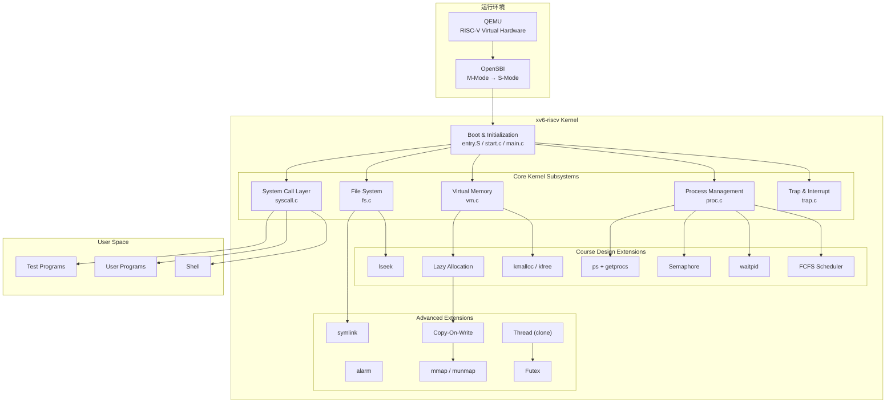
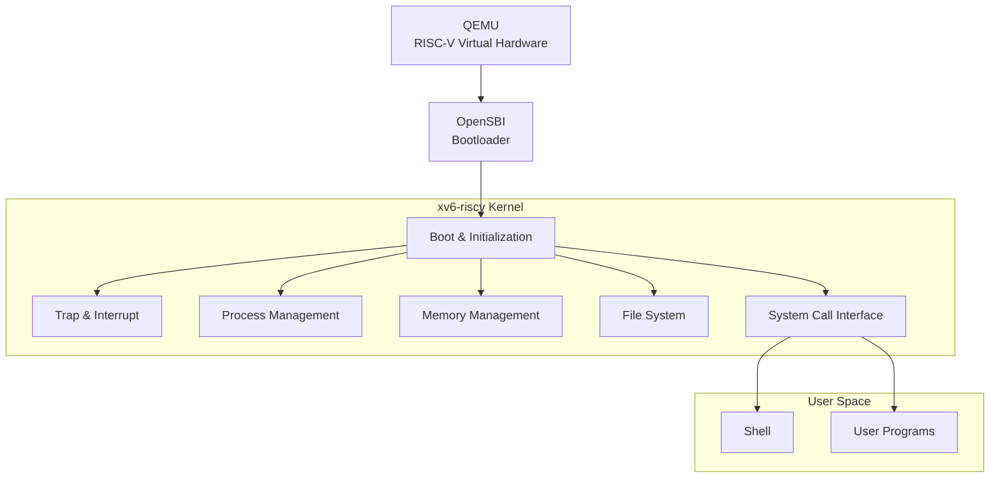
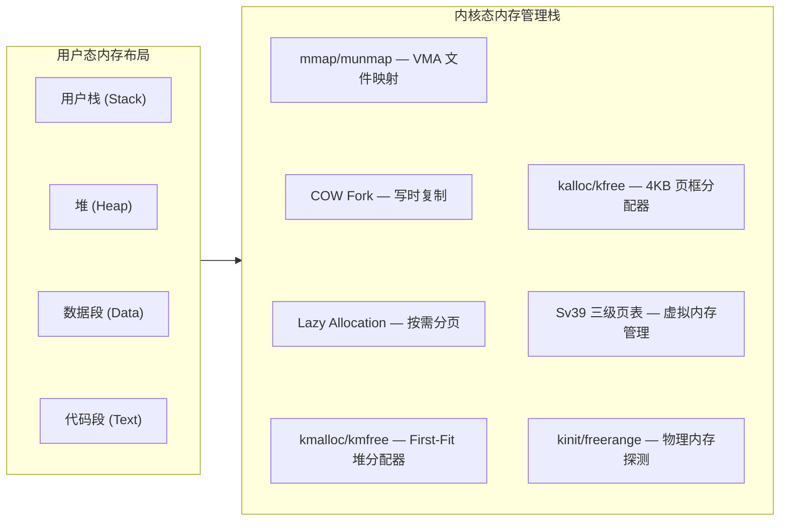
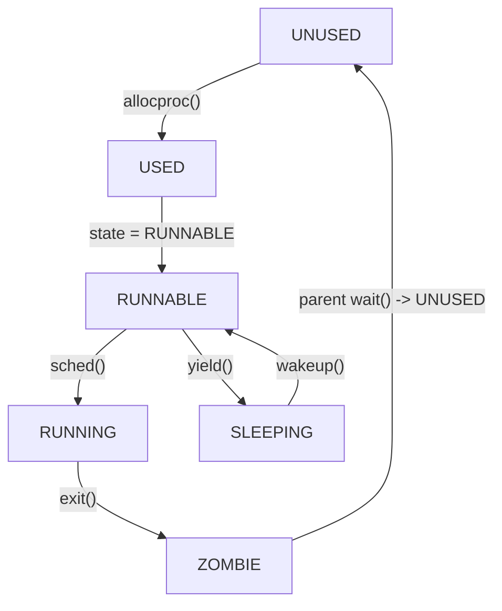
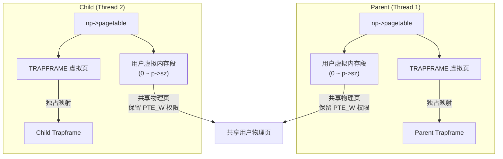
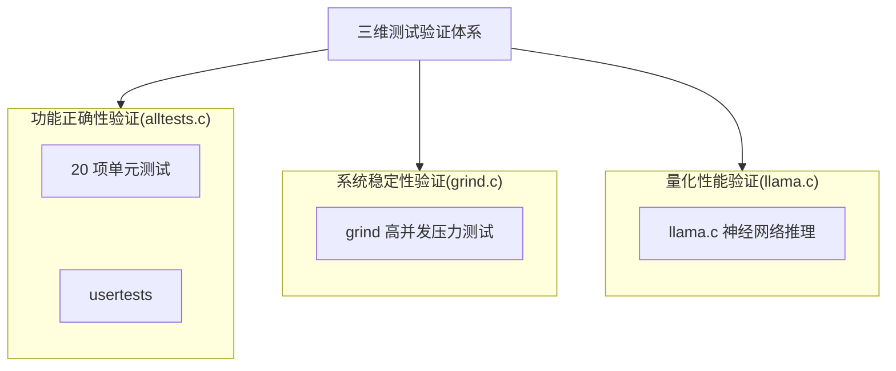
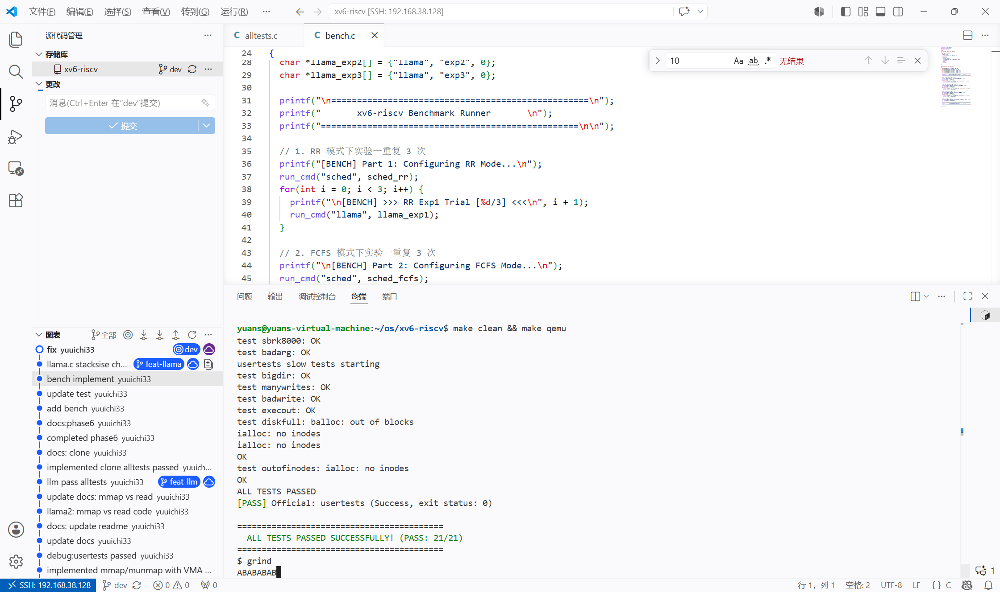
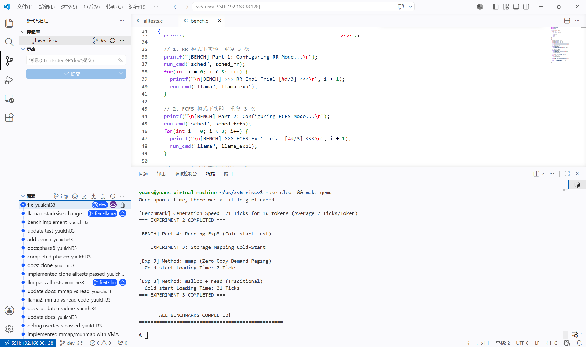

<!-- <div class="markdown-body"> -->

# 操作系统课程设计结题报告

- 姓名：袁善
- 学号：20231072030
- 日期：2026年6月20日


## 一、项目摘要

- **选题：方案 A：OS 内核实现**
- **基准**：基于 **MIT xv6-riscv**（`https://github.com/mit-pdos/xv6-riscv`），代码基线回退至 2023 年 1 月前的稳定状态。
- **目标**：在完成课程要求功能的前提下，引入部分现代 Unix/Linux 内核设计思想，拓展 xv6 内核的功能边界并验证其在真实负载下的表现。
- **开发环境**：
  - 宿主机：Windows 11 + VSCode (SSH 远程连接)
  - 目标机：Ubuntu 22.04 LTS 
  - 编译：`riscv64-linux-gnu-gcc` 
  - 模拟器：QEMU 7.2.0（`qemu-system-riscv64`）
- **工作概述**
  - **功能实现**：共支持 37 个系统调用（其中增量实现 16 个）。包括内核级堆分配器（kmalloc/kfree）、按需分页（Lazy Allocation）、写时复制（COW Fork）、文件内存映射（mmap/munmap）、FCFS 与 RR 动态调度切换、轻量级线程（clone）、用户态快速同步互斥体（futex）以及信号量、异步定时器（Alarm）、软链接（Symlink）等模块。
  - **功能验证**：系统通过增量的 20 项单元测试、xv6 原生 usertests 集成测试，在 grind 压力测试下持续运行，未发生内核 Panic 或死锁。
  - **性能评估**：移植极简 Transformer 推理引擎 llama.c 并加载 stories260K 模型，针对多核并行能力、同步原语效率（Spinlock vs Pipe vs Futex）及存储映射机制（read vs mmap）设计对比实验，量化评估内核相关子系统的实际开销。



## 二、项目完成情况

- **项目仓库地址**：`https://github.com/yuuichi33/OS`

### 2.1 功能实现
| 模块 | xv6 已实现功能 | 本项目扩展实现 | 
|:---------|:------------|:--------------|
| 系统启动 | M→S 态切换、内核加载、栈初始化、启动日志 | — |
| 中断与异常 | 时钟中断、键盘输入、ecall 系统调用 | 缺页异常处理（Lazy/COW/VMA）、用户态异常分类拦截（scause 2/13/15 诊断） |
| 内存管理 | 物理页分配、Sv39 虚拟内存 | kmalloc/kmfree 内核堆分配器、按需分页、COW Fork、mmap/munmap |
| 进程管理 | PCB、fork/exec、RR 调度 | FCFS 非抢占调度（RR/FCFS 动态切换）、waitpid（WNOHANG）、Semaphore 信号量、Alarm 异步定时器 | 
| 文件系统 | 目录文件操作、路径解析、重定向、mkfs | lseek（SEEK_SET/CUR/END）、Symlink 软链接 |
| 用户程序 | ELF 加载、Shell、管道 | ps 命令（getprocs 系统调用）、异常隔离（用户态崩溃不 panic） | 
| **扩展功能** | — | **alarm**、**COW Fork**、**mmap/munmap**、**clone 线程**、**futex 用户态锁** |

### 2.2 交付物

- 14 周提交进度报告，含技术方案、分工方案。
- 结题报告PDF，内容包括项目概述，技术方案，详细实现，系统运行功能测试，创新点，总结与展望等内容。
- 汇报PPT、可运行源码及文档。

### 2.3 系统调用清单

本项目共支持 **37 个系统调用**（其中 21 个为原生系统调用，16 个为本项目增量设计与实现）：

```
# 原生系统调用（21 个）
SYS_fork    SYS_exit    SYS_wait    SYS_pipe    SYS_read
SYS_kill    SYS_exec    SYS_fstat   SYS_chdir   SYS_dup
SYS_getpid  SYS_sbrk    SYS_sleep   SYS_uptime  SYS_open
SYS_write   SYS_mknod   SYS_unlink  SYS_link    SYS_mkdir
SYS_close

# 扩展系统调用（16 个）
SYS_getprocs    SYS_kmalloctest  SYS_sched_switch  SYS_waitpid
SYS_sem_alloc   SYS_sem_free     SYS_sem_wait      SYS_sem_signal
SYS_sigalarm    SYS_sigreturn    SYS_lseek          SYS_symlink
SYS_mmap        SYS_munmap       SYS_clone          SYS_futex
```

## 三、项目内容

### 3.1 系统设计目标与技术选型

xv6 是一个面向教学的 Unix 风格操作系统，其代码结构清晰、模块划分合理，完整实现了进程管理、虚拟内存管理、文件系统、系统调用和异常处理等核心机制。

本项目**基于 riscv 架构的 xv6** `(https://github.com/mit-pdos/xv6-riscv)`进行增量式开发，重点参考 Linux 和开源项目 Re-XVapor `(https://github.com/sandyyyz/Re-XVapor)` 以及 MIT 6.S081。项目拟在保持 xv6 原有体系结构稳定性的前提下，逐步扩展其功能，实现课程设计要求的操作系统关键机制，并在此基础上引入部分现代 Unix/Linux 内核设计思想，提高系统的完整性与可扩展性。

选择 RISC-V 处理器架构 与 xv6 内核 作为开发基准，其**决策依据**如下：
- **RISC-V 架构指令设计简洁**：规避了 x86 繁重的历史兼容包袱，RV64 寄存器与控制状态寄存器（CSRs）设计清晰，极大简化了上下文切换与 Trap 处理的汇编实现。
- **特权级与分页规范**：具备明确的 U/S/M 特权级划分，配合标准的 Sv39 三级页表，完美映射进程隔离、虚存管理等操作系统核心概念。
- **开发生态成熟**：借助标准固件 OpenSBI 和 QEMU 模拟器，可避开复杂的物理硬件探测，专注于 S-Mode 内核研发。
- **xv6 体量精简，抽象完整**：相比复杂的 Linux 内核，xv6 代码体量适中，且完整保留了 Unix 的核心抽象（PCB、VM、VFS、Syscall）。
- **高可扩展的基础架构**：其基础模块设计稳固且未过度设计，为后续渐进式扩展 COW、Lazy Allocation、clone 线程等现代内核特性留出了充足的改造空间。

### 3.2 系统总体架构

系统采用经典的分层式结构设计。整体运行环境由 QEMU、OpenSBI 和 xv6 内核组成。



- **QEMU**：提供 RISC-V 虚拟硬件环境（`-machine virt`，4 核，128MB 内存）
- **OpenSBI**：完成机器态（M-Mode）到监管态（S-Mode）的初始化和特权级切换
- **xv6 内核**：负责 CPU、内存、磁盘、中断等全部资源的管理和系统服务
- **系统调用层**：提供用户态与内核态的交互接口（共 37 个系统调用）
- **用户空间**：运行 Shell 和应用程序

### 3.2 子系统设计与实现

#### 3.2.1 系统启动（Bootloader）

- 启动流程：
```
QEMU → OpenSBI (M-mode) → entry.S (各核栈初始化)
     → start.c (CSR 配置) → main.c (子系统初始化)
     → scheduler() → init → Shell
```

- 启动日志：

```
xv6 kernel is booting

hart 1 starting
hart 2 starting
hart 3 starting
$ _
```

系统在 QEMU 中稳定启动并进入 Shell，启动过程可复现，无异常重启。此部分完全复用 xv6 已实现功能。


#### 3.2.2 中断与异常处理（Trap & Interrupt）

xv6 采用**基于 Trap 的统一异常处理框架**。所有系统调用、异常和中断最终均通过 Trap 机制进入内核。RISC-V 架构中，`scause` 寄存器标识中断/异常类型：

| scause | 类型 | 说明 |
|:------|:----|:-----|
| 8 | 系统调用 | `ecall` 指令触发 |
| 2 | 非法指令 | 执行损坏指令 |
| 12 | 指令缺页 | 执行无权限内存 |
| 13 | 读缺页 | 读取未映射/无权限地址 |
| 15 | 写缺页 | 写入只读/未映射地址 |

- 异常分发流程
  ```
  用户态运行 → 中断/异常 → trampoline.S → usertrap()
      ├── scause == 8  → 系统调用 → syscall() 分发
      ├── devintr != 0 → 硬件中断（时钟/键盘/磁盘）
      │     └── which_dev == 2 → 时钟中断 → alarm 检测
      └── 其他异常 → 分类拦截
            ├── scause 2  → 非法指令
            ├── scause 13 → 读段错误（Load Page Fault）
            │     ├── VMA 区间 → mmap 按需调页
            │     └── 堆区间  → Lazy Allocation
            ├── scause 15 → 写段错误（Store Page Fault）
            │     ├── VMA 区间 → mmap 按需调页
            │     ├── PTE_COW  → COW 分裂
            │     └── 堆区间  → Lazy Allocation
            └── 其他 → 打印诊断信息 → setkilled(p)
  ```

- 具体工作：
  - 修改 trap.c 中的 usertrap()，实现对非法指令（scause 2）与内存越界读写（scause 13/15）的分类识别。
  - 发生异常时，内核打印错误地址与指令并强制结束该进程（exit(-1)），保证内核和其他进程正常运行不崩溃。


#### 3.2.3 内存管理（Memory Management）

xv6 采用**页式内存管理**。在原有 4KB 物理页框分配器（`kalloc/kfree`）与 Sv39 页表的基础上，本项目重构并扩展了内存管理结构：



##### A. 内核堆分配器（kmalloc/kmfree）

为了给信号量、线程参数及定时器备份等模块提供内核动态内存支持，本项目基于 xv6 现有的物理页分配器（kalloc/kfree），在其之上构建了一个内核级字节级动态内存分配器 kmalloc 与 kmfree。

- 基于 **首部链表（First-Fit Header）** 实现。每次申请均自动向 8 字节对齐，并维护块首部信息（含当前块大小、空闲状态等）。当链表中空闲块大小不足时，分配器会向底层的 kalloc 申请新的 4KB 页并加入管理。
- 在 kmfree 中，分配器会自动检测相邻的连续空闲内存块，并将其合并为大块，防止内存碎片的过度累积。
- 引入独立的内核自旋锁保护堆链表，确保多核并发调用下的线程安全性。


##### B. 按需分页（Lazy Allocation）

- 参考：https://pdos.csail.mit.edu/6.S081/2020/labs/lazy.html

- **传统的 sbrk(n)**：用户请求增加 n 字节内存。内核立刻调用 kalloc 申请物理页，并通过 mappages 建立虚拟到物理的映射。这在请求很大时非常耗时，且很多程序申请了内存却根本不使用。
- **按需分页**：
  - 申请时：在 sys_sbrk() 中仅调整 p->sz 边界，不实际分配物理内存和页表项。
  - 触发时：当进程实际读写该虚拟地址空间时，触发缺页异常（scause 13/15）。在 usertrap() 中，通过 walk 函数验证该虚拟地址是否处于 [0, p->sz) 范围。若合法，则调用 kalloc 动态申请物理页，并使用 mappages 补齐映射。

- 重构 walkaddr() 与 copyout() 等内核函数，确保当用户将尚未映射的 Lazy 内存指针作为系统调用（如 read）的目标缓冲区时，内核能透明且安全地触发物理页装载。同时，调整 uvmunmap 与 uvmcopy，在检测到未映射页时选择跳过而非发生内核 Panic。

- debug 记录：最初在 usertrap 中使用 walkaddr 检测地址是否映射，但 walkaddr 已被重构为自动分配物理页，导致重复分配。解决方案：改用 walk(pagetable, va, 0) 做纯页表查询。

##### C. 写时复制（Copy-On-Write Fork）

- 参考：https://pdos.csail.mit.edu/6.S081/2025/labs/cow.html

- 原生的 fork 拷贝父进程所有的物理内存给子进程。
- COW ：在 fork 调用 uvmcopy 时，完全不分配新的物理页。子进程的页表直接指向父进程相同的物理地址。同时，将父进程和子进程中所有可写的页表项全部清除写权限（清除 PTE_W），并打上自定义的写时复制标记 PTE_COW。

- **物理页引用计数**：
  - 由于多个进程的页表同时指向同一个物理页，传统的“进程退出即释放物理页”逻辑将导致系统崩溃。
  - 在 kalloc.c 中引入全局物理页引用计数器 page_ref，通过自旋锁保护。在物理页被多次映射时增加计数，在 kfree 被调用时递减计数。仅在计数归零时，该物理页才真正被回收到空闲链表。

- **缺页中断分割**：
  - 当父进程或子进程尝试修改打上 PTE_COW 标记的只读页面时，CPU 触发 scause 15（写缺页异常）。
  - 内核拦截该异常，读取该物理页的引用计数：
    - 若当前物理页引用计数大于 1，则分配一页新物理页，进行数据拷贝，将新页重新映射到当前虚拟地址并赋予写权限（PTE_W），同时将原物理页的引用计数递减。
    - 若物理页引用计数等于 1，说明该物理页已由当前进程独占，此时无需进行数据拷贝，直接清除 PTE_COW 并恢复写权限（PTE_W）即可。


##### D. mmap/munmap 文件内存映射

- 参考：https://pdos.csail.mit.edu/6.S081/2025/labs/mmap.html

- 在传统的物理 I/O 中，用户读写文件必须通过 read/write 系统调用，这涉及到“磁盘 -> 内核缓存 -> 用户缓存”的多次数据拷贝，开销极大。 
- **mmap（Memory Mapping）** 采用另一种设计：直接把磁盘上的文件，映射到进程的虚拟地址空间中。

  - **VMA 结构设计**：在进程控制块（PCB）中引入虚拟内存区域结构（struct vma），每个进程最多支持 16 个独立的虚拟内存区，用于描述映射起止地址、保护权限（prot）、映射标志（flags，如共享 MAP_SHARED 或私有 MAP_PRIVATE）以及关联的文件指针和偏移量。

  - **缺页装载**：当用户调用 mmap(addr, len, prot, flags, fd, offset) 申请文件映射时， mmap 仅在 VMA 中登记边界。当进程访问映射空间发生缺页异常时，在 usertrap 中确定其所在的 VMA，随后调用 kalloc 申请一个物理页，并从该 VMA 记录的文件中，调用 readi 自动将对应的数据块读取到新分配的物理页中，用 mappages 将物理页映射到该缺页虚拟地址。

  - **内存回写与释放**：在 munmap 或进程 exit 销毁 VMA 时，系统遍历映射地址范围。如果映射标志包含 MAP_SHARED 且页面被修改过（Dirty 页），内核必须通过 writei 将该内存页的数据刷回磁盘文件，保证修改不丢失。然后，通过 uvmunmap 拆除该虚拟地址的页表映射并释放物理页。

- debug 记录： 
  - fork_test 报错 `panic: sched locks`，原因是 VMA 的 writei 回写操作放在了 exit() 的 acquire(&wait_lock) 之后，违反了"持锁不能睡眠"的规则。解决方案：将 VMA 释放逻辑移至 exit() 最开头。
  - 在 fork_test 中，子进程在执行 VMA 数据校验时，报错 `mismatch at 2048, wanted 'A', got 0x0`。原因是遗漏了更新文件偏移量 `v->offset`。解决方案：增加`v->offset += len;`，使文件偏移量与虚拟起点同步向后挪动。


#### 3.2.4 进程管理（Process Management）

##### A. PCB 结构（struct proc）

**进程状态机：**


##### B. FCFS + RR 调度器

- **RR（Round-Robin）**：时间片轮转，每次时钟中断（which_dev == 2）都会调用 yield() 让出 CPU。
- **FCFS（First-Come-First-Served）**：非抢占，进程一直运行到主动退出或阻塞。在 struct proc 中维护进程创建时间戳 ctime。调度器在每次遍历进程表时，选取状态为 RUNNABLE 且 ctime 最小的进程投入运行。
- **动态切换**：引入全局变量 sched_mode（0 表示 RR，1 表示 FCFS），设计系统调用 sched_switch()，允许通过用户态命令动态改变全局调度模式变量 sched_mode。

##### C. waitpid 机制

扩展进程回收接口以支持父进程等待指定子进程退出：

- 若传入 pid > 0，内核仅查找、回收 PID 匹配的特定子进程；
- 若传入 pid == -1，则兼容普通 wait，回收任意子进程。
- **非阻塞支持**：支持首部选项 WNOHANG（值为 1）。当指定该选项且目标子进程尚未退出时，内核立即返回 0，避免父进程无意义的挂起等待。

##### D. 信号量（Semaphore）

- **信号量（Semaphore）的机制与原理**
  - 同步机制，本质上是一个受保护的整型变量 count，配合一个自旋锁 lock，用来控制多个进程对共享资源的访问。
  - 两个核心操作（P 操作 和 V 操作）
    - P 操作（Wait / Down，申请资源）
      - 原理：将信号量的值 count 减 1。
      - 如果减 1 后 count >= 0，说明还有空闲资源，进程继续执行。
      - 如果减 1 后 count < 0，说明资源已耗尽，进程必须挂起等待（进入睡眠状态）。
    - V 操作（Signal / Up，释放资源）
      - 原理：将信号量的值 count 加 1。
      - 如果加 1 后 count <= 0，说明有进程正在因为资源耗尽而睡眠，此时内核需要唤醒一个正在睡眠的进程。
  - 与 xv6 的 sleep / wakeup 结合
    - sleep(void *chan, struct spinlock *lk)：让当前进程在通道 chan 上睡眠。
    - wakeup(void *chan)：唤醒所有在通道 chan 上睡眠的进程。
    - 可以直接把信号量结构体本身的内存地址 s 作为睡眠通道 chan

  - P 操作中：如果资源不够，调用 sleep(s, &s->lock)。
  - V 操作中：释放资源后，调用 wakeup(s) 唤醒在该地址上睡眠的进程。

- **具体工作**
  - 利用已实现的 kmalloc/kmfree 动态地管理信号量。
    - 定义 sem 结构体。
    - 动态分配 (sem_alloc)与动态释放 (sem_free)：利用 kmalloc() 动态申请信号量结构体，并将 64 位内核指针句柄传回用户态；释放时通过 kmfree() 彻底回收内存归还给堆。
    - P/V 操作：采用信号量自身的内存地址作为 xv6 sleep/wakeup 的共享通道。P 操作（sem_wait）在资源不足时将进程挂起，V 操作（sem_signal）在释放资源时精准唤醒通道上的等待进程。

##### E. Alarm 异步定时器

- 参考：https://pdos.csail.mit.edu/6.S081/2025/labs/traps.html

sigalarm 机制在内核中本质上是一种**用户态异步信号中断与恢复**。

- **保护现场** ：设计 sigalarm() 系统调用。当时钟中断累加到用户指定的 ticks 时，内核动态分配（利用 kmalloc）一块 struct trapframe 内存，将当前的通用寄存器与程序计数器（epc）暂存至该备份区域中。
- **控制流跳转**：将中断返回的目标地址（p->trapframe->epc）强行改写为信号处理函数 handler 的入口地址。
- **重入保护**：在处理函数执行期间，设置 alarm_running 状态标志，在此状态下屏蔽新的定时中断信号，防止因多层嵌套覆盖而导致备份的上下文失效。
- **现场恢复**：当处理函数结束后，用户态执行 sigreturn() 系统调用，内核将备份的寄存器结构重新写回当前的 p->trapframe 中，重置状态标志并释放备份空间，进程无缝恢复到原中断点继续执行。


```
时钟中断触发
  → alarm_ticks++
  → alarm_ticks == alarm_interval?
     → 是：备份 trapframe → epc = alarm_handler → alarm_running = 1
     → 否：继续运行
  → 返回用户态 → CPU 跳转到 handler 执行
     → handler 内调用 sigreturn()
        → 恢复 trapframe 备份 → alarm_running = 0
        → 原中断点继续执行
```


#### 3.2.5 文件系统（File System）

xv6 使用**日志型文件系统**，主要由 Buffer Cache、Logging Layer、Inode Layer、Directory Layer 组成。

##### lseek 文件定位

- 操作系统在 struct file 中使用 off 字段记录当前文件的读写位置（偏移量）。默认的 read 和 write 会自动递增这个值。

- 为支持在打开的文件中进行**随机访问**，本项目实现 lseek(fd, offset, whence) 系统调用：
  - 实现 sys_lseek，支持 SEEK_SET、SEEK_CUR、SEEK_END 三种标准定位模式。
  - 引入 inode 级别的睡眠锁保护，确保多核/多进程并发访问时，文件大小 size 读取和偏移量 off 改写具有强一致性。
  - 建立边界异常防御，成功拦截并过滤非法文件描述符（fd）、非 Regular 文件类型（管道/控制台设备）以及越界负数偏移。

##### Symlink 软链接

- 参考：https://pdos.csail.mit.edu/6.S081/2025/labs/fs.html

- **特殊文件类型**：定义软链接文件类型 T_SYMLINK（值为 4），实现 sys_symlink 系统调用，将链接目标路径通过 writei 动态存入软链接 Inode 的数据块中。数据块中存储的是另一个文件的目标路径名（Target Path）。

- **动态递归解析算法**：在 sys_open() 中，当遇到 T_SYMLINK 且未携带 O_NOFOLLOW 标志时，内核会读取其中的目标路径，并利用 namei() 重新定位到指向的文件。

- **死循环防御**：如果软链接形成环路（如 A -> B -> A），会导致无限递归。在递归解析过程中设计最大跳转深度检测（上限设为 10 ），一旦解析深度超过 10 层，判定为环路死锁，立即返回 -1 报错。

#### 3.2.6 多线程机制（Clone）

轻量级进程（线程）的核心特征是：共享虚拟内存空间（页表）和文件描述符，但拥有独立的 CPU 寄存器上下文和独立的用户态栈。

本系统采用**独立顶级页表 + 共享虚拟地址物理页**的方式实现了轻量级进程（LWP）形式的多线程模型：

  - **共享与隔离**：通过 clone 派生的子线程拥有独立的 struct proc，并通过 allocproc() 分配各自独占的虚拟页，用以映射其各自的 np->trapframe 物理页。这从机制上消除了多核并发上下文切换时的寄存器覆写冲突。

  - **物理页共享**：通过自定义的 uvmsharecopy() 函数，直接将父进程的页表项（除 TRAPFRAME 外）复制到子线程的页表项中，保留原有的读/写/执行等权限（不加 PTE_COW），并调用引用计数器增加对物理页的持有计数。

  - **生命周期协调**：在进程控制块中维护线程组 ID（tgid）以及线程属性标志。各线程在终止时释放自身持有的顶级页表，共享的物理内存空间由最后一个退出线程的进程环境（引用计数递减为 0 时）通过 uvmunmap 彻底释放。




#### 3.2.7 Futex 用户态快速同步锁

传统的同步方式在每次加锁/解锁时都需要陷入内核，系统调用开销相对较大。本项目基于 Linux Futex 机制的思想，实现了用户态同步互斥锁。

Futex（Fast Userspace Mutex）的核心思想是**无竞争时在用户态通过原子指令完成加锁/解锁，有竞争时才陷入内核**。
  - 无竞争时在用户态通过原子指令完成加锁/解锁：利用原子操作（如 RISC-V 的 amoswap 或 lr.w/sc.w）在用户态直接修改锁变量（0 或 1）。
  - 有竞争时才陷入内核：当用户态发现锁已被占用，调用 sys_futex(uaddr, FUTEX_WAIT, val) 让出CPU；锁持有者释放锁时，若发现有等待者，调用 sys_futex(uaddr, FUTEX_WAKE,
    val) 唤醒等待线程。

- **通道唯一性设计**：使用进程虚拟地址向物理地址的映射（通过页表 walk 提取物理地址 paddr），作为内核态挂起与唤醒的睡眠通道标识。这确保了在同一个地址空间内，不同线程对同一个用户态变量的监控能够精准映射到相同的锁通道。
- **Lost Wakeup 隐患规避**：
  - 在执行 FUTEX_WAIT 时，内核获取全局自旋锁 futex_lock，读取并确认此时该物理地址上的实际数值是否等于期望值 val。
  - 若由于线程切换导致数值已变化，则立即释放自旋锁并返回错误，避免在状态检查与真正睡眠之间因线程调度发生的“丢失唤醒”问题。
  - 若数值相符，则将当前线程挂起在以 `paddr` 为标识的内核等待链表上。
- **精准唤醒**：在 FUTEX_WAKE 操作中，系统同样获取 futex_lock，并遍历等待队列，精准唤醒最多 val 个正在该 paddr 通道上睡眠的线程。


## 四、测试与验证

为了验证系统在功能性、稳定性和高负载下的实际表现，本项目构建了一个三维**测试与验证体系**：


### 4.1 测试方案

- **功能测试**：针对新增功能分别自行设计测试程序或引入官方测试文件，精准验证**单一模块功能的正确性**。
- **异常测试**：构造非法内存访问和异常系统调用场景，验证**系统异常隔离能力和资源回收能力**。
- **系统测试**：运行 xv6 **原生测试集 usertests** ，全面验证进程管理、内存管理、文件系统及系统调用等核心功能的正确性与兼容性。
- **集成测试**：实现**统一测试框架 alltests.c**，对新增**功能测试、异常测试以及 xv6 原生 usertests** 共 21 项进行统一调度，实现一键式自动化测试。通过集成运行验证各模块之间的兼容性与协同工作能力，并检查系统整体稳定性。
- **压力测试**：运行 xv6 原生的 **grind** 测试，测试系统稳定性。

具体：[测试说明文档](devlog/test.md) `(devlog/test.md)`

### 4.2 alltests 集成测试内容

本项目设计了 alltests 集成测试框架，用于统一调度与运行增量的功能测试。测试项涵盖以下几个方面：

- crash_test.c：非法指令拦截、越界地址读取、越界地址写入、只读区域保护、内核异常隔离。
- ps.c：系统调用异常防御、进程状态边界映射、越界状态安全防护。
- kmalloctest.c：接口错误检测、内核堆功能验证、跨页大内存测试。
- sched.c：命令行参数完整性检验、调度模式合法性过滤。
- schedtest.c：先来先服务（FCFS）非抢占功能验证、时间片轮转（RR）并发抢占、时间戳顺序选取验证。
- waitpidtest.c：验证非阻塞（WNOHANG）、验证精准 PID 阻塞回收、通配符（-1）回收、退出状态码（Exit Status）回写。
- semtest.c：空指针/无效句柄防御、无需睡眠的即时获取、无需唤醒的即时释放、动态堆内存泄漏测试。
- alarmtest.c 
  - 参考 https://github.com/mit-pdos/xv6-riscv-fall19/blob/xv6-riscv-fall19/user/alarmtest.c
  - 官方的 alarmtest.c 包含了三个递进的严格测试：
    - test0：验证基础拦截与控制流跳转
    - test1：验证寄存器完整性
    - test2：验证重入锁保护（防嵌套中断）
- lseektest.c：测试非法 fd、测试非 Regular 文件（如 stdin）、测试非法 whence、测试计算后为负数的偏移量；分别精确写入、定位、并读取校对 SEEK_SET、SEEK_CUR 和 SEEK_END 三种定位效果。
- symlinktest.c
  - 参考：https://github.com/mit-pdos/xv6-riscv-fall19/blob/xv6-riscv-fall19/user/symlinktest.c
  - 软链接创建与类型校验、路径透明解析与读写、断头链接防御、环路死锁自动熔断、多级链条递归追踪、高并发多核压力测试。
- lazytests.c
  - 参考：https://github.com/mit-pdos/xv6-riscv-fall19/blob/lazy/user/lazytests.c
  - 基础延迟分配（lazy alloc）、延迟页面释放（lazy unmap）、物理内存耗尽（out of memory）。
- cowtest.c
  - 参考：https://github.com/mit-pdos/xv6-riscv-fall19/blob/xv6-riscv-fall19/user/cowtest.c
  - 内存压力测试（simpletest）、三进程并发写入测试（threetest）、系统调用写安全测试（filetest）。
- mmaptest.c
  - 参考：https://github.com/mit-pdos/xv6-riscv-fall19/blob/xv6-riscv-fall19/user/mmaptest.c
  - 基础映射与解映射测试（mmap_test）、父子进程页表隔离测试（fork_test）。
- clonetest.c：基础传参验证、物理内存共享验证、栈隔离验证、多核生命周期压力测试。
- futextest.c：原子 Fastpath 测试、Lost Wakeup 防御测试、Slowpath 互斥同步测试、多核心多线程并发锁竞争压力。

- usertests.c：
  - xv6 官方综合测试集，覆盖：
    - 系统调用参数合法性：非法用户指针、越界地址、超长字符串
    - 进程与内存管理：fork、wait、exit、kill、sbrk
    - 文件系统功能：文件创建、删除、读写、链接、目录操作
    - 并发与压力：大量并发 fork、文件操作竞争
    - 异常与鲁棒性：非法内存访问、资源耗尽

### 4.3 grind 压力测试

- grind.c：xv6 官方压力测试，创建两个子进程，高强度随机执行 23 种操作（fork、kill、文件读写、sbrk、管道等），在持续运行过程中未出现 panic、死锁或异常退出。字符交替输出（如 `ABBABA`）表明多核同步锁设计正确。

### 4.4 测试结果

运行 **alltests 全量通过（`PASS: 21/21`）**；grind 连续运行数十分钟，**系统稳定**。

<center></center>

## 五、LLM 推理引擎移植与性能验证

在 alltests 测试全部通过、grind 长时间运行系统稳定的前提下，为评估本系统在真实算力密集型任务中的实际效率，本项目将**极简 Transformer 推理引擎 llama2.c**（由 Andrej Karpathy 开源）移植至 xv6-riscv，命名为 llama.c。通过在系统内**运行 stories260K 模型（1.04MB）**，项目在进程、内存及同步子系统上设计了三项对比实验。

实验程序 llama.c 移植自 [karpathy/llama2.c](https://github.com/karpathy/llama2.c)，模型使用 [stories260K.bin](https://huggingface.co/karpathy/tinyllamas)（约 1.04MB），分词器使用 tok512.bin。

### 5.1 llama.c：在 xv6 中运行一个简化版大模型

llama.c 是一个极简的 Transformer 推理程序。它加载预训练好的模型权重，根据提示词逐个生成后续的 Token。每次生成一个 Token，都要做一次完整的神经网络前向计算：把当前 Token 的向量表示经过多层 Transformer 层的矩阵运算和注意力计算，得到下一个 Token 的概率分布，再从中采样出一个 Token 输出。

原版 run.c 依赖 Linux 的数学库、OpenMP 多线程（#pragma omp parallel for）和标准文件 I/O（fopen/fread）。由于 xv6 的用户态不提供这些，本项目做了**以下三方面的移植**：
  - **数学函数**：Transformer 推理需要 `exp`、`sqrt`、`sin`、`cos`、`pow` 等数学函数做注意力机制中的 RoPE 旋转位置编码和 Softmax 归一化。xv6 没有 `<math.h>`，因此用数值方法手写这些函数。
  - **静态线程池**：通过 `clone` 系统调用构建静态工作线程池，替代原版依赖的 OpenMP 实现。为对比同步开销，实现三种同步机制：
    - Spinlock：空转等待 `start_signal` 变化，不做系统调用但浪费 CPU
    - Pipe：通过 `read()`/`write()` 系统调用在管道上阻塞/唤醒，每次同步都陷入内核
    - Futex：无竞争时用户态快速返回，有竞争时通过 `futex_wait`/`futex_wake` 挂起/唤醒
  - **用 `open`/`read`/`stat`/`close` 替代 `fopen`/`fread`/`ftell`/`fclose`。**模型加载支持两种方式：
    - mmap：通过内存映射，零拷贝按需加载
    - malloc + read：先申请内存，再从磁盘读到用户缓冲区

- **推理流程**

```
main() → 加载模型权重 + 分词器
       → generate():
           1. init_test_pool()      // 创建工作线程池
           2. for pos = 0..steps:   // 逐个生成 Token
                forward()           //   Transformer 前向计算
                  matmul() × 7/层   //   矩阵-向量乘（多线程并行）
                  attention         //   注意力机制
                  rmsnorm           //   归一化
                sample()            //   从概率分布采样
                printf("%s", token) //   输出当前 Token
           3. destroy_test_pool()   // 回收工作线程
```

其中 `forward()` 是最核心的函数，对每一层 Transformer 依次执行：
- 7 次 `matmul()`（查询 Q、键 K、值 V、输出 O、前馈网络 w1/w2/w3）
- RoPE 旋转位置编码
- Self-Attention（多头注意力计算）
- 残差连接 + RMS 归一化
- SiLU 激活函数

**`matmul()` 是整个程序的计算瓶颈**（占 >90% 的时间），它计算的是 $\text{xout} = W \times x$——用一个大矩阵 $W$（权重）乘一个向量 $x$（当前激活值），结果是一个新向量 $\text{xout}$。**矩阵的每一行可以独立计算，适合并行化。**


### 5.2 实验一：多核可扩展性实验

- **实验目的**：验证多线程并行计算能否有效加速推理。把 `matmul()` 中的矩阵行切分到多个核心上并发执行，观察随着线程数增加，生成 Token 的速度能提升多少。

- **实验设计**：
  - QEMU 配置物理 4 核心（`-smp 4`），并发工作线程数分别设置为 1、2、4。
  - 使用 Futex 作为基础同步机制，在 RR（轮转）与 FCFS（先来先服务）两种调度策略下分别测试 3 轮，每轮推理生成 10 个 Token，记录消耗的系统 Ticks（时钟中断次数）并求取均值。
  - 由于所采用的 stories260K 模型隐藏层维度仅为 64，单次矩阵运算的物理耗时远小于 sys_futex 的内核陷入与上下文切换开销，导致无法显现并行优势。本实验在 matmul 算子最内层循环中引入**计算密度放大因子**（FACTOR = 100），通过增大单次任务的算术强度，评估该系统的性能。

- **实验数据**

    | 调度模式 | 线程数 | 轮 1 | 轮 2 | 轮 3 | 平均 Ticks | 加速比 |
    | :--- | :--- | ---: | ---: | ---: | ---: | ---: |
    | **RR** | 1 | 36 | 39 | 35 | **36.7** | 1.00× |
    | | 2 | 23 | 25 | 24 | **24.0** | 1.53× |
    | | 4 | 20 | 20 | 20 | **20.0** | 1.84× |
    | **FCFS** | 1 | 35 | 35 | 36 | **35.3** | 1.00× |
    | | 2 | 24 | 25 | 25 | **24.7** | 1.43× |
    | | 4 | 21 | 22 | 22 | **21.7** | 1.63× |

- **数据分析**
  - **并行提升**：在两种调度模式下，从 1 线程增加到 2 线程，性能均获得了明显的提升（RR 下为 1.53×，FCFS 下为 1.43×），表明矩阵乘法运算的行切分负载能够较好地利用物理核心。
  - **边际效益递减**：从 2 线程增加到 4 线程时，加速比曲线趋缓（4 线程下 RR 为 1.84×，FCFS 为 1.63×）。这符合 Amdahl 定律，因为除矩阵乘法外的串行过程（RoPE 编码、多头注意力非并行部分）以及多核之间并发竞争系统调度器锁、物理内存分配锁等内核同步开销，限制了加速比的线性延伸。
  - **调度器对比**：在多线程协作频繁睡眠唤醒的情况下，RR（时间片轮转）由于具备对就绪线程的及时抢占能力，使 worker 线程在状态就绪时能更快地获得 CPU 分配，因此其实际表现略好于非抢占式的 FCFS。


### 5.3 实验二：同步机制对比实验

- **实验目的**：多线程并行计算时，工作线程之间、工作线程与主线程之间需要同步。量化对比三种用户态同步方式（空转、内核态管道、Futex 机制）在多线程频繁同步时的效率损耗。

- **实验设计**
  - RR 调度，4 个线程，3 轮重复，每轮生成 10 个 Token。
  - 分别使用 Spinlock、Pipe、Futex 三种同步方式。
    - Spinlock：通过在用户态对原子共享标记变量进行无限忙等待，不执行系统调用。
    - Pipe：工作线程通过 read() 系统调用阻塞在内核管道上，主线程通过 write() 写入同步信号唤醒。
    - Futex：工作线程在状态未就绪时通过 futex_wait 进入内核挂起，主线程完成计算后通过 futex_wake 精准唤醒。

- **实验数据**

    | 同步方式 | 轮 1 | 轮 2 | 轮 3 | 平均 Ticks | 相比 Spinlock |
    | :--- | ---: | ---: | ---: | ---: | ---: |
    | Spinlock | 270 | 266 | 269 | **268.3** | - |
    | Pipe | 36 | 33 | 32 | **33.7** | 快 87.4% |
    | Futex | 20 | 20 | 21 | **20.3** | 快 92.4% |

- **数据分析**
  - **Spinlock 效率瓶颈**：由于物理 CPU 仅有 4 个，但包含主线程在内的计算调度实体达到了 5 个。使用 Spinlock 会导致空闲等待的工作线程死死占用物理核心而不主动让出，造成严重的 CPU 算力空转浪费，导致平均耗时达到 268.3 Ticks。
  - **Pipe 挂起让出**：使用 Pipe 机制后，等待的工作线程在调用 read() 后会立刻进入阻塞状态并被移出就绪队列，将物理核心让渡给主线程或其他计算实体，减少无效空转，使运行效率大幅提升了 87.4%。
  - **Futex 的核心优势**：Futex 相比 Pipe 在平均时间上进一步缩短了约 40%（从 33.7 Ticks 降至 20.3 Ticks）。这是因为 Futex 贯彻了 Fast-path 设计思想，只有在真正需要睡眠时才陷入内核（Slow-path），在无竞争或信号提前发出时直接在用户态解决，省去了多余的系统调用及上下文切换开销，达到了最优的整体表现。


### 5.4 实验三：存储映射冷启动对比实验

- **实验目的**：验证并对比大模型权重文件在 malloc + read 传统阻塞载入与 mmap 文件存储映射机制下的冷启动（Cold-start）初始化耗时。

- **实验设计**
  - 单线程运行，针对 1.04MB 规模的 stories260K.bin 模型权重文件，分别调用两种不同的读取方式。
  - 用 uptime() 系统调用测量加载前后的 Ticks 差值作为冷启动耗时

- **实验数据**

    | 加载方式 | I/O 机制 | 冷启动耗时 |
    | :--- | :--- | ---: |
    | `malloc + read` | 用户堆空间申请 + 阻塞式磁盘读取 + 内核/用户态双重拷贝 | **21 Ticks** |
    | `mmap` | 仅页表虚拟 VMA 建立 + 后续读写触发按需缺页调入（零拷贝） | **0 Ticks** |

- **数据分析**
  - 在 malloc + read 模式下，系统在执行计算前必须完整经历磁盘读操作、文件缓冲到进程空间的双重拷贝，冷启动耗时达到了 21 Ticks。在此期间，CPU 需阻塞等待磁盘控制器响应。
  - 在 mmap 模式下，冷启动耗时表现为 **0 Ticks**（耗时小于一个时钟滴答）。这得益于其延迟装载设计，mmap 建立映射的过程并不实际触发磁盘读盘，仅修改了页表 VMA 登记项，使冷启动耗时大幅缩短。后续随着推理的展开，仅当数据被读取时才通过缺页异常逐页调入。

### 5.5 自动化性能验证脚本 `bench.c`

为了便于复现性能评估数据，本项目提供一个自动化脚本 `bench.c` ，工作流程：

1. 切换为 RR 调度，运行 Exp1（多核可扩展性），重复 3 轮
2. 切换为 FCFS 调度，再次运行 Exp1，重复 3 轮
3. 切换回 RR 调度，运行 Exp2（同步机制对比），重复 3 轮
4. 运行 Exp3（冷启动对比），1 轮

每个实验通过 `fork()` + `exec()` 调用 `llama` 程序并传入对应参数（`exp1`、`exp2`、`exp3`），父进程 `wait()` 等待子进程完成后收集结果。调度模式的切换通过 `sched` 程序完成：`sched 0` 切到 RR，`sched 1` 切到 FCFS。

运行 bench.c 程序结果如图。

<center></center>

### 5.6 结论

通过三个实验，本项目对 xv6 系统在以下维度上做了量化评估：

1. **多核并行计算能力**：1→2→4 线程的加速比分别为 1.53× 和 1.84×（RR 模式），证明 xv6 的多核调度和 `clone` 线程机制能有效利用多核心。但受限于串行部分（Amdahl 定律），4 线程未能达到 4× 的线性加速。

2. **同步原语的效率差异**：Spinlock 因为 CPU 空转几乎无法用于实际负载（268.3 Ticks）；Pipe 通过内核阻塞大幅改善（33.7 Ticks）；Futex 利用 Fast-path/Slow-path 设计在无竞争时避免系统调用，达到最优（20.3 Ticks），比 Pipe 再快 40%。

3. **存储映射的零拷贝优势**：mmap 的冷启动延迟为 0 Ticks，对比 malloc + read 的 21 Ticks，在首屏加载速度上有数量级优势。按需调页机制将磁盘 I/O 分散到推理过程中，避免了启动时的阻塞等待。

虽然系统已通过增量功能单元测试与 usertests 共 21 项，运行 grind 数十分钟无 panic、无内存泄漏等异常现象，但在运行测试程序以及 bench 时，实验一与二仍有概率发生卡死现象，初步分析可能是 llama.c 的线程池销毁阶段存在问题，或者多线程之间竞争导致死锁，或其他原因，还需要进一步分析修复。

## 六、创新点

### 1. 完整的内存管理层次

本系统的内存子系统在 Sv39 页表及物理页框分配器的基础上，自下而上构建了结构完整、层次分明的虚拟内存体系：物理页分配器（`kalloc`）→ 内核堆分配器（`kmalloc`）→ 虚拟内存（Sv39 页表）→ 按需分页（Lazy）→ 写时复制（COW）→ 文件内存映射（mmap）。

### 2. 轻量级线程与用户态快速同步

基于独立顶级页表 + 物理共享实现 clone 线程（LWP），配合 futex 用户态快速锁（Fastpath 用户态原子操作、Slowpath 内核挂起）为并发编程提供了完整的基础设施。在 llama2.c 推理程序中验证了多线程并行+高效同步的实际效果。

### 3. 多维度测试验证与应用闭环

系统的稳定性在“功能（alltests 包含 usertests）- 压力（grind）- 真实重载性能（bench）”三个层面得到验证。将 LLM 推理引擎作为系统的真实负载，在逻辑上闭环验证了各系统调用在边缘状态下的健壮度，同时为操作系统的优化方向提供了可量化的客观参考。


## 七、总结与展望

### 7.1 总结

本项目基于 MIT xv6-riscv，在保持原有体系结构稳定性的前提下，成功扩展并实现了 16 个新增系统调用。通过引入内核字节分配器、按需分页、写时复制、VMA 存储映射、FCFS 动态调度切换、轻量级线程、Futex 同步、符号链接等多项现代操作系统关键特性，进一步拓宽了系统的实际应用边界。

全量单元测试与压力测试均顺利通过。在此基础上，通过成功运行并测试极简大模型推理程序 llama.c 的实际运行效率，量化展示了 Futex 同步锁、mmap 冷启动零拷贝和多核心动态分配在底层架构中所展现出的性能优势。

本项目已达到课程要求，具体工作：

- 基础环境搭建：构建远程 SSH 开发环境，完成交叉编译链和 QEMU 配置，通过 usertests 基础测试验证。
- 系统调用与异常防护：实现用户态异常分类拦截（非法指令、段错误）、getprocs 系统调用、内核动态内存分配器 kmalloc/kmfree，以及集成测试框架 alltests。
- 核心进程管理：实现 FCFS 与 RR 调度切换、waitpid 精准进程回收、基于 sleep/wakeup 的信号量机制，以及基于时钟中断的 alarm 异步事件通知。
- 文件系统增强：实现 lseek 文件定位和 symlink 软链接。
- 进阶虚拟内存管理：实现 Lazy Allocation（按需分页）、Copy-On-Write Fork（写时复制）以及 mmap/munmap（文件内存映射）。
- 多线程与用户态同步：基于独立页表 + 物理共享的 clone 轻量级线程模型，以及 futex 用户态快速同步锁。
- 简单的 LLM 推理引擎移植与性能评估：将 llama2.c 移植到 xv6，通过三个基准实验量化评估多核可扩展性、同步原语效率以及存储映射性能。

### 7.2 存在不足

- bench 偶发卡死：虽然系统能够稳定运行 alltests 和 grind 压力测试，但在少数情况下，运行 bench 实验时系统仍有偶发的卡死现象，初步分析可能与线程池销毁阶段 `destroy_test_pool()` 中的 `wait()` 回收时序有关。
- FCFS 多核公平性：当前多核同时扫描全局进程表选取最早进程，可能导致同一进程被多核争抢。
- mmap 不支持 MAP_ANONYMOUS：仅支持基于文件的映射，不支持匿名映射。

### 7.3 展望

- 当前 kmalloc/kfree 基于 First-Fit 算法，可进一步实现更高效的 Buddy System 或 Slab Allocator。
- 实现多核负载均衡，改进 FCFS 调度器，引入每个核心的本地就绪队列，减少全局锁竞争。
- 实现 ProcFS 虚拟文件系统。
- 增加更多进程调度算法（SPF、优先级调度等）。
- 完善用户态 libc。
- 进一步分析并修复实验程序偶发卡死的问题。
- 增加图形化界面。
- ......

## 参考资料（部分）

- https://github.com/mit-pdos/xv6-riscv
- https://github.com/mit-pdos/xv6-riscv-book/
- https://github.com/qemu/qemu
- https://github.com/sandyyyz/Re-XVapor
- https://github.com/tianx666/xv6-book-riscv-rev1-Chinese
- https://blog.csdn.net/zzy980511/category_11740137.html
- https://github.com/mit-pdos/xv6-riscv-fall19
- https://github.com/torvalds/linux
- https://pdos.csail.mit.edu/6.S081
- https://linux-kernel-labs.github.io/
- https://pdos.csail.mit.edu/6.S081/2020/labs/lazy.html
- https://fail.lingfei.xyz/tags/xv6/
- https://github.com/karpathy/llama2.c

<!-- </div> -->
