<!-- <div class="markdown-body"> -->

# 进度汇报

- 姓名：袁善
- 学号：20231072030
- 邮箱：shanyuan.dlut@gmail.com
- 日期：2026年6月6日

## 一、项目摘要
- **课设选题：方案 A：OS 内核实现**
- **基准**：基于 **MIT xv6-riscv**`(https://github.com/mit-pdos/xv6-riscv)`，代码基线回退至 2023 年 1 月前的稳定状态。
- **目标**：在完成课程要求功能的前提下，引入部分现代 Unix/Linux 内核设计思想，提高系统的完整性与可扩展性。
- **开发模式**：采用 Windows (VSCode) + 远程连接 (SSH) + 虚拟机 (Ubuntu 22.04) + 模拟器 (QEMU) 开发架构。
- **仓库地址**：`https://github.com/yuuichi33/OS`。
- **交付物**：可运行源代码 + 技术文档 + 结题报告PDF + 汇报PPT （对照结题验收说明）

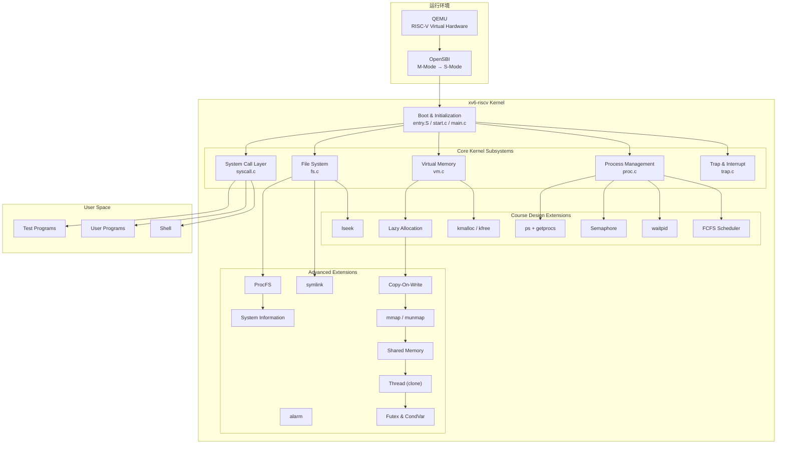

## 二、技术方案

### 2.1 系统设计目标

xv6 是一个面向教学的 Unix 风格操作系统，其代码结构清晰、模块划分合理，完整实现了进程管理、虚拟内存管理、文件系统、系统调用和异常处理等核心机制。

本项目拟在保持 xv6 原有体系结构稳定性的前提下，逐步扩展其功能，实现课程设计要求的操作系统关键机制，并在此基础上引入部分现代 Unix/Linux 内核设计思想，提高系统的完整性与可扩展性。

重点参考 Linux 和开源项目 Re-XVapor `(https://github.com/sandyyyz/Re-XVapor)` 以及 MIT 6.S081。

系统设计目标如下：
- 熟悉 xv6-riscv 内核整体架构与启动流程；
- 掌握操作系统核心子系统的实现原理；
- 完成课程要求的内存管理、进程管理、文件管理等功能扩展；
- 完成额外增加的扩展功能；
- 建立统一的系统调用与资源管理框架；
- 构建可持续扩展的实验操作系统平台；
- 构建完整的测试与验证体系。

最终形成一个具备较完整内核功能的增强型 xv6 操作系统。


### 2.2 系统总体架构

系统采用经典的分层式结构设计。整体运行环境由 QEMU、OpenSBI 和 xv6 内核组成。系统总体架构如图所示。

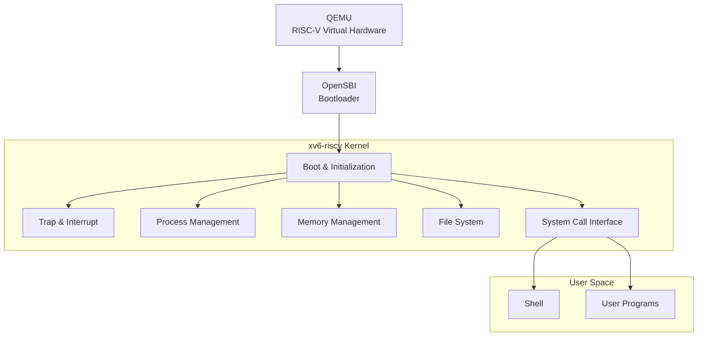
- QEMU 提供 RISC-V 虚拟硬件环境；
- OpenSBI 完成机器态初始化和特权级切换；
- xv6 内核负责资源管理和系统服务；
- 系统调用层提供用户态与内核态交互接口；
- 用户空间运行 Shell 和各类应用程序。

### 2.3 基于课程大纲子系统设计

#### 1. 系统启动（Bootloader）
- **课程大纲要求**
    - **功能示例**：实现从实模式到保护模式（x86）或从 M 态到 S 态（RISC-V）的切换；加载内核镜像到内存正确位置并跳转执行；初始化段描述符表（GDT/IDT）或中断向量表；设置栈指针，为 C 语言运行环境做准备；输出启动日志信息，证明启动成功。
    - **技术指标**：能在模拟器中成功启动并进入内核主函数；启动过程稳定可复现，无异常重启或死机。
- **xv6 现状与开发规划**
    - **现状**：xv6 底层配合 OpenSBI 已完整实现从 M 态到 S 态的平滑切换。在 `entry.S` 中安全初始化了各个 CPU 核的内核栈指针，并在 `start.c` 中配置了必要的 CSR 寄存器，稳定调入 `main.c` 主函数。最终进入 Shell，系统开始正常运行。
    - **规划**：本项目将完全复用该底层机制。后续开发过程中将在启动阶段增加调试日志输出，用于展示系统初始化过程和资源状态。

#### 2. 中断与异常处理
- **课程大纲要求**
    - **功能示例**：实现中断描述符表（IDT）的初始化与注册；实现时钟中断处理程序，支持定时功能；实现键盘中断处理，支持基本输入；实现系统调用接口（int 0x80 或 ecall），支持用户态到内核态切换；实现缺页异常处理。
    - **技术指标**：时钟中断频率稳定（如 100Hz）；键盘能正确读取扫描码并转换为 ASCII 字符；系统调用支持打印、进程创建、进程退出、文件读写。
- **xv6 现状与开发规划**
    - **现状**：xv6 采用基于 Trap 的统一异常处理框架。所有系统调用、异常和中断最终均通过 Trap 机制进入内核。xv6 已通过 `stvec` 寄存器及 `trampoline.S`/`trap.c` 构建了完整的中断向量表与异常分发路由；时钟中断稳定运行；串口驱动支持键盘扫描码转换 ASCII 码输入；`ecall` 原生支持 `write`、`fork`、`exit`、`read` 等核心系统调用。
    - **规划**：后续计划在现有框架基础上扩展：缺页异常处理；用户态非法访问检测；更完善的异常诊断信息输出。

#### 3. 内存管理
- **课程大纲要求**
    - **功能示例**：实现物理内存的探测与管理（可用内存区域识别）；实现物理页框分配器（基于位图或链表的伙伴算法/简单分配器）；实现虚拟内存管理：页表创建、映射、解除映射；实现内核堆内存分配（kmalloc/kfree）；实现用户态内存空间布局（代码段、数据段、堆、栈）。
    - **技术指标**：支持至少 4MB 物理内存管理；页大小为 4KB；支持按需分页（Demand Paging）；内存分配无泄漏，支持释放后重用。
- **xv6 现状与开发规划**
    - **现状**：xv6 当前采用页式内存管理机制。底层物理页分配器由 `kalloc/kfree` 实现。xv6 已实现物理内存映射（默认 128MB）；页框分配器采用简单的 4KB 空闲链表（`kalloc.c`）；虚拟内存使用 Sv39 标准三级页表实现映射与解映射；用户态空间布局原生支持良好。
    - **规划**：
        1. **内核堆内存管理**：在页级分配器基础上设计字节级动态分配器，实现 `kmalloc/kfree` 用于支持内核对象动态申请与释放。
        2. **实现按需分页（Demand Paging）**：改造用户堆空间增长方式。用户申请内存时仅扩展虚拟地址空间，在实际访问时通过缺页异常完成物理页分配，从而减少无效内存占用，达到 Lazy Allocation 的技术指标。

#### 4. 进程管理
- **课程大纲要求**
    - **功能示例**：实现进程控制块（PCB）数据结构；实现进程创建（fork/exec）；实现进程调度器（支持至少两种算法：FCFS 和 RR）；实现进程状态转换：就绪、运行、阻塞、僵尸；实现进程间同步机制：信号量、互斥锁；实现进程退出与等待（wait/waitpid）。
    - **技术指标**：支持多个并发进程；时间片轮转调度时间片可配置（默认 10ms）；进程切换开销小于 1ms（在 QEMU 中）；支持父子进程关系树。
- **xv6 现状与开发规划**
    - **现状**：xv6 拥有完整的 PCB 结构 `struct proc`、并发进程支持、多核状态机转换以及 `wait` 机制，默认调度为 RR（10ms 时间片）
    - **规划**：
        1.  **实现FCFS**：增加FCFS调度模式。支持 RR 与 FCFS 两种调度算法切换。
        2.  **进程同步机制**：基于自旋锁 `spinlock` 和 `sleep/wakeup` 原语，封装标准的信号量控制结构，实现原生 P/V 操作与互斥锁功能。
        3.  **实现 waitpid 机制**：支持父进程等待指定子进程退出。

#### 5. 文件系统
- **课程大纲要求**
    - **功能示例**：实现简化版文件系统（如基于内存的 RAMFS 或简化 EXT2）；支持文件/目录的创建、删除、打开、关闭、读写；实现文件描述符表管理；路径解析（绝对路径与相对路径）；支持标准输入输出重定向。
    - **技术指标**：支持至少 128 个文件，单文件最大 64KB；目录层级至少支持 3 层嵌套；文件读写支持 seek 操作；提供 mkfs 工具初始化文件系统镜像。
- **xv6 现状与开发规划**
    - **现状**：xv6 使用日志型文件系统。主要由Buffer Cache、Logging Layer、Inode Layer、Directory Layer组成。原生的 Inode 日志文件系统已具备缓存层、Logging 日志层、完备的文件描述符表及路径解析（`namei`），宿主机 `mkfs` 工具完备。
    - **规划**：重点实现 `lseek` 操作，完成对文件定位功能的支持。

#### 6. 用户程序加载与执行
- **课程大纲要求**
    - **功能示例**：实现 ELF 格式可执行文件的解析与加载；实现用户态栈初始化（参数传递、环境变量）；实现系统调用封装库（libc 简化版）；实现 shell 命令行解释器，支持基本命令（ls, cat, echo, ps, kill, exec）。
    - **技术指标**：至少能加载运行 5 个不同的用户程序；shell 支持命令解析、参数传递、管道；用户程序崩溃不影响内核稳定性。
- **xv6 现状与开发规划**
    - **现状**：`exec.c` 支持 ELF64 加载与用户栈传参配置；内置的 Shell 支持管道、后台运行（`&`）等。
    - **规划**：
        1. **编写系统状态程序 `ps.c`**：在内核中增加 `sys_getprocs` 系统调用，用于将进程表中活跃进程的状态、名称、PID 和父进程信息安全拷贝至用户态，再在用户态 `ps.c` 中进行格式化输出。
        2. 确保在 `usertrap` 中正确拦截由于用户态程序引发的非法内存访问和非法指令执行等异常事件。在异常发生时，由内核强制终止（Kill）该出错的用户进程并调用 `exit` 回收其所有资源，确保用户程序崩溃时，内核不会 Panic，整体系统持续稳定。

### 2.4 额外扩展功能设计

除课程设计要求外，计划进一步扩展以下高级功能（可选），逐步向现代 Unix/Linux 内核设计靠拢。

- alarm
- symlink
- Copy-On-Write Fork
- mmap/munmap
- Shared Memory 
- 多线程机制
- Futex 和条件变量
- ProcFS
- system information

### 2.5 测试方案

- 单元测试：针对新增功能分别自行设计测试程序或引入官方测试文件，精准验证单一模块功能的正确性。
- 异常测试：构造非法内存访问和异常系统调用场景，验证系统异常隔离能力和资源回收能力。
- 系统测试：运行 xv6 原生测试集 usertests ，全面验证进程管理、内存管理、文件系统及系统调用等核心功能的正确性与兼容性。
- 压力测试：运行 xv6 原生的 grind 测试，测试系统稳定性。
- 集成测试：实现统一测试框架 alltests.c，对新增功能测试、异常测试以及 xv6 原生 usertests 进行统一调度，实现一键式自动化测试。通过集成运行验证各模块之间的兼容性与协同工作能力，并检查系统整体稳定性。

- [测试说明文档](devlog/test.md) `(devlog/test.md)`

### 2.6 开发过程中想到的其他内容

- 堆内存管理目前采用 First-Fit 空闲链表方法，还有更复杂的 Buddy System 和 Slab Allocator方法
- 进程调度算法 FCFS RR (还有 SPF NP-FP 等 ) 
- 增加图形化界面
- 完善 libc
- 测试指标 量化优化结果

## 三、任务清单及进度规划

- 阶段一：基础环境与系统分析（Unchanged）
  - [x] 完成 QEMU、GCC 交叉工具链及 SSH 远程开发环境部署。
  - [x] xv6 架构与启动流程分析。
  - [x] 跑通 usertests 基准测试，建立 Baseline。

- 阶段二：系统调用、异常防护与动态内存（Foundation）
  - [x] 异常防护机制：在 usertrap 中拦截非法地址/指令，确保用户态崩溃不影响内核。
  - [x] kmalloc/kmfree：实现内核级字节动态分配器，为后续的信号量、定时器、线程等提供动态内存支持。
  - [x] 实现 getprocs 系统调用与用户态 ps 程序（先使用系统原生的静态进程表）。

- 阶段三：核心进程管理、调度与同步（Core Process & Sync）
  - [x] FCFS 调度器：引入创建时间戳，实现非抢占 FCFS 与 RR 的动态切换。
  - [x] waitpid：扩展进程回收机制，支持回收指定子进程。
  - [x] Semaphore（信号量）：基于自旋锁与 sleep/wakeup 实现，由于有了 kmalloc，此时可以实现 sem_alloc/sem_free。
  - [x] Alarm 异步事件通知：基于时钟中断、Trapframe 现场保存与恢复实现定时通知。

- 阶段四：文件系统增强（File System）
  - [x] lseek：实现文件指针定位，支持 SEEK_SET/CUR/END。
  - [x] Symlink（软链接）：实现符号链接节点，并在 namei 路径解析中引入递归解析与死循环防御。

- 阶段五：进阶虚拟内存管理（Advanced VM）
  - [x] Lazy Allocation（按需分页）：重构 sbrk，通过捕获 13/15 号缺页中断动态分配物理页。
  - [x] Copy-On-Write Fork（写时复制）：在 kalloc 中引入物理页引用计数，在 fork 时共享只读页表，写操作时触发缺页拷贝。
  - [x] mmap/munmap：引入虚拟内存区域（VMA）管理，实现文件与匿名的内存映射。
  - [ ] Shared Memory（共享内存）：基于 VMA 和引用计数，实现多进程共享物理页。

- 阶段六：多线程机制与用户态同步（Threading & Futex）
  - [ ] clone：利用阶段五建立起来的成熟页表管理机制，通过 uvmshare 共享物理地址空间，为轻量级线程创建独立的页表、Trapframe 和用户栈。
  - [ ] Futex 和条件变量
  
- 阶段七：系统信息与虚拟文件系统（Virtual FS）
  - [ ] ProcFS 虚拟文件系统：实现动态虚拟 Inode 映射机制。
  - [ ] System Information：实现 /proc/meminfo 和 /proc/[pid]/status，将阶段二的 getprocs 和阶段五的 VMA 状态以虚拟文件形式直观暴露。

- 阶段八：测试与全量验证（Testing）
  - [ ] 模块单元测试
  - [ ] 集成测试与原生 usertests 压力测试
  - [ ] 一键自动化测试框架 alltests 跑通

### 最终验收要求

- 验收说明
  - 21日前需先提交最终材料至云盘“最终材料”文件夹，最终材料计入总分，不提交材料不给成绩。
  - 22日下午根据分组信息到指定教室验收人处进行验收。如果个别同学有特殊情况，和相应验收老师协商。
  - 按分组信息顺序进行验收，同时带着自己电脑准备好展示系统、预输入测试样例和源码，方案A每组所有成员到场，汇报和展示总时间不超过10分钟；

- 提交最终材料

- 结题报告PDF（命名方式“方案A_学号1_姓名1_学号X_姓名X”）
内容应包括：
  - 项目概述（项目背景、目标、团队信息、分工方案）
  - 技术方案设计（整体架构图、模块划分、技术选型x86/RISC-V等）
  - 模块详细实现（设计思路、数据结构、关键算法、核心代码片段）
  - 系统运行与功能测试、创新点、总结与展望等内容。

- 汇报PPT（命名方式“汇报序号_方案A_学号1_姓名1_学号X_姓名X”）

## 四、具体完成工作

### 4.1 基础环境与系统分析
- 构建 Windows 11 (VSCode) + SSH 远程连接 + Ubuntu 22.04 虚拟机的开发架构。
- 完成 RISC-V 交叉编译器（gcc-riscv64）、调试器与 QEMU 模拟器的配置。
- 初始化 GitHub 仓库 https://github.com/yuuichi33/OS 并完成首次推送。
- 新建并切换至独立开发分支 dev，强制回滚至 2022 年底稳定提交 74c1eba，避开后续版本对 QEMU >= 7.2 的编译限制，确保兼容性。
- 通过 make qemu 成功编译并启动系统。
- 在模拟器中全量跑通内核测试集 usertests，测试结果为 ALL TESTS PASSED。同时运行官方压力测试程序 grind，在持续运行过程中未出现 panic、死锁或异常退出现象，验证系统基线版本具备良好的稳定性。
<center>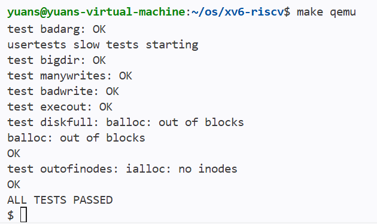</center>


### 4.2 系统调用、异常防护与动态内存
- [分析](devlog/phase2.md) `(devlog/phase2.md)`

- 用户态异常捕获
  - 修改 trap.c 中的 usertrap()，实现对非法指令（scause 2）与内存越界读写（scause 13/15）的分类识别。
  - 发生异常时，内核打印错误地址与指令并强制结束该进程（exit(-1)），保证内核和其他进程正常运行不崩溃。
- 集成测试框架（alltests）
  - 编写 alltests.c 自动测试程序，通过 fork 一键运行所有测试并比对退出状态码。
  - 一键跑通了包含正常调用、非法指令、非法读写在内的全部 4 个测试用例（PASS: 4/4）。
- getprocs 系统调用
  - 结构体 struct uproc 用于在内核与用户态间传递 PID、状态、内存大小及进程名。
  - 实现 sys_getprocs，遍历全局进程表，通过 copyout 安全地将打包数据拷贝至用户空间。
- 用户态 ps 命令
  - 编写 ps.c 工具，打印进程状态。
  - 将 ps 接入测试框架 alltests，测试结果全量通过（PASS: 5/5）。
- 内核动态内存分配器（kmalloc/kmfree）
  - 基于首部链表（First-Fit Header）实现。申请时自动进行 8 字节对齐并按需拆分空闲块；无可用块时，向底层页分配器索要全新物理页。
  - 在 kmfree 中实现了物理连续空闲块的自动检测与合并，有效防止了内存碎片的产生。
  - 使用独立的自旋锁保护分配链表，保证了多 CPU 并发分配下的数据安全。
  - 编写 kmalloctest.c 单元测试，并将其接入 alltests 集成测试框架，测试顺利通过（`PASS: 6/6`）。
<center>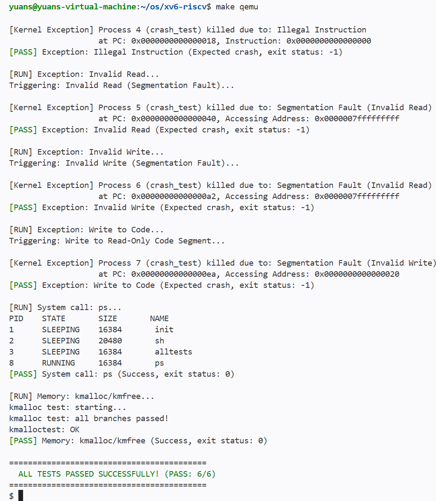</center>

### 4.3 核心进程管理、调度与同步
- [分析](devlog/phase3.md) `(devlog/phase3.md)`

- FCFS 调度器
  - 创建 ctime 时间戳，在 proc.c 的 scheduler() 中实现 FCFS 策略，调度时选取 ctime 最小（最早创建）的就绪进程。
  - 修改 trap.c 实现非抢占的 FCFS。
  - 新增 sched_switch 系统调用和 sche` 命令，支持切换调度模式。
  - 编写 schedtest 并接入 alltests。FCFS 模式下子进程完全顺序执行；RR 模式下子进程交替并发（打印交错）。测试结果全量通过（`PASS: 10/10`）。
  <center>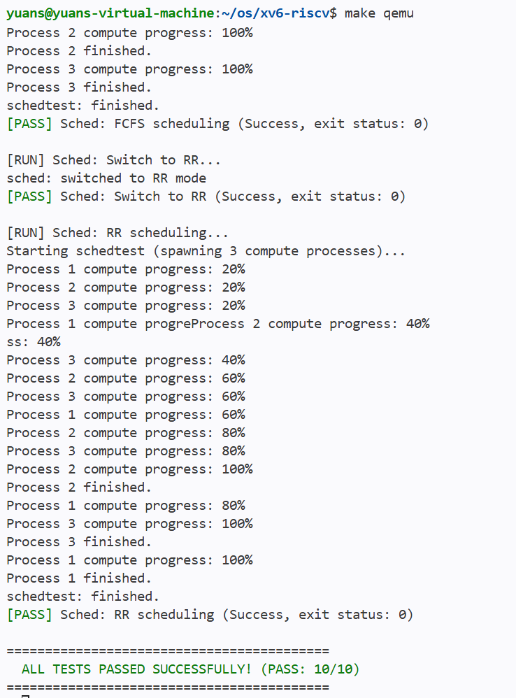</center>

- waitpid 机制
  - 若传入 pid > 0，内核仅查找、回收 PID 匹配的特定子进程；若传入 pid == -1，则兼容普通 wait，回收任意子进程。
  - 非阻塞支持：支持首部选项 WNOHANG（值为 1）。当指定该选项且目标子进程尚未退出时，内核立即返回 0，避免了父进程无意义的挂起等待。
  - 编写 waitpidtest.c，将其接入 alltests 测试框架，通过全部 11 项测试（`PASS: 11/11`）。
  <center>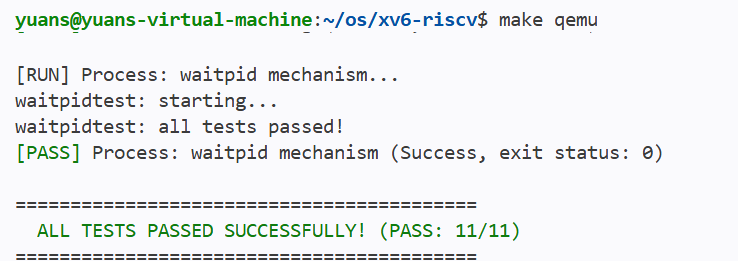</center>
 
- Semaphore（信号量）
  - 在 sem_alloc 中利用 kmalloc() 动态申请信号量结构体，并将 64 位内核指针句柄传回用户态；释放时通过 kmfree() 彻底回收内存归还给堆。
  - 采用信号量自身的内存地址作为 xv6 sleep/wakeup 的共享通道。P 操作（sem_wait）在资源不足时将进程挂起，V 操作（sem_signal）在释放资源时精准唤醒通道上的等待进程。
  - 编写 semtest.c，覆盖非法句柄防御、非阻塞 P/V、阻塞式同步（sleep/wakeup）、以及 50 次循环分配与释放的内核堆内存泄漏（Stress）测试，将其接入测试框架 alltests，全量测试顺利通过（`PASS: 12/12`）。
  <center>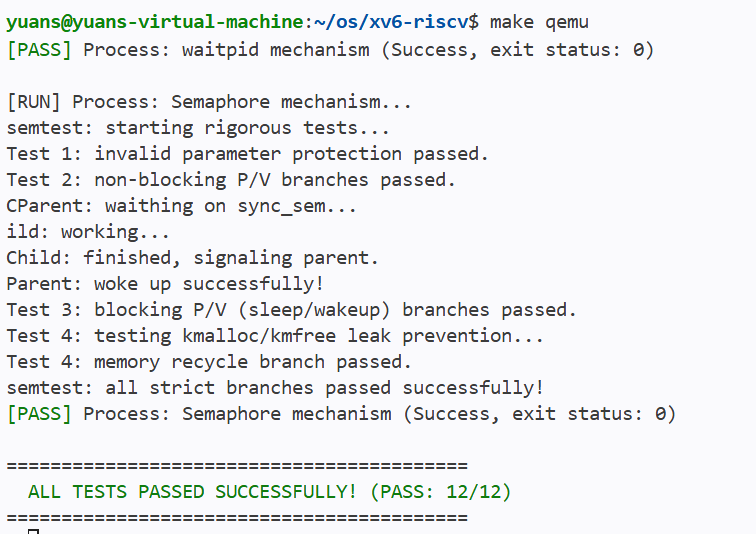</center>

- Alarm: 基于硬件时钟中断的用户态异步定时器（sigalarm / sigreturn）机制
  - 时钟中断拦截与重定向
    - 在进程创建时，利用 kmalloc 在内核堆中动态分配现场备份页 alarm_tf。
    - 时钟中断触发时累加滴答数，到期时将当前 trapframe 完整拷贝备份，并将用户态返回地址 epc 强行重定向至警报处理函数。
  - 现场恢复与防重入机制
    - a0 寄存器保护：在 sys_sigreturn 中，恢复备份现场的同时强制返回 p->trapframe->a0。
    - 重入锁保护：引入 alarm_running 标志位。当进程正在执行警报处理函数时，屏蔽新的时钟触发，避免自重入嵌套导致的栈溢出崩溃。
  - 采用官方的 alarmtest.c，集成进统一测试框架，成功通过实验（`PASS: 13/13`）。
  <center>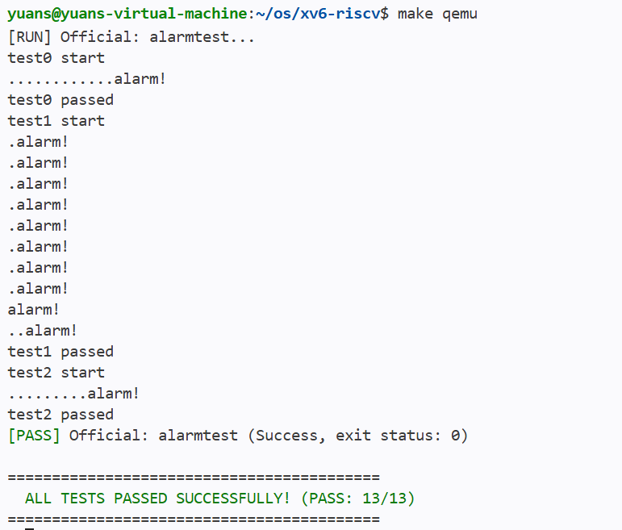</center>

### 4.4 文件系统增强
- [分析](devlog/phase4.md) `(devlog/phase4.md)`

- lseek
  - 实现 sys_lseek，支持 SEEK_SET、SEEK_CUR、SEEK_END 三种标准定位模式。
  - 引入 inode 级别的睡眠锁保护，确保多核/多进程并发访问时，文件大小 size 读取和偏移量 off 改写具有强一致性。
  - 建立边界异常防御，成功拦截并过滤非法文件描述符（fd）、非 Regular 文件类型（管道/控制台设备）以及越界负数偏移。
  - 编写 lseektest.c 并成功接入集成测试框架，全量通过 14 项测试（`PASS: 14/14`）。
  <center>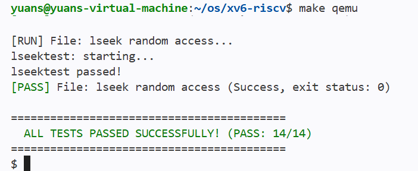</center>

- Symlink（软链接）
  - 定义软链接文件类型 T_SYMLINK（值为 4），实现 sys_symlink 系统调用，将链接目标路径通过 writei 动态存入软链接 Inode 的数据块中。
  - 重构 sys_open。当打开软链接且未指定 O_NOFOLLOW 时，内核通过 readi 递归读取目标路径并解析。设定最大递归深度为 10，防御环路软链接导致的内核死锁。
  - 成功通过官方包含基础重定向、断头链接、环路自动熔断、多级链条追踪以及多核高并发读写竞争测试（`PASS: 15/15`）。
  <center>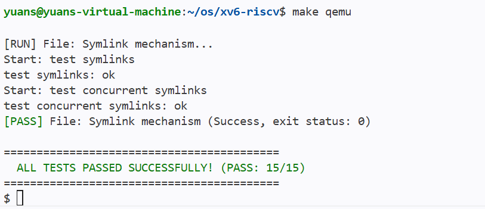</center>

### 4.5 进阶虚拟内存管理
- [分析](devlog/phase5.md) `(devlog/phase5.md)`

- 按需分页 lazy allocation
  - 修改 sys_sbrk。当进程申请增加堆内存时，仅抬高虚拟地址边界 p->sz，不实际分配物理页、不修改页表。在缩减内存时，依然立刻释放物理页。
  - 在 usertrap() 中拦截读缺页（scause 13）与写缺页（scause 15）异常。当地址处于 `[0, p->sz)` 合法堆区间内时，通过 kalloc 动态申请物理页并通过 mappages 补齐映射。
  - 重构 walkaddr() 和 copyout()。当用户进程将尚未映射的 Lazy 内存指针传给 read/write 等系统调用时，内核在执行虚拟地址转换时能自动透明地为其补齐分配物理页。
  - 修改 uvmunmap 与 uvmcopy，使其在执行页表释放或 fork 拷贝时，遇到尚未分配物理页的 Lazy 页面时直接 continue，不再 Panic。
  - 修复官方 lazytests 退出码硬编码为 1 的问题，集成测试全部通过（`PASS: 16/16`）。
  <center>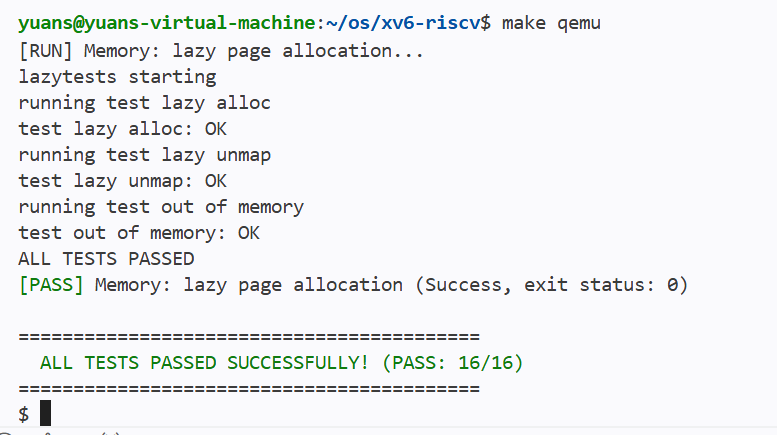</center>

- Copy-On-Write Fork
  - 重构 uvmcopy，在 fork 时不复制物理内存，仅复制页表项，清除 PTE_W 写权限并打上自定义的 PTE_COW 标记。
  - 在 kalloc.c 中设计全局自旋锁保护的物理页计数器 page_ref。重构 kalloc 与 kfree，仅在引用计数递减到 0 时才真正归还物理空闲链表。
  - 在 usertrap 中捕获 scause 15 写异常。若多进程共享则调用 cow_alloc 申请新页拷贝数据；若当前进程独占该页（计数为 1），则直接还原写权限，免去拷贝开销。
  - 在 copyout() 中加入 PTE_COW 拦截与主动分裂，保障内核态向用户态写回数据时的安全性。
  - 通过官方 cowtest.c 压力与并发测试，集成测试全部通过（`PASS: 17/17`）。
  <center>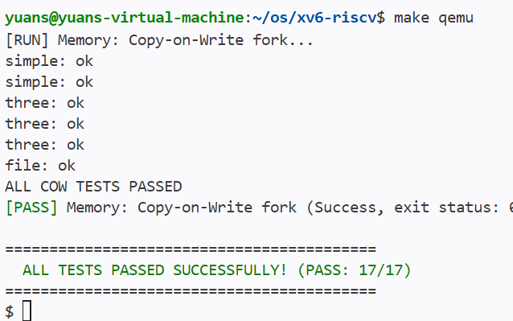</center>

- mmap/munmap 文件内存映射
  - 设计虚拟内存区域 struct vma 结构，并在 PCB 中维护进程最大 16 个 VMA 映射槽。
  - 实现 sys_mmap 系统调用。在 mmap 时仅在 VMA 中登记边界，不进行实际物理分配。在发生 VMA 区间缺页时，动态申请物理页，并调用 readi 将磁盘对应的文件块按需调入物理内存。
  - 在 sys_munmap 和 exit() 时，遍历映射区间，若为 MAP_SHARED 且已被建立物理映射的页，通过 writei 自动将脏数据刷回对应磁盘文件。
  - 在 sys_sbrk 中实现动态上限检测，限制进程大小不能超过 VMA 的最低起始地址，防止堆与 VMA 重叠。
  - 通过官方 mmaptest.c 所有测试子项，集成测试全部通过（`PASS: 18/18`）。
  <center>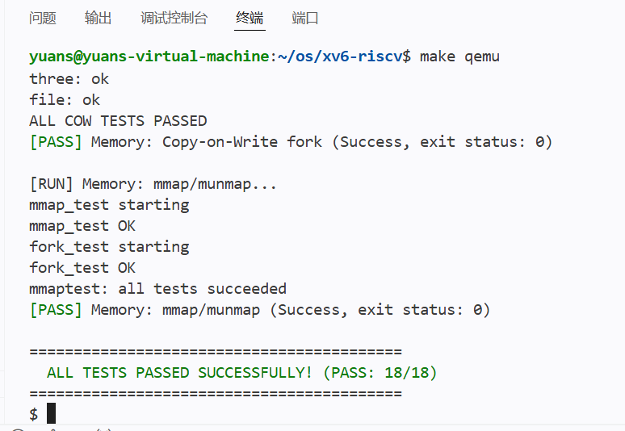</center>

- 此时进行了一次全量测试，测试结果：alltests 全量通过； grind 连续运行数分钟，系统稳定。

## 五、测试与验证
### 5.1 llm mmap vs read

- 参考：https://github.com/karpathy/llama2.c
- Vivek S. Pai, Peter Druschel, and Willy Zwaenepoel. 2000. IO-Lite: a unified I/O buffering and caching system. ACM Trans. Comput. Syst. 18, 1 (Feb. 2000), 37–66. https://doi.org/10.1145/332799.332895

为测试内核在面对较大文件（约 1MB）和密集浮点数计算时的稳定性，同时定量评估存储映射对程序启动效率的优化，本项目移植 Andrej Karpathy 的轻量级 Llama 2 C 语言推理引擎 llama2.c 。测试模型选用在 TinyStories 数据集上训练好的极简大语言模型 stories260K.bin（二进制文件大小约为 1.04 MB）。

由于默认的 xv6 文件系统最大单文件上限仅为 268KB，且磁盘总容量仅为 2MB，无法容纳该模型文件。为此，本项目对文件系统底层规格进行调整：
- 在 kernel/fs.h 中，将 BSIZE（块大小）从 1024 改为 2048。
- 在 kernel/param.h 中，将 FSSIZE（磁盘大小）从 2000 改为 8000 块。

编写用户态测试程序 user/llama.c。该程序支持以下两种加载模式，并利用 uptime() 系统调用统计从程序启动到数据装载完毕所耗费的 CPU 时钟滴答数（Ticks），进行量化对比：
- Mmap 模式 (-m)：直接调用项目中自定义实现的 mmap 系统调用。它只在页表里登记地址，不进行实际读盘，等运行需要时才触发缺页中断读盘。
- Read 模式 (-r)：先用 malloc 申请 1.1MB 内存，再调用 read() 一次性把文件从磁盘读进内存。

**一次运行的结果**
```
$ llama stories260K.bin -m
[AI OS] Model Config loaded: Dim=64, Layers=5, Vocab=512
[Benchmark] Mode: mmap (Zero-Copy)
[AI OS] Calling mmap to map 1056540 Bytes of weights...
[Benchmark] Cold-start Loading Time: 0 Ticks
[Benchmark] Mounted/Allocated Address: 0x0000000040000000

[AI OS] Generating text... (Stories260K Mode)

Once upon a time, there was a little boy named Timmy...

[AI OS] Story generated successfully.
$ llama stories260K.bin -r
[AI OS] Model Config loaded: Dim=64, Layers=5, Vocab=512
[Benchmark] Mode: malloc + read (Traditional)
[AI OS] Allocating memory and reading 1056540 Bytes sequentially...
[Benchmark] Cold-start Loading Time: 21 Ticks
[Benchmark] Mounted/Allocated Address: 0x0000000000005010

[AI OS] Generating text... (Stories260K Mode)

Once upon a time, there was a little boy named Timmy...
[AI OS] Story generated successfully.
```
- 测试数据显示，存储映射（mmap）模式下的冷启动耗时为 0 Ticks，而传统顺序读取模式则需要 21 Ticks。
- 产生该耗时差异的根本原因在于：传统 read() 模式必须阻塞式地执行全量物理磁盘块读取，并进行从内核缓冲区到用户堆的二次内存拷贝；而 mmap 模式下，内核仅建立了虚存空间的映射关系而未发生真实的物理磁盘 I/O。
- 这一对比定量地证明了存储映射与零拷贝（Zero-Copy）机制在提升应用启动效率、节省物理内存开销方面的显著优势。同时，该大模型程序在 xv6 系统中的成功无错运行，也全面验证了本项目实现的虚拟内存管理、按需调页（Lazy Allocation）和文件系统规格扩展等核心模块在面临高负载情况下的健壮性。
  
## 参考资料（部分）

- https://github.com/mit-pdos/xv6-riscv
- https://github.com/mit-pdos/xv6-riscv-book/
- https://github.com/qemu/qemu
- https://github.com/sandyyyz/Re-XVapor
- https://github.com/tianx666/xv6-book-riscv-rev1-Chinese
- https://blog.csdn.net/zzy980511/category_11740137.html
- https://github.com/mit-pdos/xv6-riscv-fall19
- https://github.com/torvalds/linux
- https://pdos.csail.mit.edu/6.S081
- https://linux-kernel-labs.github.io/
- https://pdos.csail.mit.edu/6.S081/2020/labs/lazy.html
- https://fail.lingfei.xyz/tags/xv6/
- https://github.com/karpathy/llama2.c

<!-- </div> -->