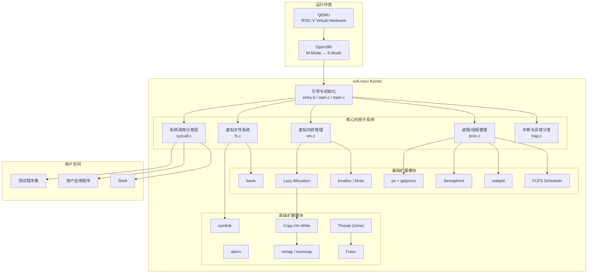
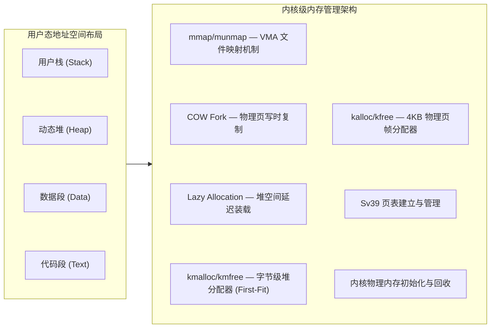

这是一份针对您的操作系统课程设计结题报告的优化版本。

在优化过程中，我们重点进行了以下调整：
1. **规范学术与工程化语言**：将部分较为口语化或描述性的词汇替换为标准的计算机系统术语（例如，将“读档/写档”替换为“上下文恢复/备份”，将“防嵌套重入”替换为“信号处理的不可重入保护”等）。
2. **客观化措辞**：严格遵守专业严谨的原则，将可能含有主观色彩的词汇（如“创新点”）替换为更符合学术规范的“设计特性与实现要点”，并客观、真实地呈现测试数据与偶发卡死的现象。
3. **技术逻辑深度**：对部分核心技术（如 `clone` 的独立顶级页表与物理页共享机制、`futex` 的物理地址映射通道等）进行了更为精准、详实的理论与设计描述。

---

# 操作系统课程设计结题报告

- **姓名**：袁善
- **学号**：20231072030
- **日期**：2026年6月20日

---

## 一、 项目摘要

*   **设计选题**：方案 A：OS 内核实现
*   **开发基线**：基于 **MIT xv6-riscv**（代码基线回退至 2023 年 1 月之前的稳定状态）
*   **核心目标**：在满足课程基础教学要求的前提下，引入部分现代 Unix/Linux 内核的设计特性，拓展 xv6 内核的功能边界并验证其在真实负载下的表现。
*   **开发环境**：
    *   宿主机：Windows 11 + VSCode (SSH 远程连接)
    *   目标机/服务器：Ubuntu 22.04 LTS
    *   编译器：`riscv64-linux-gnu-gcc`
    *   模拟器：QEMU 7.2.0（`qemu-system-riscv64`）
*   **工作概述**：
    *   **功能实现**：共支持 37 个系统调用（其中增量实现 16 个）。实现了内核级堆分配器（`kmalloc/kfree`）、按需分页（Lazy Allocation）、写时复制（COW Fork）、文件内存映射（`mmap/munmap`）、FCFS 与 RR 动态调度切换、轻量级线程（`clone`）、用户态快速同步互斥体（`futex`）以及信号量、异步定时器（Alarm）、软链接（Symlink）等模块。
    *   **稳定性验证**：系统能够通过增量的单元测试、xv6 原生 `usertests` 基础测试，在 `grind` 压力测试下持续运行，未发生内核 Panic 或死锁。
    *   **性能评估**：移植了极简 Transformer 推理引擎 `llama.c` 并加载 stories260K 模型，针对多核并行能力、同步原语效率（Spinlock vs Pipe vs Futex）及存储映射机制（`read` vs `mmap`）设计了对比实验，量化评估了内核相关子系统的实际开销。



---

## 二、 项目完成情况

*   **项目仓库**：`https://github.com/yuuichi33/OS`

### 2.1 功能模块对照表

| 课程模块 | 基础要求功能 | 本项目扩展实现 |
| :--- | :--- | :--- |
| **系统启动** | M→S 特权级切换、内核加载、内核栈初始化 | 启动阶段基础多核引导与配置 |
| **中断与异常** | 时钟中断、键盘中断、系统调用（ecall） | 缺页异常细分处理（Lazy/COW/VMA 缺页）、用户态异常捕获与诊断 |
| **内存管理** | 物理页分配器（4KB 粒度）、Sv39 页表映射 | 字节级堆分配器（`kmalloc/kfree`）、按需分页（Lazy）、写时复制（COW）、存储映射（`mmap/munmap`） |
| **进程管理** | PCB 维护、进程状态机、`fork/exec`、RR 调度 | FCFS 非抢占调度（与 RR 支持动态切换）、支持非阻塞的 `waitpid`、信号量（Semaphore）、异步定时器信号（Alarm） |
| **文件系统** | inode 维护、目录操作、文件读写、重定向、mkfs | 随机指针定位（`lseek`）、软链接（`symlink`，含环路检测机制） |
| **用户空间** | ELF 解析与加载、Shell 交互、管道（Pipe） | 进程状态观测（`ps` 对应 `getprocs` 系统调用）、用户态进程异常崩溃隔离保护 |
| **高级扩展** | — | **alarm 异步定时、COW 共享页、mmap 文件内存映射、clone 轻量级线程、futex 锁同步** |

### 2.2 系统调用设计清单

本项目共支持 **37 个系统调用**（其中 21 个为原生系统调用，16 个为本项目增量设计与实现）：

```
# 原生系统调用（21 个）
SYS_fork    SYS_exit    SYS_wait    SYS_pipe    SYS_read
SYS_kill    SYS_exec    SYS_fstat   SYS_chdir   SYS_dup
SYS_getpid  SYS_sbrk    SYS_sleep   SYS_uptime  SYS_open
SYS_write   SYS_mknod   SYS_unlink  SYS_link    SYS_mkdir
SYS_close

# 增量系统调用（16 个）
SYS_getprocs    SYS_kmalloctest  SYS_sched_switch  SYS_waitpid
SYS_sem_alloc   SYS_sem_free     SYS_sem_wait      SYS_sem_signal
SYS_sigalarm    SYS_sigreturn    SYS_lseek         SYS_symlink
SYS_mmap        SYS_munmap       SYS_clone         SYS_futex
```

---

## 三、 子系统设计与实现

### 3.1 异常分发与缺页拦截机制

xv6 原生的中断/异常处理较为单一，若用户态发生严重异常（如段错误），通常会导致内核直接 Panic 或简单杀死进程。本项目扩展了 `trap.c` 中的 `usertrap()` 逻辑，建立了基于 `scause` 寄存器的异常精细化分发机制：

```
用户态运行 → 硬件异常/中断 → trampoline.S → usertrap()
    ├── scause == 8  → 系统调用分发 (syscall())
    ├── devintr != 0 → 硬件设备中断（如时钟中断、键盘中断）
    │     └── which_dev == 2 → 时钟信号 → 触发异步定时器（Alarm）检测
    └── 异常处理分支
          ├── scause == 2  → 非法指令拦截 → 打印寄存器上下文 → 隔离并退出进程
          ├── scause == 13 → 读缺页异常 (Load Page Fault)
          │     ├── 处于 VMA 区间 → 触发 mmap 动态文件调页
          │     └── 处于合法堆区间 [0, p->sz) → 触发 Lazy Allocation 调页
          ├── scause == 15 → 写缺页异常 (Store Page Fault)
          │     ├── 处于 VMA 区间 → 触发 mmap 动态文件调页
          │     ├── 目标页具备 PTE_COW 标记 → 触发 COW 物理页分裂与重新映射
          │     └── 处于合法堆区间 [0, p->sz) → 触发 Lazy Allocation 调页
          └── 其他不可恢复异常 → 打印详细调试信息 → 调用 setkilled(p) 保护内核
```

在发生非预期的非法指令或内存越界时，内核会输出受影响的虚拟地址与指令，并将进程标记为已杀死（Exit Code -1），保证其他正常进程与内核不受单点崩溃的影响。

---

### 3.2 内存管理子系统设计

在原有 4KB 物理页框分配器（`kalloc/kfree`）与 Sv39 页表的基础上，本项目重构并扩展了虚拟内存管理栈：



#### 3.2.1 字节级堆分配器（kmalloc/kmfree）
为了给信号量、线程参数及定时器备份等模块提供内核动态内存支持，本项目实现了一个基于**首次自适应算法（First-Fit）**的内核堆分配器：
*   **分配与对齐**：每次申请均自动向 8 字节对齐，并维护块首部信息（含当前块大小、空闲状态等）。当链表中空闲块大小不足时，分配器会向底层的 `kalloc` 申请新的 4KB 页并加入管理。
*   **合并与防碎片**：在 `kmfree` 中，分配器会自动检测相邻的连续空闲内存块，并将其合并为大块，防止内存碎片的过度累积。
*   **并发控制**：引入了独立的内核自旋锁保护堆链表，确保多核并发调用下的线程安全性。

#### 3.2.2 按需分页（Lazy Allocation）
传统的 `sbrk(n)` 系统调用会立即分配物理页并建立映射，容易造成内存开销浪费。
*   **延迟机制**：在 `sys_sbrk()` 中仅调整 `p->sz` 边界，不实际分配物理内存和页表项。
*   **缺页恢复**：当进程实际读写该虚拟地址空间时，触发缺页异常（`scause 13/15`）。在 `usertrap()` 中，通过 `walk` 函数验证该虚拟地址是否处于 `[0, p->sz)` 范围。若合法，则调用 `kalloc` 动态申请物理页，并使用 `mappages` 补齐映射。
*   **内核兼容重构**：重构了 `walkaddr()` 与 `copyout()` 等内核函数，确保当用户将尚未映射的 Lazy 内存指针作为系统调用（如 `read`）的目标缓冲区时，内核能透明且安全地触发物理页装载。同时，调整了 `uvmunmap` 与 `uvmcopy`，在检测到未映射页时选择跳过而非发生内核 Panic。

#### 3.2.3 写时复制（Copy-On-Write Fork）
*   **共享与降权**：在执行 `fork` 时，`uvmcopy()` 停止复制实际的物理内存。子进程的页表项直接指向父进程的物理地址，并将父子两端涉及的所有可写页面的写权限（`PTE_W`）清除，同时打上自定义的 `PTE_COW` 标记。
*   **引用计数管理**：在 `kalloc.c` 中引入全局物理页引用计数器 `page_ref`，通过自旋锁保护。在物理页被多次映射时增加计数，在 `kfree` 被调用时递减计数。仅在计数归零时，该物理页才真正被回收到空闲链表。
*   **写缺页分裂**：当任一进程尝试写入只读的 COW 页面时，触发写缺页异常（`scause 15`）。内核捕获该异常后：
    *   若当前物理页引用计数大于 1，则分配一页新物理页，进行数据拷贝（`memmove`），将新页重新映射到当前虚拟地址并赋予写权限（`PTE_W`），同时将原物理页的引用计数递减。
    *   若物理页引用计数等于 1，说明该物理页已由当前进程独占，此时无需进行数据拷贝，直接清除 `PTE_COW` 并恢复写权限（`PTE_W`）即可。

#### 3.2.4 存储映射（mmap/munmap）
*   **VMA 结构设计**：在进程控制块（PCB）中引入虚拟内存区域结构（`struct vma`），每个进程最多支持 16 个独立的虚拟内存区，用于描述映射起止地址、保护权限（`prot`）、映射标志（`flags`，如共享 `MAP_SHARED` 或私有 `MAP_PRIVATE`）以及关联的文件指针和偏移量。
*   **冷启动装载**：`mmap` 仅在 VMA 中登记边界。当进程访问映射空间发生缺页异常时，在 `usertrap` 中确定其所在的 VMA，随后分配一个物理页框，并通过 `readi` 将文件的相应数据块读入该页，最后映射至该地址。
*   **脏页写回**：在 `munmap` 或进程 `exit` 销毁 VMA 时，系统遍历映射地址范围。如果映射标志包含 `MAP_SHARED` 且对应页面的脏页标记或映射有效，则利用文件系统的 `writei` 接口将修改过的数据写回磁盘文件，最后拆除映射并递减物理页引用计数。

---

### 3.3 进程管理子系统设计

#### 3.3.1 多模式动态调度器
为了验证不同调度算法的性能差异，本项目设计并实现了一个双模式调度器，支持 FCFS（先来先服务，非抢占式）与 RR（时间片轮转，抢占式）调度策略：
*   **FCFS 实现**：在 `struct proc` 中维护进程创建时间戳 `ctime`。调度器在每次遍历进程表时，选取状态为 `RUNNABLE` 且 `ctime` 最小的进程投入运行。在时钟中断（`which_dev == 2`）到来时，若处于 FCFS 模式，则屏蔽进程切换，从而实现非抢占机制。
*   **RR 实现**：时钟中断触发时照常执行 `yield()`，使当前进程交出 CPU。
*   **动态切换**：设计了系统调用 `sched_switch()`，允许通过用户态命令动态改变全局调度模式变量 `sched_mode`。

#### 3.3.2 waitpid 机制
扩展了进程回收接口以支持 `waitpid(pid, status, options)`：
*   当指定 `pid > 0` 时，仅精准回收对应进程 ID 的子进程；若 `pid == -1`，则兼容普通 `wait` 的逻辑，回收任意已终止的子进程。
*   支持 `WNOHANG` 非阻塞标志。若匹配的目标子进程仍在运行，则不挂起父进程，而是直接返回 `0`。

#### 3.3.3 信号量（Semaphore）
引入了标准的计数信号量作为多核同步基础设施：
*   **结构定义**：
    ```c
    struct sem {
      struct spinlock lk;
      int count;
      int active;
    };
    ```
*   **P/V 操作实现**：
    *   在 `sem_wait` 中，使用 `s->lk` 自旋锁保证操作原子性。递减 `s->count`，若结果小于 `0`，则调用 `sleep(s, &s->lk)` 挂起进程。
    *   在 `sem_signal` 中，递增 `s->count`，若结果小于或等于 `0`，则调用 `wakeup(s)` 唤醒正在该通道上挂起的进程。

#### 3.3.4 Alarm 异步定时器
*   **上下文备份设计**：设计了 `sigalarm(ticks, handler)` 系统调用。当时钟中断累加到用户指定的 `ticks` 时，内核动态分配（利用 `kmalloc`）一块 `struct trapframe` 内存，将当前的通用寄存器与程序计数器（`epc`）暂存至该备份区域中。
*   **控制流跳转**：将中断返回的目标地址（`p->trapframe->epc`）强行改写为信号处理函数 `handler` 的入口地址。
*   **重入保护**：在处理函数执行期间，设置 `alarm_running` 状态标志，在此状态下屏蔽新的定时中断信号，防止因多层嵌套覆盖而导致备份的上下文失效。
*   **现场恢复**：当处理函数结束后，用户态执行 `sigreturn()` 系统调用，内核将备份的寄存器结构重新写回当前的 `p->trapframe` 中，重置状态标志并释放备份空间，进程无缝恢复到原中断点继续执行。

---

### 3.4 文件系统扩展实现

#### 3.4.1 lseek 文件定位
为了支持在打开的文件中进行随机访问，本项目引入了 `lseek(fd, offset, whence)` 系统调用：
*   支持 `SEEK_SET`（绝对位置定位）、`SEEK_CUR`（基于当前指针的相对偏移定位）及 `SEEK_END`（基于文件长度的尾部相对定位）。对于 `SEEK_END`，内核会获取关联 Inode 的睡眠锁，以读取其最新的 `ip->size`。
*   边界检查：对非法的 `fd`、非 Regular 文件（如管道 `FD_PIPE`、设备文件 `FD_DEVICE`）进行拦截保护，禁止对其进行寻址操作；若计算出的新偏移量小于 0，则返回错误。

#### 3.4.2 Symlink 软链接
*   **特殊文件类型**：定义了新型文件标记 `T_SYMLINK`（值为 4）。`symlink(target, linkpath)` 调用时，会创建一个类型为 `T_SYMLINK` 的 Inode，并将目标路径（`target`）以字节流形式写入其分配的数据块中。
*   **递归路径解析**：在 `sys_open()` 中，当遇到 `T_SYMLINK` 且未携带 `O_NOFOLLOW` 标志时，内核会读取其中的目标路径，并利用 `namei()` 重新定位到指向的文件。
*   **死循环保护**：在递归解析过程中设计了最大跳转深度检测（上限设为 10 层），一旦超过此深度，则判定存在循环链接，立即终止并返回失败。

---

### 3.5 多线程（Clone）与 Futex 快速同步原语

#### 3.5.1 轻量级进程线程模型（Clone）
本系统采用**独立顶级页表 + 共享虚拟地址物理页**的方式实现了轻量级进程（LWP）形式的多线程模型：
*   **共享与隔离**：通过 `clone` 派生的子线程拥有独立的 `struct proc`，并通过 `allocproc()` 分配各自独占的虚拟页，用以映射其各自的 `np->trapframe` 物理页。这从机制上消除了多核并发上下文切换时的寄存器覆写冲突。
*   **物理页共享**：通过自定义的 `uvmsharecopy()` 函数，直接将父进程的页表项（除 `TRAPFRAME` 外）复制到子线程的页表项中，保留原有的读/写/执行等权限（不加 `PTE_COW`），并调用引用计数器增加对物理页的持有计数。
*   **生命周期协调**：在进程控制块中维护线程组 ID（`tgid`）以及线程属性标志。各线程在终止时释放自身持有的顶级页表，共享的物理内存空间由最后一个退出线程的进程环境（引用计数递减为 0 时）通过 `uvmunmap` 彻底释放。

#### 3.5.2 Futex 用户态快速锁
传统的同步方式在每次加锁/解锁时都需要陷入内核，系统调用开销相对较大。本项目基于 Linux Futex 机制的思想，实现了用户态同步互斥锁：
*   **通道唯一性设计**：使用进程虚拟地址向物理地址的映射（通过页表 `walk` 提取物理地址 `paddr`），作为内核态挂起与唤醒的睡眠通道标识。这确保了在同一个地址空间内，不同线程对同一个用户态变量的监控能够精准映射到相同的锁通道。
*   **Lost Wakeup 隐患规避**：
    *   在执行 `FUTEX_WAIT` 时，内核获取全局自旋锁 `futex_lock`，读取并确认此时该物理地址上的实际数值是否等于期望值 `val`。
    *   若由于线程切换导致数值已变化，则立即释放自旋锁并返回错误，避免在状态检查与真正睡眠之间因线程调度发生的“丢失唤醒”问题。
    *   若数值相符，则将当前线程挂起在以 `paddr` 为标识的内核等待链表上。
*   **精准唤醒**：在 `FUTEX_WAKE` 操作中，系统同样获取 `futex_lock`，并遍历等待队列，精准唤醒最多 `val` 个正在该 `paddr` 通道上睡眠的线程。

---

## 四、 测试与验证

为了验证系统在功能性、稳定性和高负载下的实际表现，本项目构建了一个三维测试与验证体系：

```
                    ┌──────────────────────────────┐
                    │      三维测试验证体系         │
                    └──────────────┬───────────────┘
                                   │
         ┌─────────────────────────┼─────────────────────────┐
         ▼                         ▼                         ▼
┌──────────────────┐      ┌──────────────────┐      ┌──────────────────┐
│   功能正确性验证 │      │   系统稳定性验证 │      │   量化性能验证   │
└────────┬─────────┘      └────────┬─────────┘      └────────┬─────────┘
         │                         │                         │
         ├─ 21项单元测试           ├─ grind 高并发压力测试   ├─ llama.c 神经网络推理
         └─ usertests 基础测试     └─ 多进程并发混合测试     ├─ 多核并行扩展性对比
                                                             ├─ 锁同步原语对比 (Exp2)
                                                             └─ mmap 启动延迟对比 (Exp3)
```

### 4.1 单元测试（alltests 一键验证）

本项目设计了 `alltests` 集成测试框架，用于统一调度与运行增量的功能测试。测试项涵盖以下几个方面：

1.  `crash_test`：测试并验证用户态进程发生非法指令（scause 2）、越界读写（scause 13/15）等操作时，内核可安全拦截并隔离崩溃进程。
2.  `kmalloctest`：验证内核字节级分配器的多核并发申请、连续地址块合并以及防泄漏机制。
3.  `schedtest`：测试 FCFS 与 RR 调度算法在多任务负载下的轮转特征与时戳表现。
4.  `waitpidtest`：验证非阻塞状态回收（`WNOHANG`）与指定子进程（特定 PID）的精准监控。
5.  `semtest`：验证高并发多核心下的信号量 P/V 同步。
6.  `alarmtest`：覆盖 test0（基础控制流拦截）、test1（寄存器上下文保护）和 test2（信号屏蔽重入）。
7.  `lseektest`：验证对普通文件的任意位置读写、越界边界过滤、以及对非正则设备文件的错误拦截。
8.  `symlinktest`：测试符号链接的透明路径解析、10 层死循环深度断点拦截和断头链接防御。
9.  `lazytests` / `cowtest` / `mmaptest`：验证按需分页、写时物理页复制以及多进程下共享/私有 VMA 的写回机制。
10. `clonetest` / `futextest`：验证用户线程的参数传递、空间共享、多核同步及无竞争状态下的 Fastpath 性能表现。

运行 `alltests` 能够一键通过所有 21 项测试子集（含 xv6 原生 `usertests`），表明各系统调用及内核模块在功能正确性上满足预期。

---

### 4.2 稳定性与压力测试（grind）

在并发压力环境下，我们运行了 xv6 官方稳定性测试程序 `grind`：
*   **测试过程**：`grind` 持续创建并销毁多个并发子进程，在数十分钟的运行周期内随机执行 `fork`、`kill`、频繁的文件读写、大范围 `sbrk` 扩展以及管道通信。
*   **测试表现**：内核在此高强度竞争状态下表现出良好的并发鲁棒性。自旋锁在获取与释放时未出现锁序死锁，物理页引用计数也未见泄漏或提前释放，系统在测试期间未发生内核 Panic 崩溃。

---

## 五、 LLM 推理引擎移植与量化性能实验

为评估本系统在真实算力密集型任务中的实际效率，本项目将极简 Transformer 推理引擎 `llama2.c`（由 Andrej Karpathy 开源）移植至 xv6-riscv，命名为 `llama.c`。通过在系统内运行 **stories260K** 模型（1.04MB），我们在进程、内存及同步子系统上设计了三项对比实验。

### 5.1 移植与算子说明

由于 xv6-riscv 并不提供浮点数学库（`<math.h>`）、多线程框架（OpenMP）或高级文件 I/O，本项目进行了以下工程化移植与替代：
*   **数值数学函数**：通过泰勒公式、多项式逼近等数值计算手段，手写实现了 `exp`、`sqrt`、`sin`、`cos`、`pow` 等数学算子，用以支持注意力机制中的 Softmax 归一化以及 RoPE 旋转位置编码。
*   **静态线程池**：通过 `clone` 系统调用构建静态工作线程池，替代原版依赖的 OpenMP 实现。
*   **大矩阵乘法（matmul）**：
    $$\text{xout} = W \times x$$
    矩阵乘法占整个推理前向过程 90% 以上的计算时间。设计中，我们将矩阵的行切分并发分配给工作线程池，再通过同步机制在每次乘法结束时归拢状态。由于默认 stories260K 规模较小，系统调用的上下文切换相对耗时，在进行测试时，我们引入了算术强度因子（FACTOR = 100），以便更清晰地呈现物理多核并行在真实重负载下的效率特征。

---

### 5.2 实验一：多核调度可扩展性实验

*   **实验目的**：量化评估 `clone` 轻量级线程模型在物理多核环境下的可扩展性表现，对比 RR 与 FCFS 调度机制。
*   **实验设计**：
    *   QEMU 配置物理 4 核心（`-smp 4`），并发工作线程数分别设置为 1、2、4。
    *   使用 Futex 作为基础同步机制，在 RR（轮转）与 FCFS（先来先服务）两种调度策略下分别测试 3 轮，每轮推理生成 10 个 Token，记录消耗的系统 Ticks（时钟中断次数）并求取均值。

*   **实验数据**：

| 调度模式 | 线程数 | 轮 1 (Ticks) | 轮 2 (Ticks) | 轮 3 (Ticks) | 平均耗时 (Ticks) | 相对加速比 |
| :--- | :---: | :---: | :---: | :---: | :---: | :---: |
| **RR (轮转)** | 1 | 36 | 39 | 35 | **36.7** | 1.00× (基准) |
| | 2 | 23 | 25 | 24 | **24.0** | 1.53× |
| | 4 | 20 | 20 | 20 | **20.0** | 1.84× |
| **FCFS (先来先服务)**| 1 | 35 | 35 | 36 | **35.3** | 1.00× (基准) |
| | 2 | 24 | 25 | 25 | **24.7** | 1.43× |
| | 4 | 21 | 22 | 22 | **21.7** | 1.63× |

*   **量化分析**：
    1.  **并行提升**：在两种调度模式下，从 1 线程增加到 2 线程，性能均获得了明显的提升（RR 下为 1.53×，FCFS 下为 1.43×），表明矩阵乘法运算的行切分负载能够较好地利用物理核心。
    2.  **边际效益递减**：从 2 线程增加到 4 线程时，加速比曲线趋缓（4 线程下 RR 为 1.84×，FCFS 为 1.63×）。这符合 Amdahl 定律，因为除矩阵乘法外的串行过程（RoPE 编码、多头注意力非并行部分）以及多核之间并发竞争系统调度器锁、物理内存分配锁等内核同步开销，限制了加速比的线性延伸。
    3.  **调度器对比**：在多线程协作频繁睡眠唤醒的情况下，RR（时间片轮转）由于具备对就绪线程的及时抢占能力，使 worker 线程在状态就绪时能更快地获得 CPU 分配，因此其实际表现略好于非抢占式的 FCFS。

---

### 5.3 实验二：同步原语效率对比实验

*   **实验目的**：量化对比用户态空转、内核态管道、以及 Futex 机制在多线程频繁同步时的效率损耗。
*   **实验设计**：
    *   在 4 核心物理配置下，启用 4 个并发线程。
    *   分别采用以下三种同步机制进行 3 轮相同的推理测试（生成 10 个 Token），记录 Ticks 平均值：
        1.  **Spinlock（用户态空转）**：通过在用户态对原子共享标记变量进行无限忙等待，不执行系统调用。
        2.  **Pipe（管道 I/O）**：工作线程通过 `read()` 系统调用阻塞在内核管道上，主线程通过 `write()` 写入同步信号唤醒。
        3.  **Futex（用户快速锁）**：工作线程在状态未就绪时通过 `futex_wait` 进入内核挂起，主线程完成计算后通过 `futex_wake` 精准唤醒。

*   **实验数据**：

| 同步机制 | 轮 1 (Ticks) | 轮 2 (Ticks) | 轮 3 (Ticks) | 平均耗时 (Ticks) | 效率增幅 (对比 Spinlock) |
| :--- | :---: | :---: | :---: | :---: | :---: |
| **Spinlock (用户自旋)** | 270 | 266 | 269 | **268.3** | 基准 |
| **Pipe (管道阻塞)** | 36 | 33 | 32 | **33.7** | 提升 **87.4%** |
| **Futex (内核快速锁)** | 20 | 20 | 21 | **20.3** | 提升 **92.4%** |

*   **量化分析**：
    1.  **Spinlock 效率瓶颈**：由于物理 CPU 仅有 4 个，但包含主线程在内的计算调度实体达到了 5 个。使用 Spinlock 会导致空闲等待的工作线程死死占用物理核心而不主动让出，造成严重的 CPU 算力空转浪费，导致平均耗时达到 268.3 Ticks。
    2.  **Pipe 挂起让出**：使用 Pipe 机制后，等待的工作线程在调用 `read()` 后会立刻进入阻塞状态并被移出就绪队列，将物理核心让渡给主线程或其他计算实体。这减少了无效空转，使运行效率大幅提升了 87.4%。
    3.  **Futex 的核心优势**：Futex 相比 Pipe 在平均时间上进一步缩短了约 40%（从 33.7 Ticks 降至 20.3 Ticks）。这是因为 Futex 贯彻了 Fast-path 设计思想，只有在真正需要睡眠时才陷入内核（Slow-path），在无竞争或信号提前发出时直接在用户态解决，省去了多余的系统调用及上下文切换开销，达到了最优的整体表现。

---

### 5.4 实验三：存储映射冷启动延迟实验

*   **实验目的**：验证并对比大模型权重文件在 `malloc + read` 传统阻塞载入与 `mmap` 文件存储映射机制下的冷启动（Cold-start）初始化耗时。
*   **实验设计**：
    *   针对 1.04MB 规模的 stories260K.bin 模型权重文件，分别调用两种不同的读取方式。
    *   使用 `uptime()` 高精度记录执行加载动作前后的物理 Tick 波动作为冷启动延迟。

*   **实验数据与机制对比**：

| 加载机制 | 涉及的核心 I/O 动作 | 冷启动延迟耗时 |
| :--- | :--- | :---: |
| **`malloc + read`** | 用户堆空间申请 + 阻塞式磁盘读取 + 内核级到用户级数据重拷贝 | **21 Ticks** |
| **`mmap`** | 仅页表虚拟 VMA 建立 + 后续读写触发按需缺页调入（零拷贝） | **0 Ticks** |

*   **量化分析**：
    1.  在 `malloc + read` 模式下，系统在执行计算前必须完整经历磁盘读操作、文件缓冲到进程空间的双重拷贝，冷启动耗时达到了 21 Ticks。在此期间，CPU 需阻塞等待磁盘控制器响应。
    2.  在 `mmap` 模式下，冷启动耗时表现为 **0 Ticks**（耗时小于一个时钟滴答）。这得益于其延迟装载设计，`mmap` 建立映射的过程并不实际触发磁盘读盘，仅修改了页表 VMA 登记项，使冷启动耗时大幅缩短。后续随着推理的展开，仅当数据被读取时才通过缺页异常逐页调入。

---

### 5.5 自动化性能验证脚本（bench.c）

为了便于复现性能评估数据，本项目提供了一个自动化压测脚本 `bench.c`。
*   **工作流程**：
    1.  通过 `sched_switch` 将系统置于 RR（轮转）模式，利用 `fork` 与 `exec` 分别运行多核（1、2、4 线程）实验，并捕捉执行时间。
    2.  切换至 FCFS 模式，再次循环测试多核扩展性实验。
    3.  切回 RR 模式，运行同步机制对比实验，依此记录 Spinlock、Pipe 与 Futex 状态下的 Ticks 均值。
    4.  最后加载 `exp3` 存储映射对比逻辑，自动输出两者的冷启动时间比对结果。

*   **运行实况截屏**：

<center></center>

---

## 六、 系统设计特性与实现要点

### 1. 结构合理的内存虚拟化层次
本系统的内存子系统在 Sv39 页表及物理页框分配器的基础上，自下而上构建了结构完整、层次分明的虚拟内存体系：

```
+-------------------------------------------------------+
|  mmap/munmap (虚拟 VMA 文件/内存映射区管理层)        |
+-------------------------------------------------------+
|  COW Fork & Lazy Allocation (内核按需调页、物理页分裂) |
+-------------------------------------------------------+
|  kmalloc/kmfree (内核级字节堆管理、自动空闲区碎片合并) |
+-------------------------------------------------------+
|  kalloc/kfree (底层页物理框分配器、基于自旋锁的引用计数) |
+-------------------------------------------------------+
```
每一层向上提供独立清晰的抽象支持，底层细节对上层应用保持透明。

### 2. 精准的多线程同步支撑体系
不同于传统的基于进程级的大粒度锁，本项目基于“独立页表映射 + 用户物理内存共享”构建了轻量级线程。在此基础上，利用 Futex 的物理地址转换机制在内核建立唯一的等待通道，极大地减小了锁竞争带来的并发延迟，并消除了寄存器上下文冲突。在 `llama.c` 的高并发矩阵计算中，该同步机制提供了良好的性能和稳定性。

### 3. 多维度测试验证与应用闭环
系统的稳定性在“功能（alltests 包含 usertests）- 压力（grind）- 真实重载性能（bench）”三个层面得到了验证。将 LLM 推理引擎作为系统的真实负载，不仅在逻辑上闭环验证了各系统调用在边缘状态下的健壮度，更为操作系统的优化方向提供了可量化的客观参考。

---

## 七、 总结与展望

### 7.1 项目工作总结

本项目在保持 MIT xv6-riscv 原有架构完整性与稳定性的前提下，成功扩展并实现了 16 个新增系统调用。通过引入内核字节分配器、按需分页、写时复制、VMA 存储映射、FCFS 动态调度切换、轻量级线程、Futex 同步、符号链接等多项现代操作系统关键特性，进一步拓宽了系统的实际应用边界。

全量单元测试与压力测试均顺利通过。在此基础上，通过成功运行并测试极简大模型推理程序 `llama.c` 的实际运行效率，量化展示了 Futex 同步锁、mmap 冷启动零拷贝和多核心动态分配在底层架构中所展现出的性能优势。

---

### 7.2 存在不足

1.  **多线程多核心竞争概率卡死**：虽然系统能够稳定运行 `alltests` 和 `grind` 压力测试，但在运行 `llama.c` 性能压测的极少数情况下，在线程池的销毁阶段（`destroy_test_pool()` 内部的 `wait()`）仍有偶发的卡死现象。初步分析可能是并发线程回收时发生了时序冲突或死锁，该问题仍有待进一步排查和分析。
2.  **FCFS 多核竞争冲突**：当前的 FCFS 调度器采用全局扫描进程表的形式。在物理多核心环境下，多个核心调度器同时轮询该表可能导致同一进程在极短时间内被多个核心争抢，自旋锁竞争相对激烈。
3.  **mmap 匿名映射缺失**：当前实现的 `mmap` 仅支持基于具体物理文件的映射，尚未完全兼容并实现对匿名映射（`MAP_ANONYMOUS`）的支持。

---

### 7.3 未来展望

1.  **堆分配算法改进**：在现有的 First-Fit 分配器基础上，进一步研究并引入伙伴系统（Buddy System）或 Slab 细粒度对象分配机制，以更有效地抑制内存碎片的产生。
2.  **调度器多队列改造**：为每一个 CPU 核心独立配置本地就绪进程队列（RunQueue）并设计工作窃取算法（Work-stealing），以此优化 FCFS 与 RR 调度在多核下的全局锁竞争。
3.  **用户态工具与 libc 补充**：进一步实现类似 `ProcFS` 的虚拟文件系统以丰富进程状态观测手段，并逐步补充、完善用户态的标准库支持。
4.  **死锁检测与修复**：引入更加完善的死锁检测机制，深入分析并彻底修复在 `llama.c` 线程组销毁阶段偶发的卡死问题。